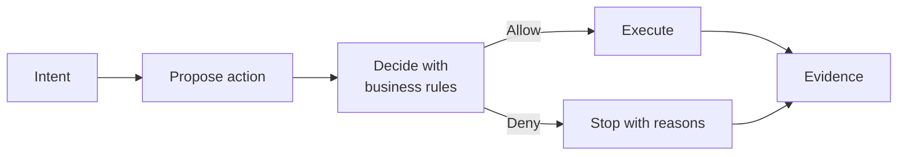

# Policy Pilot

**An AI capability execution platform governed by executable business policies.**

AI can initiate real enterprise operations. It cannot decide them alone.



> **AI proposes. Policy decides. Deterministic systems execute. Everything is explainable.**

Policy Pilot is a **reference implementation** of that control model, demonstrated on the cash leg of Standard Settlement Instructions (SSI) — maker–checker payments under segregation of duties, line-of-business boundaries, and amount clubs.

---

## The problem

Enterprises want AI that can *do* work: create a payment, submit for funding, approve a trade, answer “Are there any instances of approving each other's payments?”

What they cannot accept is AI that **bypasses business decisions** — four-eyes rules, ownership, limits, compliance — because those rules lived in a prompt, a spreadsheet, or a service the agent never called.

Today those decisions are scattered across application `if` statements, BPM diagrams, directories, and tribal knowledge. When AI enters the stack without a shared decision layer, governance becomes hope.

---

## The idea

**Every enterprise action is the execution of a business decision. Every business decision is the evaluation of executable policies.**

In Policy Pilot:

1. **Intent** — a human (or system) asks in natural language, or invokes a capability.
2. **Propose** — AI helps select the capability and parameters. It prepares a *proposal*, not a fait accompli.
3. **Decide** — **executable business policies** (Rego / OPA) evaluate segregation of duties, approvals, LOB ownership, amount clubs, and lifecycle rules. Identity supplies facts; policy supplies meaning.
4. **Execute** — application services change state **only** after policy allows — and they re-evaluate themselves. Chat preflight is never the sole gate.
5. **Evidence** — the decision *and* the outcome are written together, then kept available for investigation.

That is a **controlled ecosystem**: AI is inside the perimeter of governance, not outside it with a privilege escalation path labeled “tool call.”

---

## What you get (business outcomes)

| Outcome | What it means |
|---------|----------------|
| **Governed automation** | High-stakes actions run through the same decision layer for humans, APIs, and AI-initiated capabilities. |
| **Fail-closed control** | Deny or abandoned confirmation stops the work. There is no soft “best effort” write after policy says no. |
| **Explainable decisions** | Allow/deny comes with *why* — durable on the audit event, not lost in a chat transcript. |
| **Consistent rules** | SoD, reporting-line inversion, LOB scope, amount clubs — encoded once, reused on every mutation. |
| **Investigable evidence** | What was proposed, who acted, what policy said, and what changed — available afterward for supervisors and compliance. |

This is not “prompt the model to be careful.” Policy is software that runs **before** execution.

---

## Why this is not another agent framework

| Typical AI agents | Policy Pilot |
|-------------------|--------------|
| Model plans and often steers tool use | Model proposes; **policy decides** |
| Governance bolted on in prompts | Governance is the **decision layer** |
| Permission ≈ “can the agent call the API?” | Permission = **business decision** (SoD, limits, ownership, approval) |
| Success = task completed | Success = task completed **under enforceable rules**, with evidence |

If you land here wondering “why not LangGraph / AutoGen?” — those optimize agent loops. Policy Pilot optimizes **enterprise control when AI is allowed to touch real operations.**

---

## Reference domain (proof, not the whole product)

The working vertical is **cash SSI**: instructions and payments, front office / middle office / funding / compliance personas, live eligibility, scripted create → submit → approve → cancel capabilities, and conversation over graph + audit events.

The pattern generalizes: any high-stakes capability that must obey **intent → decide → execute → evidence**. SSI is the worked example that makes the claim falsifiable.

Business rule vocabulary in this reference: **[OPA policy controls](docs/opa-controls.md)**.

---

## Honest boundaries

- **True:** Side-effecting capabilities cannot complete without passing executable policy (chat preflight **and** authoritative service evaluation). AI does not own a private write path.
- **True:** Investigation answers from governed records under entitlement — not an unscoped dump of the enterprise.
- **Not claimed:** The language model never errs on routing or wording. Control is on **execution and decisions**, not on verbal perfection.
- **Reference posture:** Local identity, demo credentials, and compose-up ops are intentional for a runnable reference — not a bank production packaging claim.

Architecture review (adversarial): **[docs/architecture-review-2026-07-18.md](docs/architecture-review-2026-07-18.md)**.

---

## Try it

```bash
./scripts/clean-slate.sh
open http://localhost:8092
```

Prerequisites and GCP Vertex setup: **[How it works — Quick start](docs/how-it-works.md#quick-start)**.

---

## Go deeper

### Governance and product

| Document | Contents |
|----------|----------|
| **[How it works](docs/how-it-works.md)** | Integration picture, data flow, intent pipelines, graph model, ETL, quick start |
| **[OPA policy controls](docs/opa-controls.md)** | Four-eyes, reporting-line inversion, LOB boundaries, amount clubs |
| **[Authorization audit trail](docs/authorization-audit-trail.md)** | Who / when / why on past approvals; live eligibility |
| **[OBO call paths](docs/obo-call-paths.md)** | Service JWT + on-behalf-of matrix across chat and domain APIs |
| **[Architecture review](docs/architecture-review-2026-07-18.md)** | Adversarial review (score and residual risks) |
| **[Sample questions](docs/sample-questions.md)** | Demo prompts by path (`graph`, `tools`, `skill`, `vector`) |
| **[Domain models and demo users](docs/domain-models.md)** | Instruction / payment models and persona logins |

### Architecture and data plane

| Document | Contents |
|----------|----------|
| **[Architecture decisions](docs/architecture-decisions.md)** | Why ZITADEL, OPA, MongoDB, Kafka, Neo4j, Vertex, `cypher_builder` |
| **[Data flow](docs/data-flow.md)** | Mutation → Mongo transaction → Kafka CDC → indexer → Neo4j → chat |
| **[Intent determination](docs/intent-determination.md)** | Route → Retrieve → Synthesize; `RouterDecision` |
| **[Neo4j graph model](neo4j-graph-model/README.md)** | Shared graph schema, writer roles, example Cypher |
| **[Indexer Mongo DLQ](ssi-indexer/src/etl/dlq/README.md)** | DLQ-before-commit, pause-on-failure, replay, integrity banner |
| **[OPA policy seed](opa-policy-seed/README.md)** | Rego package layout and local evaluation |
| **[ZITADEL seed](zitadel-seed/README.md)** | Demo users, groups, amount clubs |

### Governed capabilities (skills)

| Document | Contents |
|----------|----------|
| **[Create-payment skill](docs/create-payment-skill.md)** | Draft payment: OPA `CREATE` preflight, Go / No Go |
| **[Submit-payment skill](docs/submit-payment-skill.md)** | Desk submits DRAFT for funding approval |
| **[Approve-payment skill](docs/approve-payment-skill.md)** | Funding approve of SUBMITTED payment |
| **[Cancel-payment skill](docs/cancel-payment-skill.md)** | Middle-office cancel of DRAFT or SUBMITTED |

### Operations

| Document | Contents |
|----------|----------|
| **[Local development](docs/local-development.md)** | Run services, logs, regression, URLs |
| **[GCP / Vertex setup](docs/gcp-setup.md)** | Credentials, smoke test, embeddings / Gemini |
| **[Observability](docs/observability.md)** | OTLP → Prometheus / Loki / Tempo; OpenSLO catalog, Sloth rules, Grafana |

### Applications and libraries

| Directory | README | Port |
|-----------|--------|------|
| Policy Pilot chat | [ssi-chat](ssi-chat/README.md) | 8092 |
| Demo harness | [ssi-demo-harness](ssi-demo-harness/README.md) | 8091 |
| Indexer | [ssi-indexer](ssi-indexer/README.md) | 8090 |
| Instruction service | [instruction-service](instruction-service/README.md) | 8000 |
| Payment service | [payment-service](payment-service/README.md) | 8093 |
| Authorization service | [authorization-service](authorization-service/README.md) | 8094 |
| Sequence service | [sequence-service](sequence-service/README.md) | 8095 |
| Kafka Connect | [kafka-connect](kafka-connect/README.md) | 8083 |
| Cypher builder | [shared/cypher_builder](shared/cypher_builder/README.md) | — |
| Authz client | [shared/authz_client](shared/authz_client/README.md) | — |
| ZITADEL directory | [shared/zitadel_directory](shared/zitadel_directory/README.md) | — |
