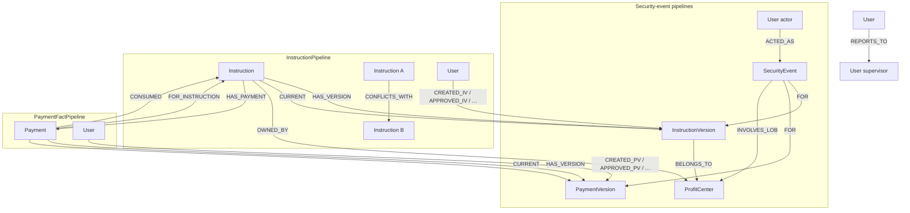

# Policy Pilot

An event-driven, policy-aware knowledge platform for regulated financial systems — OPA authorization, Neo4j knowledge graphs, hybrid retrieval, and LLM-powered investigation in one conversational surface.

Policy Pilot gives supervisors and compliance officers a single place to ask questions over the cash leg of Standard Settlement Instructions (SSI). It unifies **live policy rules** (OPA), **operational state** (instructions and payments), and the **immutable audit trail** of what was allowed or denied — so teams investigate in natural language instead of stitching answers from LDAP, databases, and ticket queues.

## Why this exists

In a large bank, answering even simple supervision questions is painfully slow:

- *Are there users approving each other's instructions?*
- *Did a subordinate approve their manager's instruction?*
- *Who can approve this payment when two approvers are out sick?*
- *Why was someone allowed to approve across line-of-business boundaries?*

The answers rarely live in one place. Rules sit in **LDAP**, **OPA**, **application code**, and **database config** that only one team understands. Worse, **what policy says** and **what actually happened** can diverge — investigators need both the **policy decision** (allow/deny and why) and the **operational fact**, captured together at decision time.

Policy Pilot models that end to end. Every mutation is recorded, streamed through Kafka, indexed into Neo4j (graph + multimodal vector/fulltext), and made queryable in conversation — a **holistic, evidence-backed view** grounded in what the system actually did.

## What you can ask

Policy Pilot surfaces **fraud patterns, compliance violations, and collusion signals** — not just application status screens.

- _Are there any instances of approving each other's instructions?_
- _Are there instructions approved by someone who reports directly to the creator?_
- _Who approved instruction X, and why was it allowed?_ (full OPA audit — Who / When / Why)
- _Who can approve payment Y?_ (live OPA eligibility, not historical guesswork)
- _Show me all ALERT events for FICC instructions in the last 7 days._
- _Are there active instructions sharing the same creditor account and currency?_

More examples and demo personas: **[Domain models and demo users](docs/domain-models.md)**.

---

## How it works


Policy Pilot sits at the end of an event-driven pipeline: domain services enforce OPA policy and write versioned state + security events to MongoDB; Kafka Connect streams changes; **ssi-indexer** builds a shared Neo4j graph and multimodal search index; **ssi-chat** routes each question through a **Route → Retrieve → Synthesize** pipeline before answering.

| Topic | Summary |
|-------|---------|
| **[Intent determination](docs/intent-determination.md)** | Gemini returns a strict `RouterDecision` (eligibility, graph, vector, or hybrid). Selective retrieval — no blind merge of graph and vector on every question. |
| **[Data flow](docs/data-flow.md)** | Mongo transactions → Kafka CDC → four ETL pipelines → Neo4j + multimodal store → chat. |
| **[Architecture decisions](docs/architecture-decisions.md)** | Why ZITADEL, OPA, MongoDB, Kafka, Neo4j hybrid search, Vertex AI, and `cypher_builder`. |
| **[Authorization audit trail](docs/authorization-audit-trail.md)** | Who / When / Why on past approvals; live *who can approve?* via eligible-approvers APIs. |
| **[Local development](docs/local-development.md)** | Run services locally, observability, regression evaluation, component map. |

---

## Neo4j graph model

Four ETL pipelines write to the **same Neo4j database**, sharing nodes (`Instruction`, `InstructionVersion`, `User`, `ProfitCenter`, `Payment`, `PaymentVersion`, `SecurityEvent`). Writers split into two symmetric roles:

| Writer type | Pipelines | Owns |
|-------------|-----------|------|
| **Fact** (state) | `InstructionPipeline`, `PaymentFactPipeline` | Versions, `CURRENT`, `SUPERSEDES`, lifecycle edges (`_*IV` / `_*PV`), structural edges, root denorm, multimodal state docs |
| **Audit** (events) | `InstructionSecurityEventPipeline`, `PaymentSecurityEventPipeline` | `SecurityEvent`, `ACTED_AS`, `FOR` → version, `INVOLVES_LOB`, multimodal event docs |

Security-event pipelines write audit edges only — they do not write lifecycle edges, `CURRENT`, or `CONSUMED`. Each audit row links to the version that was current at event time via **`FOR`**.



Instruction lifecycle uses `CREATED_IV`, `APPROVED_IV`, …; payment lifecycle uses `CREATED_PV`, `APPROVED_PV`, … SINGLE_USE submit writes `USED_IV` plus `CONSUMED` / `CONSUMED_BY`; payment reject/cancel removes consumption on `RELEASE_USE`.

Cross-graph queries work because nodes are shared:

```cypher
-- ALERT event actor + linked version + current instruction state
MATCH (actor:User)-[:ACTED_AS]->(e:SecurityEvent {severity: 'ALERT'})
OPTIONAL MATCH (e)-[:FOR]->(v:InstructionVersion)
OPTIONAL MATCH (i:Instruction {instruction_id: v.instruction_id})-[:CURRENT]->(cv:InstructionVersion)
RETURN actor.display_name, e.message, v.instruction_id, cv.status, cv.owning_lob
ORDER BY e.timestamp DESC LIMIT 20;

-- Mutual approval (collusion signal)
MATCH (a:User)-[:APPROVED_IV]->(va:InstructionVersion)<-[:CREATED_IV]-(b:User)
MATCH (b)-[:APPROVED_IV]->(vb:InstructionVersion)<-[:CREATED_IV]-(a)
WHERE a.user_id < b.user_id
RETURN a.display_name AS user_a, b.display_name AS user_b,
       va.instruction_id AS approved_by_a, vb.instruction_id AS approved_by_b;

-- Subordinate approved supervisor's instruction (inversion of control)
MATCH (creator:User)-[:CREATED_IV]->(v:InstructionVersion)
MATCH (approver:User)-[:APPROVED_IV]->(v)
MATCH (approver)-[:REPORTS_TO]->(creator)
RETURN creator.display_name AS creator, approver.display_name AS approver,
       v.instruction_id, v.owning_lob
LIMIT 50;

-- Payment approver reports to payment creator
MATCH (p:Payment)-[:CURRENT]->(pv:PaymentVersion)
MATCH (creator:User)-[:CREATED_PV]->(pv)
MATCH (approver:User)-[:APPROVED_PV]->(pv)
MATCH (approver)-[:REPORTS_TO]->(creator)
RETURN creator.display_name, approver.display_name, p.payment_id, pv.amount
LIMIT 50;

-- Potential duplicate settlement routes
MATCH (i1:Instruction)-[:CONFLICTS_WITH]->(i2:Instruction)
MATCH (i1)-[:CURRENT]->(v1:InstructionVersion)
MATCH (i2)-[:CURRENT]->(v2:InstructionVersion)
RETURN v1.instruction_id, v1.creditor_account, v1.currency, v2.instruction_id
LIMIT 50;
```

Full property catalog, edge matrix, and reload procedure: **`neo4j-graph-model/`** — see [neo4j-graph-model/README.md](neo4j-graph-model/README.md) and [neo4j-graph-model/PHASE-0.md](neo4j-graph-model/PHASE-0.md).

---

## Quick start

**Prerequisites:** Docker + Docker Compose; GCP project with Vertex AI enabled and a service account key — **[GCP setup](docs/gcp-setup.md)**.

```bash
cp .env.example .env
# Set GCP_SA_KEY_PATH and GOOGLE_APPLICATION_CREDENTIALS

python scripts/vertex_smoke_test.py   # optional but recommended

docker compose up -d

# Seed demo users (~30 s after ZITADEL starts)
PAT=$(docker exec zitadel-login cat /zitadel/bootstrap/login-client.pat | tr -d '\n')
cd zitadel-seed && ZITADEL_PAT="$PAT" python3 seed.py

open http://localhost:8091   # harness — run policy scenarios
open http://localhost:8092   # Policy Pilot — start asking questions
```

**Full demo seed** (instructions, payments, dozens of policy-denial ALERTs):

```bash
./ssi-demo-harness/seed-demo-data.sh          # reset volumes + seed
./ssi-demo-harness/seed-demo-data.sh --seed-only   # stack already up
```

Allow **ssi-indexer** to catch up after seeding before ALERT counts in chat look correct. See [ssi-demo-harness/README.md](ssi-demo-harness/README.md).

| URL | What |
|-----|------|
| http://localhost:8092 | Policy Pilot |
| http://localhost:8091 | Demo harness |
| http://localhost:8090 | Indexer search console |
| http://localhost:8000 | Instruction service |
| http://localhost:8093 | Payment service |
| http://localhost:8094 | Authorization service |
| http://localhost:8095 | Sequence service |
| http://localhost:7474/browser/ | Neo4j (`neo4j` / `devpassword`) |

**Reset:** `docker compose down -v --remove-orphans && docker compose up -d` — then re-seed ZITADEL users and run the harness seed script.

**Neo4j graph only** (keep Mongo/Kafka data, replay ETL): see [ssi-indexer/README.md](ssi-indexer/README.md#reset-consumer-offsets) and [neo4j-graph-model/README.md](neo4j-graph-model/README.md#wipe-and-reload-demo-graph).

Demo logins (password `Password1!`): see **[Domain models and demo users](docs/domain-models.md)**.

---

## Documentation

| Document | Contents |
|----------|----------|
| [docs/intent-determination.md](docs/intent-determination.md) | Route → Retrieve → Synthesize pipeline, `RouterDecision`, observability |
| [docs/data-flow.md](docs/data-flow.md) | End-to-end pipeline, transactions, storage and Kafka topics |
| [docs/architecture-decisions.md](docs/architecture-decisions.md) | ZITADEL, OPA, MongoDB, Kafka, Neo4j, Vertex, models |
| [docs/authorization-audit-trail.md](docs/authorization-audit-trail.md) | Who / When / Why, live eligibility |
| [docs/domain-models.md](docs/domain-models.md) | Instruction and payment models, demo users |
| [docs/gcp-setup.md](docs/gcp-setup.md) | Vertex AI credentials and smoke test |
| [docs/local-development.md](docs/local-development.md) | Local services, logs, regression suite, URLs |

Each application directory also has its own README — see table below.

---

## Repository layout

```
.
├── docker-compose.yml
├── docs/                            # Architecture and operations guides
├── instruction-service/             # Instruction lifecycle API + UIs
├── payment-service/                 # Payment lifecycle API + UIs
├── authorization-service/           # OPA gateway + user directory UI
├── sequence-service/                # Monotonic id allocation
├── shared/
│   ├── authz_client/                # Domain → authorization-service HTTP client
│   ├── cypher_builder/              # Neo4j planned query engine
│   ├── sequence_client/             # Domain → sequence-service HTTP client
│   ├── vertex_client/               # Vertex AI embeddings + Gemini
│   └── telemetry/                   # OpenTelemetry helpers
├── kafka-connect/                   # Mongo CDC → Kafka
├── ssi-indexer/                     # Kafka → Neo4j + multimodal index
├── ssi-chat/                        # Policy Pilot
├── ssi-demo-harness/                # Scenario harness + seed-demo-data.sh
├── neo4j-graph-model/               # Graph schema (PHASE-0.md)
├── opa-policy-seed/                 # Rego policies
└── zitadel-seed/                    # Demo user definitions
```

| Directory | README | Port |
|-----------|--------|------|
| `instruction-service` | [README](instruction-service/README.md) | 8000 |
| `payment-service` | [README](payment-service/README.md) | 8093 |
| `authorization-service` | [README](authorization-service/README.md) | 8094 |
| `sequence-service` | [README](sequence-service/README.md) | 8095 |
| `ssi-indexer` | [README](ssi-indexer/README.md) | 8090 |
| `ssi-chat` | [README](ssi-chat/README.md) | 8092 |
| `ssi-demo-harness` | [README](ssi-demo-harness/README.md) | 8091 |
| `neo4j-graph-model` | [README](neo4j-graph-model/README.md) | — |
| `kafka-connect` | [README](kafka-connect/README.md) | 8083 |
| `opa-policy-seed` | [README](opa-policy-seed/README.md) | — |
| `zitadel-seed` | [README](zitadel-seed/README.md) | — |
| `shared/cypher_builder` | [README](shared/cypher_builder/README.md) | — |
| `shared/authz_client` | [README](shared/authz_client/README.md) | — |
