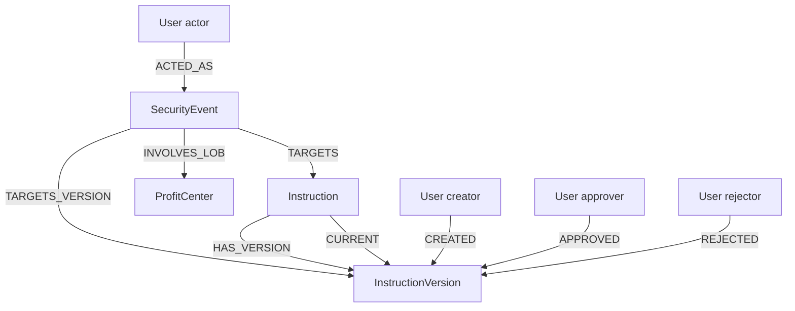
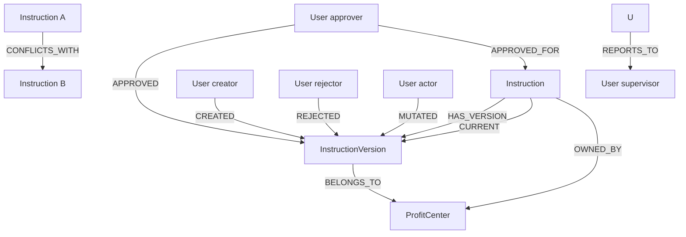
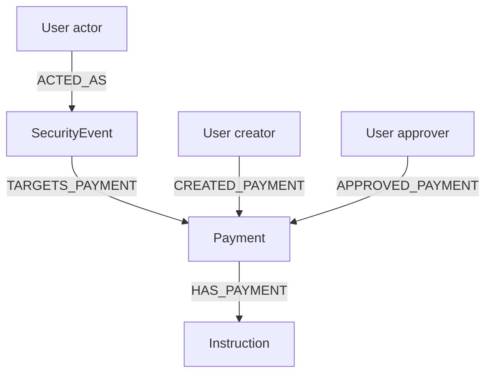

# Security Event RAG Demo

A monorepo demonstrating how to build a **retrieval-augmented generation (RAG) system over financial security events** using a containerized stack with **Vertex AI** (embeddings, answer synthesis, and structured graph query extraction).

**PolicyPilot** — the chat application in this repo — gives supervisors and compliance officers a single conversational surface over the cash leg of the Standard Settlement Instructions (SSI).

## Why this exists

In a large bank, middle-office supervisors and compliance officers are accountable for **enforcing firm policy and regulation** — segregation of duties, approval limits, LOB boundaries, and the rules that govern who may move money. In practice, answering even simple questions is painfully slow:

- *Are there any instances of approving each other's instructions?*
- *Are there any instructions approved by someone who reports directly to the creator of the instructions?*
- *Who can approve this payment when two approvers are out sick?*
- *Why was this person allowed to approve an instruction from another line of business?*
- *Why was someone permitted to create a payment above $25 million?*

The answers rarely live in one place. Some rules sit in **LDAP**, some in an **OPA** or local rule engine, some are **hard-coded in application services**, and others linger in **database configuration** that only one team understands. Policy-based access control may exist on paper, but enforcement is partial — so investigators open tickets across operations, technology, and compliance, then spend days stitching fragments into a story everyone will trust.

Worse, **what the permission model says** and **what actually happened** can diverge. A user may lack a role in one system yet still approve a payment because a downstream check passed, a stale entitlement was cached, or an exception path fired. For audit and supervision, the decisive record is not the org chart or the role matrix — it is the **security event**: the immutable fact that an action occurred, who performed it, whether policy allowed or denied it, and **why** (the OPA decision context captured at decision time).

This demo models that reality end to end. Every instruction or payment mutation — create, submit, approve, reject, and policy denial — is recorded as a structured security event, streamed through Kafka, indexed into Neo4j (graph + multimodal vector/fulltext), and made queryable in **natural language**. Stakeholders do not need to know which database, topic, or team owns the answer; they ask in conversation and get a **holistic, evidence-backed view** grounded in what the system actually did.

The technical approach is **hybrid RAG** (vector search, BM25, and Neo4j) with **query-adaptive routing** — the assistant picks the right retrieval path and answer strategy for each question (planned graph queries, exact lookups, live eligibility checks, or full synthesis) instead of forcing every query through a single retrieval pattern.

## Demo questions

The chat is designed to surface **fraud patterns, compliance violations, and collusion signals** — questions that go beyond what a standard application status screen can answer.

**Collusion and mutual approval:**
- _Are there any instances of approving each other's instructions?_
- _Has any user attempted to approve an instruction they originally created?_

**Inversion of control — segregation of duties:**
- _Are there any instructions approved by someone who reports directly to the creator of the instructions?_

> Banks enforce a hierarchy rule: a subordinate must not approve their manager's instruction. This is an inversion of control violation — the approval authority flows the wrong way up the reporting chain.

**Compliance investigation:**
- _Who created the instruction that Michael Torres rejected?_
- _Who approved instruction `<uuid>`, and why was it allowed?_ (full OPA audit trail — approver, timestamp, policy rationale)
- _Show me all ALERT events for FICC instructions in the last 7 days._
- _Which users triggered the most policy denial alerts this week?_

**Duplicate and conflicting routes:**
- _Are there active instructions sharing the same creditor account and currency — potential duplicate settlement routes?_

**Exact event and instruction lookup:**
- _Can you show me the instruction associated with security event id `<uuid>`?_
- _Can you show me the full lifecycle timeline of instruction `<uuid>`?_

**Payment policy and compliance:**
- _How many payment ALERT events happened today?_
- _Who can approve payment `<uuid>`?_
- _Are there any payments where the approver directly reports to the payment creator?_
- _Show me all APPROVED payments over $10M for FICC this week._

---

## Architecture


### Data flow

1. **Instruction service** — operator creates/mutates an instruction; ZITADEL JWT is validated; the service calls **authorization-service** with On-Behalf-Of (service account `svc-instruction` + user token); authz evaluates OPA and returns `allow` + `allow_basis`; instruction version and security event (with `details.authorization`) are written to MongoDB **in a single transaction** (`ssi_cash_instructions.instructions` and `security_events.instruction_service`). Domain services do **not** publish to Kafka directly.
2. **Payment service** — middle-office users create payments against approved SSI instructions; the same OBO → authz → OPA path applies; each action writes the payment version and matching security event to MongoDB (`ssi_cash_activities.payments` and `security_events.payment_service`) in one transaction.
3. **Kafka Connect** — four MongoDB source connectors watch those collections and publish **verbatim full documents** to `instruction_security_events`, `instructions`, `payment_security_events`, and `payments`. **ssi-indexer** normalizes versioned `_id` values and security-event ids in `mongo_cdc.py` at consume time.
4. **Authorization service** — sole runtime caller of OPA. Exposes evaluate and eligible-approvers APIs to domain services only (no MongoDB). Reads candidate approvers from `users.yaml` for batch eligibility checks.
5. **SSI indexer** — runs four independent Kafka consumers, all **self-contained** (full snapshots embedded — no API callbacks). Denormalizes `authorization_summary`, `approved_at`, and related fields onto Neo4j `MultimodalDocument` nodes and the graph for chat retrieval.
   - **InstructionSecurityEventPipeline** (`instruction_security_events`) → Neo4j graph + multimodal `source=instruction_security_event`
   - **InstructionPipeline** (`instructions`) → instruction master graph + multimodal `source=instruction_state`
   - **PaymentSecurityEventPipeline** (`payment_security_events`) → payment security graph + multimodal `source=payment_security_event`
   - **PaymentFactPipeline** (`payments`) → payment master graph + multimodal `source=payment_fact`
6. **Chat** — selects a retrieval mode (`events` / `instructions` / `payments` / `all`), runs vector + BM25 + Neo4j in parallel, merges with reciprocal rank fusion. Count, ranking, hierarchy, and approval-by-ID questions use **deterministic planned Cypher** (`shared/cypher_builder`) or exact lookups. Instruction approval audit questions return **Who / When** from indexed data and **Why** via **Vertex Gemini** rewrite of OPA `authorization_summary`. Live **who can approve?** questions bypass RAG and call instruction-service or payment-service eligible-approvers APIs (compliance JWT). Other questions use **Vertex Gemini** synthesis over retrieved context; unresolved graph questions fall back to **Gemini structured graph plan extraction** → read-only Cypher.

---

### Why ZITADEL?

**What ZITADEL is:** ZITADEL is an open-source cloud-native identity and access management (IAM) platform — think self-hosted Auth0 or Okta. It provides OIDC/OAuth2 authentication, JWT issuance, user management, and metadata storage. In this demo it runs entirely in Docker with no external dependencies.

**How ZITADEL is used:**

Every request to the instruction and payment services carries a ZITADEL-issued JWT Bearer token. Each service validates it against ZITADEL's OIDC discovery endpoint (`/.well-known/openid-configuration`) and extracts the caller's identity — user ID, roles, LOB, and reporting line — from ZITADEL user metadata:

| Metadata key | Meaning | Used for |
|---|---|---|
| `subject_user_id` | Business user ID (`mo-100`, `ficc-300`) | Security events, graph nodes |
| `given_name` / `family_name` | Full name | `display_name` in graph + chat answers |
| `title` | Seniority (Analyst / VP / MD) | OPA approval matrix |
| `roles` | JSON array (`INSTRUCTION_CREATOR`, `INSTRUCTION_APPROVER`) | OPA role check |
| `lob` | Owning profit center (FICC, FX, DESK_*) | OPA LOB ownership check |
| `supervisor_id` | Direct manager's user ID | Inversion-of-control detection in graph |

This metadata is stored in ZITADEL via the `zitadel-seed/seed.py` script, which reads `users.yaml` and calls the ZITADEL admin API to create users and attach metadata. Domain services decode and validate this metadata on every authenticated request.

**Service accounts** (`svc-instruction`, `svc-payment`) authenticate to authorization-service and (for payment) instruction-service using machine tokens. On user-initiated lifecycle calls, the domain service forwards the user's JWT in `X-On-Behalf-Of` so OPA evaluates policy for the real actor, not the service account.

**Why ZITADEL over a simpler alternative:** ZITADEL provides a **user metadata API** that allows arbitrary key-value pairs per user (roles, LOB, supervisor). This means identity attributes that drive authorization policy (LOB ownership, seniority, org hierarchy) live in the identity layer — not hard-coded in the application or duplicated across services. Any service that validates the JWT can read the same canonical user attributes without a separate user-profile API call.

---

### Why OPA?

**What OPA is:** Open Policy Agent is a **policy-as-code** engine. It decouples authorization decisions from application code — the application sends a structured query (`input`) to OPA and receives a boolean decision (allow / deny). Policies are written in **Rego**, a declarative language designed for hierarchical data queries.

**How OPA is used:**

Only **authorization-service** calls OPA at runtime. Domain services build structured policy input and POST to authz; authz forwards to OPA's Data API:

```
instruction-service / payment-service
  → authorization-service  (svc-* token + X-On-Behalf-Of: user JWT)
  → OPA POST /v1/data/{instruction|payment}/lifecycle/allow
```

Example input (built by the domain service, evaluated by authz → OPA):

```json
{
  "input": {
    "action": "APPROVE",
    "subject": { "user_id": "mo-100", "title": "Analyst", "roles": ["INSTRUCTION_CREATOR"], "lob": null },
    "resource": { "instruction_id": "...", "owning_lob": "FICC", "created_by": "mo-100", "status": "SUBMITTED" }
  }
}
```

OPA evaluates the Rego policy bundle and returns `allow` / `deny`. Authorization-service also queries **`allow_basis`**, **`violations`**, and **`is_alert`**. Domain services store the result on every security event as `details.authorization` and copy `authorization.summary` to `event.reason` for authorized actions.

**OPA security in this demo:** OPA listens on `:8181` with no authentication (typical for a local policy sidecar). The trust boundary is **authorization-service**, which requires `svc-instruction` or `svc-payment` bearer tokens. Do not expose OPA to untrusted networks in production — keep it on an internal network reachable only from authz.

Example authorization block on an APPROVE security event:

```json
{
  "engine": "opa",
  "package": "instruction.lifecycle",
  "action": "APPROVE",
  "decision": "allow",
  "allow_basis": [
    "approval matrix: Vice President may approve work by Analyst",
    "approver LOB FICC matches instruction LOB",
    "approver does not report to creator",
    "role INSTRUCTION_APPROVER"
  ],
  "summary": "Vasquez, Elena (ficc-300) was allowed to APPROVE because approval matrix: Vice President may approve work by Analyst; ..."
}
```

**Key policies enforced:**

| Rule | Rego condition | What it catches |
|---|---|---|
| Role gate | `"INSTRUCTION_APPROVER" in subject.roles` | Non-approvers attempting to approve |
| Creator cannot approve | `subject.user_id != resource.created_by` | Self-approval (cross-approval collusion) |
| Subordinate cannot approve | `approver.supervisor_id != creator.user_id` | Manager approving subordinate's instruction (inversion of control) |
| LOB ownership | `subject.lob == resource.owning_lob` | Wrong-desk approval (e.g. FX desk approving FICC instruction) |
| Status gate | `resource.status == "SUBMITTED"` | Approving an instruction not yet submitted |
| Role segregation | `"INSTRUCTION_CREATOR" not in subject.roles` | Middle-office creator accounts cannot approve |

**Why policy-as-code matters for this demo:** Allows and denials both produce structured audit records in Kafka → Neo4j multimodal store. Denials surface as `ALERT` events for fraud-pattern questions (_"which users triggered the most policy denial alerts?"_). Allows carry `details.authorization` so the chat can answer approval audit questions with **Who / When / Why**, not just a name from instruction state.

**Why OPA over embedding auth in domain services:** Policy logic changes independently of application logic. Adding a new rule (e.g. "MD-level approval required for international wire > $10M") requires editing a `.rego` file and reloading OPA — not rebuilding instruction-service or payment-service. OPA mounts `opa-policy-seed/policies/` and loads Rego on every start; `opa-policy-seed` verifies policies are compiled before app services start.

---

### Why MongoDB for security events?

Security events are **write-heavy, append-only, and schema-flexible**. Different event actions (CREATE, APPROVE, REJECT, VIEW) carry different payloads — a rejection includes a reason, an approval includes the approver's LOB, a VIEW includes a resource path. A fixed relational schema would require either nullable columns for every possible field or a separate table per event type, both of which complicate queries.

MongoDB fits naturally because:

- **Schemaless documents** — each event is stored as-is with no schema migration when new fields are added. New event types or enrichment fields can be introduced without downtime.
- **Long-term retention** — MongoDB's native **TTL indexes** allow per-collection expiry policies. Security events for regulatory audit trails can be retained for years on cheap storage (or tiered to Atlas Online Archive), while transient operational events expire automatically. A single `db.createIndex({"timestamp": 1}, {expireAfterSeconds: N})` declaration governs the lifecycle.
- **Bi-temporal versioning** — instructions are stored as versioned documents (`version_number`, `in`/`out` timestamps). MongoDB's document model stores the entire version as a self-contained snapshot alongside its lifecycle metadata without JOIN complexity.
- **Change Streams** — the instruction-service live security-event monitor and the `SecurityEventWatcher` for real-time UI updates both consume MongoDB Change Streams, which provide ordered, resumable change feeds without an external CDC layer.
- **Replica set transactions** — writing an instruction version and its security event in a single ACID multi-document transaction requires a MongoDB replica set, which `docker-compose.yml` initialises automatically as `rs0`.

---

### Why Kafka?

Every instruction or payment mutation produces a **security event** in MongoDB. **Kafka Connect** CDC decouples domain services from downstream consumers.

Key reasons:

- **Fan-out with no coupling** — any new consumer (compliance reporting tool, real-time fraud detector, ML feature pipeline) can subscribe to the domain topics independently without any change to instruction-service or payment-service. Connect publishes once per Mongo insert; consumers scale independently.
- **Durable replay** — Kafka retains events on disk for a configurable retention window. If the ETL falls behind, restarts, or needs to reprocess a backfill, it can seek back to any offset and replay without touching the domain APIs.
- **Ordered delivery per partition** — events for the same key arrive in order, which matters for the ETL's `CURRENT` relationship management in Neo4j (it only promotes a new version if its `version_number` is higher than the current one).
- **Backpressure isolation** — a spike in instruction activity does not block instruction-service. The ETL processes at its own pace; the Kafka topic absorbs the burst.

In this demo Kafka runs as a single broker with no replication, which is appropriate for local development. A production deployment would use a multi-broker cluster with `replication.factor=3` and `min.insync.replicas=2`.

---

### Why Neo4j vector + fulltext BM25 (hybrid search)?

No single retrieval strategy reliably handles the full range of questions a user asks over security events.

**Dense vector search** (via **Vertex AI `text-embedding-004`** embeddings stored on `MultimodalDocument` nodes) excels at **semantic similarity** — "who tried to approve each other's instructions?" or "show me policy denial events for FX desk" — where the meaning matters more than the exact words. But dense search struggles with **exact identifiers**: if the user pastes a UUID like `2f75858d-d845-40d4-b9fb-43951a8c40e2`, the embedding of that string carries little semantic signal and the cosine similarity ranking is unreliable.

**BM25 fulltext search** (Neo4j Lucene index on `search_text`) is a classical term-frequency model. It excels precisely where dense search fails: **exact-match tokens** — UUIDs, user IDs (`mo-100`, `ficc-300`), action names (`APPROVE`, `REJECT`), currency codes (`USD`, `EUR`). However, BM25 has no concept of synonymy or paraphrase — "declined" and "rejected" are unrelated tokens to BM25.

**Hybrid search** fuses both signals with reciprocal rank fusion (RRF, k=60) in the indexer console and chat reranker:

```
score_hybrid(doc) = 1/(k + rank_dense) + 1/(k + rank_bm25)
```

Using **one Neo4j store** for graph traversal, dense vectors, and lexical search keeps chat/search/discovery infrastructure simple — no separate vector database to operate.

---

### Why Neo4j (knowledge graph)?

The fundamental limitation of vector + BM25 retrieval is that it operates over **flat document similarity**. Each enriched security event is an independent point in the index. Relationships between events — "this approval was done by the same person who created the other instruction", "these two instructions share a creditor account and currency, suggesting a duplicate route" — are **invisible** to a retriever that ranks documents one at a time.

A **knowledge graph** makes those relationships first-class queryable citizens:

```
(User ficc-300)-[:APPROVED]->(InstructionVersion v2)
(User mo-100)-[:CREATED]->(InstructionVersion v2)
(User ficc-300)-[:APPROVED_FOR]->(User mo-100)   ← cross-approval edge
```

The graph enables questions that are **structurally impossible** with flat retrieval alone:

| Question | Why flat retrieval fails | How Neo4j answers it |
|---|---|---|
| Are there users who approved each other's instructions? | Would require joining two separate query results and checking for symmetry | `MATCH (a)-[:APPROVED_FOR]->(b), (b)-[:APPROVED_FOR]->(a)` |
| What is the full lifecycle timeline of instruction X? | Each event is a separate document — reassembling order requires post-processing | `MATCH (e)-[:TARGETS]->(i) ORDER BY e.timestamp` |
| Which instructions share the same creditor account? | No link exists between documents for separate instructions | `MATCH (v1)-[:CONFLICTS_WITH]->(v2)` |
| Who are all the users in the FICC profit center? | Would need keyword search on `lob=FICC` and hope the field is indexed | `MATCH (u)-[:BELONGS_TO]->(p:ProfitCenter {lob: 'FICC'})` |

**Role in improving RAG recall:**

The chat pipeline uses **planned Cypher** from `shared/cypher_builder` for known question shapes, and **Vertex Gemini** to extract a structured graph query plan when no planner rule matches. The resulting read-only Cypher runs against Neo4j and returns structured rows (event IDs, user IDs, instruction IDs, timestamps). Those rows are injected into the LLM context alongside the vector and BM25 results. **Vertex Gemini** then synthesises an answer that combines semantic context (from vector search) with precise relational facts (from the graph). Neither source alone would produce a complete, accurate answer for relationship-heavy questions.

The graph also serves as a **cross-validation layer**: if a UUID is present in the question, the pipeline runs a deterministic Cypher lookup (`MATCH (e:SecurityEvent {event_id: $id})-[:TARGETS_VERSION]->(v)`) that is guaranteed to be exact regardless of embedding similarity.

---

### Why Vertex AI?

**What Vertex provides in this demo:** Google Cloud Vertex AI hosts the **embedding** and **generative** models used for semantic search and natural-language answers. Both **ssi-indexer** and **PolicyPilot** call Vertex through the shared `vertex_client` package (`shared/vertex_client/`).

| Role | Model | Used by |
|------|-------|---------|
| Document + query embeddings | `text-embedding-004` (768-dim) | ssi-indexer (write), PolicyPilot (query) |
| Answer synthesis + authorization WHY rewrite | `gemini-2.5-flash` | PolicyPilot |
| Graph query plan extraction (fallback) | `gemini-2.5-flash` | PolicyPilot (structured JSON → Cypher via `cypher_builder`) |

**Why Vertex for all ML:**

- **Consistent vectors** — indexer and chat use the same embedding model and dimension (`768`), so query vectors match indexed documents.
- **No local GPU** — embeddings, synthesis, and graph plan extraction all run in GCP; the demo stack is fully containerized aside from GCP credentials.
- **Production-shaped** — mirrors how many teams run retrieval locally/in-VPC and call a managed LLM for generation.

**GCP setup (one-time):** enable Vertex AI API, create a service account with `roles/aiplatform.user`, download a JSON key, and set `GCP_SA_KEY_PATH` / `GOOGLE_APPLICATION_CREDENTIALS` (see `.env.example`). Docker Compose mounts the key into **ssi-indexer** and **ssi-chat** at `/run/secrets/gcp-sa.json`. Smoke test: `python scripts/vertex_smoke_test.py`.

> **Important:** changing the embedding model or dimension requires dropping Neo4j vector indexes, resetting Kafka consumer offsets, and replaying the ETL (see `ssi-indexer/README.md`).

---

### Graph queries — `shared/cypher_builder`

Neo4j graph retrieval uses a **two-tier** approach:

1. **Planned Cypher** — rule-based intent matching in `shared/cypher_builder` for counts, rankings, hierarchy traversals, approval lookups, and other high-confidence question shapes. No LLM call.
2. **Gemini graph plan extraction** — when no planner rule matches, PolicyPilot asks Gemini for a structured `GraphQueryPlan` (intent + parameters), which `cypher_builder` turns into validated read-only Cypher.

The indexer Search Console `POST /api/cypher/generate` endpoint uses the same planner (deterministic matches only).

---

## Services

| URL | Service | Purpose |
|-----|---------|---------|
| http://localhost:8092 | SSI chat | Natural-language Q&A (four search modes) |
| http://localhost:8000/ui/ | Instruction service | Instruction browser |
| http://localhost:8000/ui/security-events/ | Instruction service | Live security event monitor (SSE) |
| http://localhost:8000/docs | Instruction service | OpenAPI |
| http://localhost:8093/ui/ | Payment service | Payment browser |
| http://localhost:8093/ui/security-events/ | Payment service | Live payment security event monitor (SSE) |
| http://localhost:8093/docs | Payment service | OpenAPI |
| http://localhost:8090 | SSI indexer | Search console — vector / BM25 / hybrid / Neo4j |
| http://localhost:8091 | Demo harness | Generate instruction + payment lifecycle traffic |
| http://localhost:8094 | Authorization service | OPA evaluation API (service accounts) |
| http://localhost:8094/docs | Authorization service | OpenAPI |
| http://localhost:8094/ui/ | Authorization service | Read-only user directory (roles, groups, LOBs, managers) |
| http://localhost:8083/connectors | Kafka Connect | Mongo CDC connector REST API |
| http://localhost:7474/browser/ | Neo4j | Graph browser — `neo4j` / `devpassword` |
| http://localhost:8080/ui/console | ZITADEL | Identity admin console |
| http://localhost:5601 | OpenSearch Dashboards | Search exported OTLP application logs |
| http://localhost:9200 | OpenSearch | Log index API (`otel-logs`) |

---

## Observability (logs)

Application services send logs **directly over OTLP** to the OpenTelemetry Collector (`4317`). The collector forwards them to two destinations:

1. **Debug exporter** — collector stdout (`docker compose logs otel-collector`)
2. **OpenSearch** — index `otel-logs` (redacted HTTP and Vertex Gen AI log lines, startup messages, errors)

Metrics and traces still use the debug exporter only. There is no application log file on disk; optional console mirroring uses `OTEL_LOG_CONSOLE=true`.

To browse logs locally, open [OpenSearch Dashboards](http://localhost:5601), create an index pattern for `otel-logs*`, and use **Discover**.

---

## Components

| Directory | Role |
|-----------|------|
| `instruction-service` | FastAPI lifecycle API — routes policy checks to authorization-service (OBO), `details.authorization` audit block, Mongo persistence (Connect CDC to Kafka), compliance eligible-approvers API |
| `payment-service` | Cash payment lifecycle against approved SSI instructions — same authz/OBO pattern, Mongo persistence (Connect CDC to Kafka), payment and security event UIs, compliance eligible-approvers API |
| `ssi-indexer` | Four Kafka consumers — instruction + payment security events and state facts → Neo4j graph + multimodal indexer (Vertex embeddings) + search console UI |
| `kafka-connect` | MongoDB source connectors — change streams → domain Kafka topics (full documents, no transforms) |
| `ssi-chat` | **PolicyPilot** — RAG chat assistant; Vertex Gemini synthesis + graph plan extraction; four search modes, triple retrieval, Who/When/Why approval audit, planned Cypher, regression suite |
| `shared/cypher_builder` | Shared Neo4j query planner — deterministic Cypher intents + Gemini plan → Cypher conversion |
| `shared/vertex_client` | Shared Vertex AI client — embeddings (`text-embedding-004`) and generation (`gemini-2.5-flash`) |
| `authorization-service` | Stateless OPA gateway — lifecycle evaluate + batch eligible-approvers; user directory UI; reads `users.yaml`; no database |
| `ssi-demo-harness` | ZITADEL-authenticated UI to drive lifecycles and OPA policy scenarios |
| `neo4j-graph-model` | Graph schema docs, Cypher constraints/indexes, example queries |
| `opa-policy-seed` | Startup gate — waits until OPA has compiled mounted Rego policies |
| `zitadel-seed` | Demo user seed (`users.yaml`) — middle office, FICC/FX/DESK approvers, payment creators/approvers, front-office submitters, compliance analysts (`comp-001`, `comp-002`), service accounts |

---

## Models

### Embedding model — Vertex `text-embedding-004`

The ETL and PolicyPilot use [Google `text-embedding-004`](https://cloud.google.com/vertex-ai/generative-ai/docs/embeddings/get-text-embeddings) via the shared `vertex_client` package.

| Property | Value |
|----------|-------|
| Model | `text-embedding-004` |
| Provider | Google Vertex AI |
| Output dimension | **768** float32 |
| Index task | `RETRIEVAL_DOCUMENT` (ETL) / `RETRIEVAL_QUERY` (chat) |

Each document is embedded at write time by **ssi-indexer** and at query time by **PolicyPilot** for similarity search.

> **Important:** changing the embedding model or dimension requires dropping Neo4j vector indexes and replaying the ETL (reset Kafka offsets — see `ssi-indexer/README.md`).

### Generative model — Vertex `gemini-2.5-flash`

PolicyPilot uses Gemini for natural-language answers and authorization WHY rewrites.

| Property | Value |
|----------|-------|
| Model | `gemini-2.5-flash` (configurable via `VERTEX_GEMINI_MODEL`) |
| Provider | Google Vertex AI |
| Used for | Answer synthesis, authorization WHY summarization |

Retrieved context (vector + BM25 + graph rows) is passed to Gemini; the model does **not** emit raw Cypher directly — graph fallback uses structured plan extraction via `cypher_builder`.

### Lexical retrieval — Neo4j fulltext (BM25)

Alongside dense vectors, both the ETL indexer and chat retriever use Neo4j's **fulltext index** on `MultimodalDocument.search_text` (Lucene BM25). BM25 complements dense semantic search by excelling at exact-match terms like UUIDs, user IDs (`mo-100`, `ficc-300`), and action names (`APPROVE`, `REJECT`).

**Per-question LLM calls (PolicyPilot):**

| Step | Provider | When |
|------|----------|------|
| Query embedding | Vertex `text-embedding-004` | Every question (vector search) |
| Graph plan extraction | Vertex `gemini-2.5-flash` | Graph fallback when no planner rule matches |
| Answer synthesis | Vertex `gemini-2.5-flash` | Open-ended questions |
| Authorization WHY rewrite | Vertex `gemini-2.5-flash` | Approval audit questions only |
| Planned Cypher | `cypher_builder` (no LLM) | Counts, rankings, hierarchy, known audit shapes |

WHO and WHEN in approval audit answers remain deterministic from indexed data.

---

## Prerequisites

| Requirement | Notes |
|-------------|-------|
| Docker + Docker Compose | All containers are defined in `docker-compose.yml` |
| GCP project + Vertex AI | Enable `aiplatform.googleapis.com`; service account with `roles/aiplatform.user` |
| GCP service account key | Set `GCP_SA_KEY_PATH` in `.env` (mounted into ssi-indexer and ssi-chat) |

---

## Quick start

```bash
# 0. Configure Vertex (copy and edit paths)
cp .env.example .env
# Set GCP_SA_KEY_PATH and GOOGLE_APPLICATION_CREDENTIALS to your service account JSON

# 1. Optional: verify Vertex connectivity
python scripts/vertex_smoke_test.py

# 3. Start the full stack
docker compose up -d

# 4. Seed demo users (after ZITADEL has initialised — ~30 s)
PAT=$(docker exec zitadel-login cat /zitadel/bootstrap/login-client.pat | tr -d '\n')
cd zitadel-seed && ZITADEL_PAT="$PAT" python3 seed.py

# 5. Open the test harness — run instruction and payment policy scenarios
open http://localhost:8091

# 6. Open the chat and start asking questions (try Security Events mode first)
open http://localhost:8092
```

### Reset everything

```bash
docker compose down -v --remove-orphans
docker compose up -d
# re-seed ZITADEL users as above
```

---

## Demo users

All passwords are `Password1!`. Login names follow `{user_id}@ssi.local`.

| User | Name | Role | LOB |
|------|------|------|-----|
| `mo-100` | Sarah Chen | Analyst — middle office creator | — |
| `mo-101` | James Patel | Analyst — middle office creator | — |
| `mo-050` | David Okonkwo | VP — middle office creator | — |
| `mo-010` | Patricia Walsh | MD — middle office creator | — |
| `ficc-201` | Michael Torres | Associate — approver | FICC |
| `ficc-300` | Elena Vasquez | VP — approver | FICC |
| `ficc-400` | Robert Kim | MD — approver | FICC |
| `ficc-500` | Caroline Nguyen | Partner — approver | FICC |
| `fx-201` | Amira Hassan | Associate — approver | FX |
| `fx-300` | Lucas Berger | VP — approver | FX |
| `rates-201` | Nina Johansson | Associate — approver | DESK_RATES |
| `pay-101` | Emily Rodriguez | Analyst — payment creator | FICC, FX |
| `pay-201` | Sophie Laurent | VP — funding approver | FICC, FX |
| `fo-ficc-101` | Alex Morrison | Analyst — front-office submitter | FICC |
| `fo-fx-101` | Jordan Blake | Analyst — front-office submitter | FX |
| `svc-instruction` | — | Service account — instruction service → authorization-service (OBO) | — |
| `svc-payment` | — | Service account — payment service → authorization-service and instruction-service (OBO) | — |
| `admin-001` | Platform Administrator | **Platform admin** — secured UIs (harness, browsers, ETL console, user directory) and **PolicyPilot** | — |
| `comp-001` / `comp-002` | Compliance analysts | **PolicyPilot** and live eligible-approvers questions (via domain services) | — |

**Platform admin (`admin-001`)** — sign in at any secured admin UI (test harness, instruction browser, payment browser, ETL indexer, authorization user directory) and at **PolicyPilot** (`http://localhost:8092`). Requires `PLATFORM_ADMIN` role and `ADMIN` group. All `/api/ui/*` and harness `/api/*` routes require this login; chat and domain-service eligible-approvers APIs accept `PLATFORM_ADMIN` in addition to compliance roles. Business lifecycle APIs still use their respective seeded users via ZITADEL JWT. **`admin-001` does not emit VIEW security events** when listing or reading instructions via the REST API (`SECURITY_EVENT_VIEW_EXCLUDED_USER_IDS`), so harness status polling does not flood the audit log. The instruction browser UI (`/api/ui/instructions`) reads Mongo directly and never records VIEW events.

After changing `users.yaml`, re-seed Zitadel (`zitadel-seed` container or manual seed script).

See `zitadel-seed/users.yaml` for the full payment user roster (`pay-102` … `pay-400`, amount-limit clubs, and dual-role holders).

---

## Instruction model

An **instruction** is an **SSI settlement route template** — accounts, agent chain, currency, and validity. It is **not** a payment message; no amount, value date, or remittance information lives here.

```
instruction_type    STANDING | SINGLE_USE
wire_scope          DOMESTIC | INTERNATIONAL
currency            ISO 4217 (e.g. USD, EUR)
funding_account     source account
debtor / creditor   legal entities
*_agent             bank chain (ABA / BIC / CHIPS)
effective_date      template validity start
end_date            template validity end
```

Lifecycle: `DRAFT` → `SUBMITTED` → `APPROVED` or `REJECTED`; approved instructions may become `SUSPENDED`, `USED`, `EXPIRED`, or `DELETED`. `STANDING` and `SINGLE_USE` remain instruction types, not lifecycle statuses.

---

## Payment model

A **payment** is a cash transfer request against an approved SSI instruction. Middle-office users create payments; front-office desk users submit them; funding approvers approve or reject.

```
instruction_id      linked approved SSI route
amount              payment amount (USD in demo)
currency            ISO 4217
value_date          settlement date
owning_lob          inherited from instruction
```

Lifecycle: `DRAFT` → `SUBMITTED` → `APPROVED` or `REJECTED` (or `CANCELLED` if the instruction becomes invalid at approval time).

Policy denials (self-approval, wrong LOB, amount over club limit, subordinate approver) emit `ALERT` security events; authorized actions emit `INFO`.

---

## Storage and topic names

| Layer | Name | Purpose |
|-------|------|---------|
| Multimodal vector index | `multimodal_embedding` | Dense search on `MultimodalDocument.embedding` |
| Multimodal fulltext index | `multimodal_search_text` | BM25 lexical search on `search_text` |
| Multimodal `source` | `instruction_security_event`, `instruction_state`, `payment_security_event`, `payment_fact` | Document type filter for chat modes |
| MongoDB | `ssi_cash_instructions.instructions` | Instruction versions |
| MongoDB | `ssi_cash_activities.payments` | Payment records |
| MongoDB | `security_events.instruction_service` | instruction-service security events |
| MongoDB | `security_events.payment_service` | Payment security events |
| Kafka | `instruction_security_events` | Instruction security events (Mongo CDC) |
| Kafka | `instructions` | Instruction version rows (Mongo CDC) |
| Kafka | `payment_security_events` | Payment security events (Mongo CDC) |
| Kafka | `payments` | Payment version rows (Mongo CDC) |

---

## Neo4j graph model

Four ETL pipelines write to the **same Neo4j database**, producing complementary sub-graphs that share nodes (`Instruction`, `InstructionVersion`, `User`, `ProfitCenter`, `Payment`, `SecurityEvent`).

### Graph 1 — Instruction Security Event Graph
Built by `InstructionSecurityEventPipeline` from the `instruction_security_events` topic.
Answers: _who triggered this event, what severity, what instruction was touched, which actor caused a policy denial?_



### Graph 2 — Instruction Master Graph
Built by `InstructionPipeline` from the `instructions` topic.
Answers: _what is the current state of an instruction, who approved it, are there duplicate settlement routes, did a subordinate approve their manager's instruction?_



### Graph 3 — Payment Security Event Graph
Built by `PaymentSecurityEventPipeline` from the `payment_security_events` topic.
Answers: _who attempted a denied payment action, what amount/LOB was involved?_



### Graph 4 — Payment Master Graph
Built by `PaymentFactPipeline` from the `payments` topic.
Answers: _what is the current payment status, who created/submitted/approved it, which instruction does it use?_

The `REPORTS_TO` relationship (org hierarchy from ZITADEL `supervisor_id`) is written by the ETL on every user upsert and powers inversion-of-control queries in chat.

The `CURRENT` relationship is **version-aware** — it only advances forward and is never overwritten by an older version arriving out of order.

Because the graphs share nodes, cross-graph queries work naturally:

```cypher
-- ALERT event actor + current instruction state in one query
MATCH (actor:User)-[:ACTED_AS]->(e:SecurityEvent {severity: 'ALERT'})
MATCH (e)-[:TARGETS_VERSION]->(v:InstructionVersion)
MATCH (i:Instruction {instruction_id: v.instruction_id})-[:CURRENT]->(cv:InstructionVersion)
RETURN actor.display_name, e.message, cv.status, cv.owning_lob
ORDER BY e.timestamp DESC LIMIT 20;

-- Full lifecycle timeline of an instruction (from instruction master graph)
MATCH (i:Instruction {instruction_id: $uuid})-[:HAS_VERSION]->(v:InstructionVersion)
OPTIONAL MATCH (actor:User)-[:MUTATED]->(v)
RETURN v.version_number, v.action, v.status, v.timestamp,
       coalesce(actor.display_name, actor.user_id) AS actor
ORDER BY v.version_number ASC LIMIT 50;

-- Mutual approval (collusion signal)
MATCH (a:User)-[:APPROVED]->(va:InstructionVersion)<-[:CREATED]-(b:User)
MATCH (b)-[:APPROVED]->(vb:InstructionVersion)<-[:CREATED]-(a)
WHERE a.user_id <> b.user_id
RETURN a.display_name AS user_a, b.display_name AS user_b,
       va.instruction_id AS approved_by_a, vb.instruction_id AS approved_by_b;

-- Subordinate approved supervisor's instruction (inversion of control)
MATCH (creator:User)-[:CREATED]->(v:InstructionVersion)
MATCH (approver:User)-[:APPROVED]->(v)
MATCH (approver)-[:REPORTS_TO]->(creator)
RETURN creator.display_name AS creator, approver.display_name AS approver,
       v.instruction_id, v.owning_lob
LIMIT 50;

-- Payment approver reports to payment creator
MATCH (creator:User)-[:CREATED_PAYMENT]->(p:Payment)
MATCH (approver:User)-[:APPROVED_PAYMENT]->(p)
MATCH (approver)-[:REPORTS_TO]->(creator)
RETURN creator.display_name, approver.display_name, p.payment_id, p.amount
LIMIT 50;

-- Potential duplicate settlement routes
MATCH (i1:Instruction)-[:CONFLICTS_WITH]->(i2:Instruction)
MATCH (i1)-[:CURRENT]->(v1:InstructionVersion)
MATCH (i2)-[:CURRENT]->(v2:InstructionVersion)
RETURN v1.instruction_id, v1.creditor_account, v1.currency, v2.instruction_id
LIMIT 50;
```

See `neo4j-graph-model/` for the full property catalog and schema.

---

## RAG pipeline detail

PolicyPilot uses **hybrid RAG** (vector, BM25, and Neo4j) with **rule-based query routing** to select the right retrieval and answer path per question — planned Cypher for aggregates and relationship traversals, exact ID lookups for audit trails, live OPA eligibility for “who can approve?”, and LLM synthesis when exploratory search is needed.

```
User question + search mode (events | instructions | payments | all)
│
├─ Count / ranking / hierarchy question? ──► Planned Cypher (deterministic, Neo4j authoritative)
│
├─ Instructions mode + UUID + "who approved"? ──► Exact instruction lookup + APPROVE event fetch
│                                              └─► Who/When from graph; Why via OPA summary + LLM rewrite
│
├─ UUID detected? ──► Exact multimodal fetch + fixed Neo4j lookup (pinned to top of context)
│
├─► Neo4j dense vector search (Vertex text-embedding-004), filtered by mode
├─► Neo4j fulltext BM25 search, filtered by mode
├─► Planned Cypher via cypher_builder (deterministic intents)
├─► Vertex Gemini graph plan extraction → Cypher (fallback)
         │
         ▼
    RRF merge (k=60) + dedupe by event_id / payment_id
         │
         ▼
    Vertex Gemini answer synthesis (or structured Who/When/Why for approval audit)
```

| Chat mode | Multimodal `source` filter | Neo4j focus |
|-----------|---------------|-------------|
| `events` | `instruction_security_event` + `payment_security_event` | Both security event graphs |
| `instructions` | `instruction_state` | Instruction master graph |
| `payments` | `payment_fact` | Payment master graph |
| `all` | no filter | All entity types |

The chat API response includes the generated Cypher query, graph rows, per-source timing, and source cards tagged `vector` / `bm25` / `neo4j` / `exact`.

### Retrieval quality evaluation

The regression suite (`ssi-chat/regression/`) measures answer quality beyond keyword checks:

- **Routing accuracy** — did the response use the expected path (`neo4j_direct`, `full_rag`, `eligibility`) and synthesis mode?
- **Entity recall** — are instruction/payment IDs from the question grounded in sources or graph rows?
- **Source precision@5** — for vector-mode cases, do top sources include `vector` or `bm25` channels?
- **Groundedness / faithfulness** — lightweight token-overlap proxies against graph rows and retrieved context (no LLM-as-judge dependency)

Run the full bank with metrics: `python -m regression.runner --seed --report regression-report.json`. For a smaller labeled set with strict gates, use `--eval-golden`. Offline metric tests: `pytest tests/test_eval_metrics.py`. See `ssi-chat/regression/README.md`.

---

## Authorization audit trail (Who / When / Why)

Every authorized instruction or payment mutation stores an OPA **authorization block** on the security event:

| Field | Purpose |
|-------|---------|
| `details.authorization.summary` | Human-readable allow/deny sentence |
| `details.authorization.allow_basis` | List of policy checks that passed (allows only) |
| `details.authorization.violations` | Named violation codes (denials) |
| `details.authorization.subject_at_decision` | Actor snapshot at decision time |
| `event.reason` | Copy of `summary` on successful actions |

The ETL denormalizes these onto multimodal documents (`authorization_summary`, `authorization_basis`, `approved_at` on `instruction_state`) and Neo4j (`InstructionVersion.approved_at`, `authorization_summary`, `authorization_basis`).

**Chat behaviour (Instructions mode, approval questions):**

| Part | Source | Method |
|------|--------|--------|
| **WHO** | `approver_display` / graph | Deterministic |
| **WHEN** | `approved_at` / event timestamp | Deterministic |
| **WHY** | OPA `authorization_summary` + `allow_basis` | Gemini rewrite into readable prose (falls back to raw summary if Vertex fails) |

**Chat behaviour (live policy — who can approve this payment?):**

Compliance analysts sign in at http://localhost:8092 (`comp-001` / `comp-002`, password `Password1!`). Questions like _"Who can approve payment &lt;payment-id&gt;?"_ bypass RAG and call **payment-service** (`POST /api/v1/payments/{id}/eligible-approvers`), which loads the payment, fetches backing instruction context from instruction-service, and delegates OPA batch evaluation to authorization-service. Instruction eligibility questions call **instruction-service** (`POST /api/v1/instructions/{id}/eligible-approvers`) the same way.

---

## Transactional consistency

Every instruction mutation (create, update, submit, approve, reject, suspend, reactivate, use, delete) writes:

- the instruction version to `ssi_cash_instructions.instructions`
- the matching security event to `security_events.instruction_service`

Every payment mutation (create, submit, approve, reject) writes:

- the payment record to `ssi_cash_activities.payments`
- the matching security event to `security_events.payment_service`

in a **single MongoDB multi-document transaction** per service. **Kafka Connect** picks up inserts from those collections and publishes to Kafka; **ssi-indexer** consumes asynchronously. MongoDB must run as a replica set — `docker-compose.yml` initialises `rs0` automatically.

---

## Local development

```bash
# instruction-service API
cd instruction-service && pip install -e .
uvicorn inst.main:app --reload --port 8000

# SSI indexer + search console
cd ssi-indexer && pip install -e .
ssi-indexer           # :8090

# SSI chat
cd ssi-chat && pip install -e .
ssi-chat              # PolicyPilot :8092

# Authorization service
cd authorization-service && pip install -e .
authorization-service           # :8094

# Payment service
cd payment-service && pip install -e .
payment-service                 # :8093

# Demo harness
cd ssi-demo-harness && pip install -e .
ssi-demo-harness-ui   # :8091
```

Each service reads configuration from environment variables (see its own README for the full list). Requires local MongoDB (replica set), Kafka, Kafka Connect, Neo4j, OPA, ZITADEL, and **Vertex AI** (GCP credentials).

---

## Running locally — GCP and Vertex AI setup

If you want to run or contribute to this repo on your machine, you need a **GCP project with Vertex AI enabled** and a **service account key** mounted into **ssi-indexer** and **ssi-chat**. Those two services call Vertex for embeddings (`text-embedding-004`), Gemini synthesis, and structured graph query extraction. The rest of the stack (MongoDB, Kafka, Neo4j, OPA, ZITADEL) runs entirely in Docker and does not require GCP.

### What you need installed

| Tool | Purpose |
|------|---------|
| [Google Cloud CLI (`gcloud`)](https://cloud.google.com/sdk/docs/install) | Create project resources and download a service account key |
| Docker + Docker Compose | Run the full stack (`docker compose up -d`) |
| Python 3.11+ | Run `scripts/vertex_smoke_test.py` and optional local service dev |

You also need **billing enabled** on the GCP project. Vertex AI calls are metered; this demo uses small models and typical dev usage is low cost, but a billing account must be attached.

### 1. Create a GCP project

In the [Google Cloud Console](https://console.cloud.google.com/) create a new project (or pick an existing one). Note the **project ID** (not the display name) — the SDK and `gcloud` use the ID, e.g. `my-rag-demo-123456`.

Set it as your active project:

```bash
gcloud config set project YOUR_PROJECT_ID
```

### 2. Enable the Vertex AI API

```bash
gcloud services enable aiplatform.googleapis.com
```

This enables the Vertex AI Platform API (`aiplatform.googleapis.com`), which covers embeddings and Gemini generation used by the demo.

### 3. Create a service account

Create a dedicated service account for local development (do not reuse production credentials):

```bash
gcloud iam service-accounts create vertex-client \
  --display-name="Vertex AI client (local dev)"
```

Grant the roles the demo needs:

```bash
gcloud projects add-iam-policy-binding YOUR_PROJECT_ID \
  --member="serviceAccount:vertex-client@YOUR_PROJECT_ID.iam.gserviceaccount.com" \
  --role="roles/aiplatform.user"

gcloud projects add-iam-policy-binding YOUR_PROJECT_ID \
  --member="serviceAccount:vertex-client@YOUR_PROJECT_ID.iam.gserviceaccount.com" \
  --role="roles/serviceusage.serviceUsageConsumer"
```

- **`roles/aiplatform.user`** — call Vertex embeddings and Gemini models.
- **`roles/serviceusage.serviceUsageConsumer`** — allow the service account to consume enabled APIs (required when the key authenticates outside your user session).

### 4. Download a JSON key

Create a key file on your machine (keep it out of git — `.gitignore` already excludes `.env` and typical key paths):

```bash
mkdir -p ~/.config/gcloud
gcloud iam service-accounts keys create \
  ~/.config/gcloud/YOUR_PROJECT_ID-vertex-client-key.json \
  --iam-account=vertex-client@YOUR_PROJECT_ID.iam.gserviceaccount.com
```

Treat this file like a password. Do not commit it or paste it into issues.

### 5. Configure this repository

Copy the example env file and point both variables at your key:

```bash
cp .env.example .env
```

Edit `.env`:

```bash
GCP_PROJECT_ID=YOUR_PROJECT_ID
GCP_REGION=us-central1
GCP_SA_KEY_PATH=/absolute/path/to/YOUR_PROJECT_ID-vertex-client-key.json
GOOGLE_APPLICATION_CREDENTIALS=/absolute/path/to/YOUR_PROJECT_ID-vertex-client-key.json
```

| Variable | Used by | Notes |
|----------|---------|-------|
| `GCP_PROJECT_ID` | ssi-indexer, ssi-chat, smoke test | Must match the project where Vertex AI is enabled |
| `GCP_REGION` | ssi-indexer, ssi-chat | Default `us-central1`; Gemini and embedding models must be available in this region |
| `GCP_SA_KEY_PATH` | Docker Compose | Host path mounted read-only into containers at `/run/secrets/gcp-sa.json` |
| `GOOGLE_APPLICATION_CREDENTIALS` | Local Python runs, smoke test | Same JSON file; inside containers Compose sets this to `/run/secrets/gcp-sa.json` automatically |

Optional overrides (defaults are fine for most contributors): `VERTEX_EMBEDDING_MODEL`, `VERTEX_GEMINI_MODEL`, `EMBEDDING_DIMENSION` — see `.env.example`.

### 6. Verify Vertex connectivity

From the repo root, with `GOOGLE_APPLICATION_CREDENTIALS` set (via `.env` export or shell):

```bash
pip install google-genai pydantic   # if not already installed
export $(grep -v '^#' .env | xargs)  # load GCP_* from .env (bash)
python scripts/vertex_smoke_test.py
```

You should see `CONNECTION SUCCESSFUL` and a short greeting from Gemini. If this fails, fix credentials before starting Docker — **ssi-indexer** and **ssi-chat** will not index or answer questions without Vertex.

Common failures:

| Symptom | Likely fix |
|---------|------------|
| `403` / `Permission denied` | Confirm `roles/aiplatform.user` on the service account and that `GCP_PROJECT_ID` matches the key's project |
| `API not enabled` | Re-run `gcloud services enable aiplatform.googleapis.com` |
| `Could not automatically determine credentials` | Set `GOOGLE_APPLICATION_CREDENTIALS` to the absolute path of your JSON key |
| Model not found in region | Set `GCP_REGION=us-central1` or choose a region where `gemini-2.5-flash` and `text-embedding-004` are available |

### 7. Start the stack and seed demo data

Once the smoke test passes, follow [Quick start](#quick-start) above: `docker compose up -d`, seed ZITADEL users, run scenarios in the harness (`http://localhost:8091`), then open PolicyPilot (`http://localhost:8092`).

For regression or smoke tests without Vertex (e.g. CI without GCP secrets), set `API_SMOKE_SKIP_VERTEX=1` — see `ssi-chat/regression/README.md`.

---

## Repository layout

```
.
├── docker-compose.yml
├── otel-collector-config.yaml       # OTLP receiver; logs → debug + OpenSearch
├── instruction-service/             # Instruction lifecycle API + UIs
├── payment-service/                 # Payment lifecycle API + UIs
├── authorization-service/           # OPA gateway + user directory UI
├── shared/cypher_builder/           # Neo4j query planner (deterministic + Gemini plan parsing)
├── shared/vertex_client/            # Vertex AI embeddings + Gemini generation
├── shared/authz_client/             # HTTP client used by domain services → authz
├── kafka-connect/                   # Mongo CDC → Kafka (four source connectors)
├── ssi-indexer/                     # Kafka indexer + search console
├── ssi-chat/                        # PolicyPilot — RAG chat + compliance policy Q&A
├── ssi-demo-harness/                # Demo scenario harness UI
├── neo4j-graph-model/               # Graph schema and example queries
├── opa-policy-seed/                 # Rego policies
└── zitadel-seed/                    # Demo user definitions
```

Each application directory has its own README.

---
