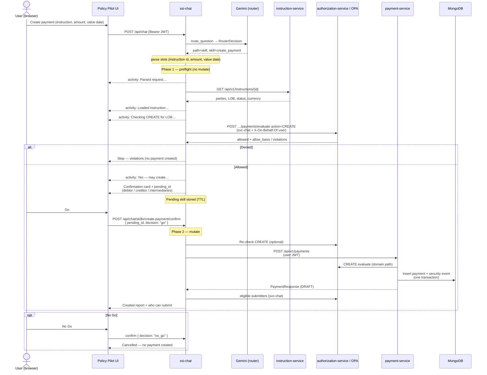

# Create-payment skill

Policy Pilot’s first **mutation skill**: a scripted multi-step flow that creates a draft payment from natural language, only after an OPA preflight and an explicit **Go / No Go** confirmation.

Skills are **not** free-form LLM tool loops. Steps are fixed; authorization always goes through **authorization-service → OPA**, the same path payment-service uses for `CREATE`.

Related: **[Submit-payment skill](submit-payment-skill.md)** (desk submits the DRAFT for funding approval).

| | |
|--|--|
| **Package** | [`ssi-chat/src/chat_application/skills/`](../ssi-chat/src/chat_application/skills/) |
| **Demo users** | `pay-101`, `pay-205` (middle-office `PAYMENT_CREATOR`) |
| **Chat mode** | **Payments** |
| **Tag** | **`skill`** (see [sample questions](sample-questions.md)) |

---

## Example

```text
Can you create a payment for instruction ID 20260705-FICC-I-31?
Value date tomorrow; amount: 12 million USD.
```

Sign in as `pay-205` / `Password1!`, select **Payments**, then send the question.

---

## How intent is identified

**Thumb rule** ([intent determination](intent-determination.md)): natural-language intent uses Gemini structured output (`RouterDecision.path`). Create-payment is selected when `path=skill` and `skill=create_payment`.

| Step | Mechanism |
|------|-----------|
| Intent | Gemini `route_query` → `path=skill` |
| Slot parse | Deterministic parsers for instruction id, amount, value date |
| Execution | Scripted preflight → Go / No Go → payment-service CREATE |

Capability questions like “Can I create a payment?” should route to `path=me`, not this mutation skill.


---

## Sequence (happy path)



---

## Activity steps (what the user sees)

| Step | Activity / UI | Side effect |
|------|---------------|-------------|
| 0. Route | (none for skill) | Gemini `path=skill` |
| 1. Parse slots | Parsed instruction, amount, value date | Deterministic parsers |
| 2. Load instruction | Loading / loaded LOB, status, currency | None |
| 3. Preflight CREATE | Checking roles, groups, covering LOBs, amount club… | Authz evaluate only |
| 4. Explain | **Yes** + humanized allow basis, or **No** + stop | None |
| 5. Confirm | Card: instruction, amount, value date, LOB, debtor/creditor names & accounts, intermediaries · **Go** / **No Go** | Pending skill id |
| 6. Create (Go only) | Creating draft… | `POST /api/v1/payments` → Mongo |
| 7. Submitters | Looking up who can submit… | Authz eligible-submitters |
| 8. Report | Payment id, instruction, amount, LOB, eligible desk submitters | None |

---

## Design rules

| Rule | Meaning |
|------|---------|
| **Scripted pipeline** | Regex detector + fixed steps — not an agent inventing APIs; Gemini router is not the skill classifier |
| **OPA stays normative** | Preflight and create both use payment `CREATE` policy |
| **Explain before confirm** | Stream permission reasoning before any Go button |
| **Confirm before mutate** | No Mongo write until **Go** |
| **Fail closed** | Deny, No Go, expired pending, wrong user, or authz re-check unavailable → no create |
| **Act as logged-in user** | User JWT on instruction GET and payment CREATE; `svc-chat` OBO for evaluate |

Chat does **not** write Mongo directly. On **Go**, payment-service allocates the id, re-evaluates OPA, and inserts the payment version + security event in one transaction (`ssi_cash_activities.payments` + `security_events.payment_service`). Kafka CDC / indexer then update Neo4j as for any other create.

---

## APIs

| Call | When |
|------|------|
| `POST /api/chat` | Phase 1 — detect skill, return activities + `skill_confirmation` |
| `POST /api/chat/skills/create-payment/confirm` | Phase 2 — `{ "pending_id", "decision": "go" \| "no_go" }` |
| `GET /api/v1/instructions/{id}` | Load SSI parties for the card |
| `POST /api/v1/authorization/payments/evaluate` | Dry-run (and optional re-check) `CREATE` |
| `POST /api/v1/payments` | Create DRAFT (user JWT) |
| `POST /api/v1/authorization/payments/eligible-submitters` | Post-create desk submitter list |

---

## Code map

| Module | Role |
|--------|------|
| `skills/detect.py` | Phrase + instruction id + amount + value date (`today` / `tomorrow` / ISO) |
| `skills/create_payment.py` | Phase 1 runner + confirm / Go path |
| `skills/pending_store.py` | In-process TTL pending skills |
| `skills/instruction_client.py` | Instruction GET (user / svc-chat OBO) |
| `skills/payment_client.py` | Payment CREATE |
| `skills/format.py` | Confirmation card + created report |
| `pipeline/orchestrator.py` | Skill short-circuit before me-intents / RAG |
| `static/app.js` | Activity list + Go / No Go card |

Tests: `ssi-chat/tests/test_create_payment_skill.py`.
