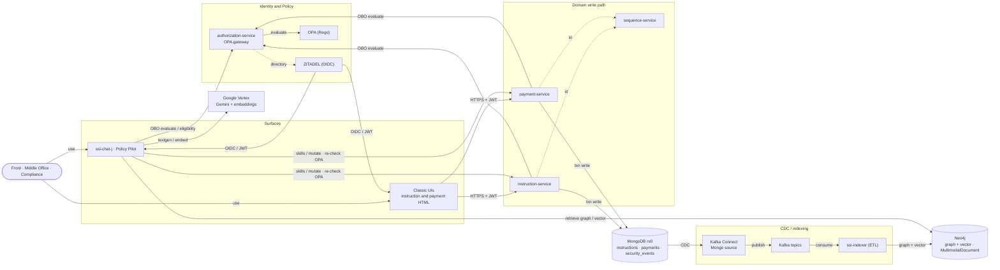
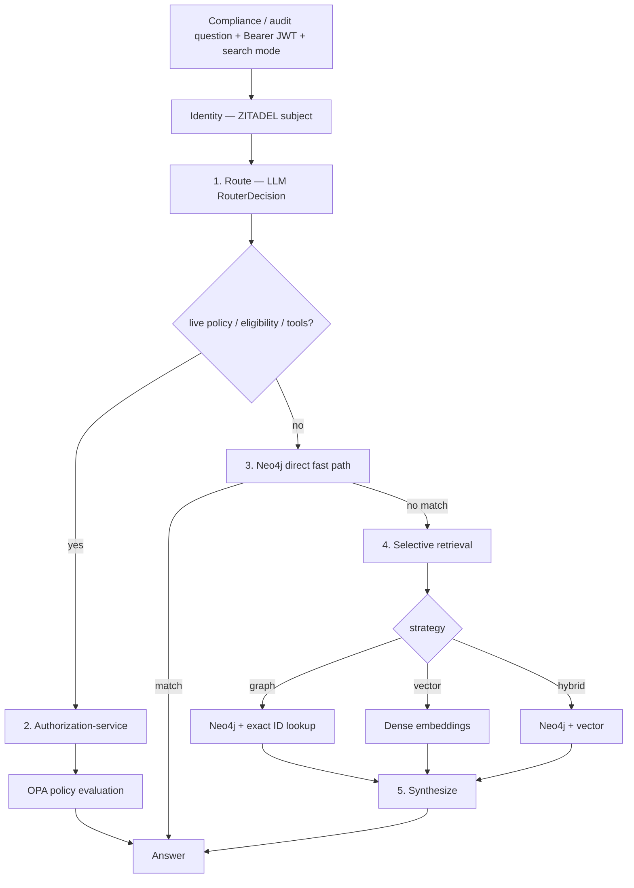
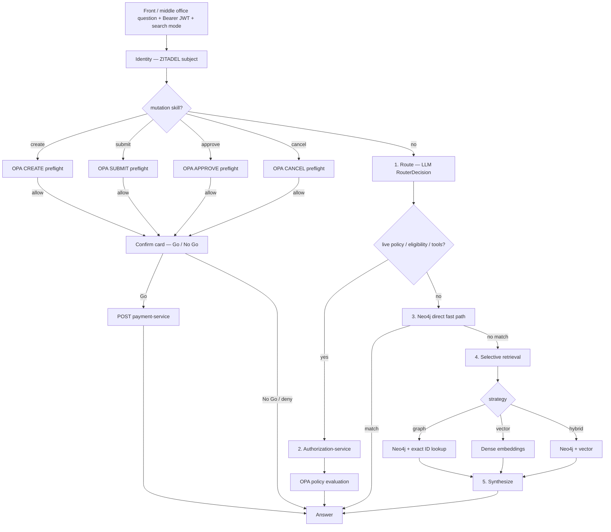

# How Policy Pilot works

Technical reference for the operating stack: integration, data flow, intent routing, graph model, and local run. For the product story — policy, governance, and control — see the **[root README](../README.md)**.

**Principle (product):** AI proposes · Policy decides · Deterministic systems execute · Everything is explainable.

---

## Reference architecture

Component-level dataflow (mutation → evidence → retrieval). Chat-internal Route → Retrieve → Synthesize detail is in the sections below.



Domain services enforce OPA policy and write versioned state **and** a security event to MongoDB in one transaction. Kafka Connect streams inserts; **ssi-indexer** builds a shared Neo4j graph and dense vector index. **ssi-chat-j** (Java / Spring AI) routes natural language through Route → Retrieve → Synthesize. Live policy and eligibility use the same **authorization-service → OPA** path as mutations (logged-in user JWT / ZITADEL session via OBO) — not a parallel unchecked tool layer.

| Topic | Summary |
|-------|---------|
| **[OPA policy controls](opa-controls.md)** | SoD, reporting-line inversion, LOB boundaries, amount clubs |
| **[SoD: Mutual Approval](sod-mutual-approval.md)** | Instruction vs payment: role segregation / FO submit |
| **[Data flow](data-flow.md)** | Mongo transactions → Kafka CDC → ETL → Neo4j → chat |
| **[Intent determination](intent-determination.md)** | Gemini `RouterDecision`, selective retrieval |
| **[Create / submit / approve / cancel payment skills](create-payment-skill.md)** | Scripted capabilities, OPA preflight, Go / No Go |
| **[Indexer Mongo DLQ](../ssi-indexer/src/etl/dlq/README.md)** | DLQ-before-commit, pause-on-failure, integrity banner |
| **[Architecture decisions](architecture-decisions.md)** | Why ZITADEL, OPA, Mongo, Kafka, Neo4j, Vertex |
| **[Architecture review](architecture-review-2026-07-18.md)** | Adversarial review — proposed **9.0 / 10** (pending owner confirm) |
| **[Observability](observability.md)** | OTLP → Prometheus / Loki / Tempo + OpenSLO catalog |
| **[Local development](local-development.md)** | Services, logs, regression, URLs |

---

## Intent determination

**ssi-chat-j** decides what to do with a natural-language question before retrieval and synthesis. Spring AI / Gemini returns a strict `RouterDecision` (structured output) — not fuzzy text classification or regex phrase lists. Open-vocabulary slots (amounts, dates, status, type) come from the LLM; regex is only for stable tokens (ids, explicit clubs). **Skills** are fixed pipelines that reuse authorization-service → OPA, not free-form agent tool loops.

| Layer | Mechanism | Purpose |
|-------|-----------|---------|
| **Route** | Gemini Flash + structured `RouterDecision` | Pick retrieval / skill strategy |
| **Skills** | create / submit / approve / cancel payment | Mutate only after OPA preflight + Go / No Go |
| **Fast paths** | Neo4j direct YAML, live OPA eligibility, me-intents | Skip full RAG when a specialized handler applies |
| **Retrieve** | Graph, vector, or hybrid (selective) | Avoid blind merge of unrelated results |
| **Synthesize** | Deterministic formatters or Gemini | Final answer from retrieved context |

Full specification: **[intent-determination.md](intent-determination.md)**.

### Compliance and audit (read-only)

Compliance analysts investigate policy, eligibility, graph patterns, and event history. They do **not** run mutation skills.



### Front and middle office (payment operations)

Payment creators, desk submitters, and funding approvers use the same route → retrieve → synthesize path for questions, and can run **mutation skills** after OPA preflight and explicit **Go / No Go**.



Implementation: `ChatApiController` → path dispatcher (`ssi-chat-j`). Skills: [create](create-payment-skill.md) · [submit](submit-payment-skill.md) · [approve](approve-payment-skill.md) · [cancel](cancel-payment-skill.md).

---

## Data flow and integration

End-to-end mutation → evidence path: **[data-flow.md](data-flow.md)**.

Summary:

1. Instruction / payment service validates identity, calls **authorization-service** with OBO, evaluates **OPA**, writes version + security event in **one Mongo transaction**.
2. **Kafka Connect** publishes CDC to four topics.
3. **ssi-indexer** consumes and writes Neo4j graph + multimodal vector documents (`owning_lob` densified for chat LOB scope).
4. **ssi-chat-j** retrieves under subject LOB scope (graph / vector / hybrid) or runs a skill / live policy path.

OBO call matrix: **[obo-call-paths.md](obo-call-paths.md)**.

---

## Neo4j graph model

Four ETL pipelines write to the **same Neo4j database**, sharing instruction, payment, user, LOB, and security-event nodes.

| Writer type | Pipelines | Owns |
|-------------|-----------|------|
| **Fact** (state) | `InstructionPipeline`, `PaymentFactPipeline` | Versions, `CURRENT`, lifecycle and structural edges, vector state docs |
| **Audit** (events) | `InstructionSecurityEventPipeline`, `PaymentSecurityEventPipeline` | `SecurityEvent`, `ACTED_AS`, `FOR` → version, vector event docs |

Full specification: **[neo4j-graph-model/README.md](../neo4j-graph-model/README.md)**.

---

## ETL resilience

Indexer failures after retries go to a Mongo **DLQ before** the Kafka offset commits; if quarantine is unavailable, consumers **pause**. Chat shows an integrity banner when lag / pause / DLQ depth warrants it.

Details: **[ssi-indexer DLQ](../ssi-indexer/src/etl/dlq/README.md)**.

---

## Quick start

**Prerequisites:** Docker + Docker Compose; GCP Vertex AI — **[GCP setup](gcp-setup.md)**.

```bash
cp .env.example .env
# Set GCP_SA_KEY_PATH and GOOGLE_APPLICATION_CREDENTIALS

python scripts/vertex_smoke_test.py   # optional but recommended

./scripts/clean-slate.sh

open http://localhost:8091   # harness — policy scenarios
open http://localhost:8096   # Policy Pilot (ssi-chat-j)
```

`clean-slate.sh` wipes volumes, rebuilds, starts infra in order (ZITADEL PAT race), seeds demo users. Domain data stays empty unless `--with-demo-seed`.

| URL | What |
|-----|------|
| http://localhost:8096 | Policy Pilot (`ssi-chat-j`) |
| http://localhost:8091 | Demo harness |
| http://localhost:8090 | Indexer search console |
| http://localhost:8000 | Instruction service |
| http://localhost:8093 | Payment service |
| http://localhost:8094 | Authorization service |
| http://localhost:8095 | Sequence service |
| http://localhost:7474/browser/ | Neo4j Browser (`neo4j` / `devpassword`) |

Demo logins: **[domain-models.md](domain-models.md)**. More ops: **[local-development.md](local-development.md)**.

---

## Repository layout

```
.
├── docker-compose.yml
├── docs/                            # Product and ops guides
├── instruction-service/             # Instruction lifecycle API + UIs
├── payment-service/                 # Payment lifecycle API + UIs
├── authorization-service/           # OPA gateway + directory UI
├── sequence-service/                # Monotonic id allocation
├── shared/                          # authz_client, cypher_builder, telemetry, …
├── kafka-connect/                   # Mongo CDC → Kafka
├── ssi-indexer/                     # Kafka → Neo4j graph + vector index
├── ssi-chat-j/                      # Policy Pilot conversational surface (Java)
├── ssi-demo-harness/                # Scenario harness + seed scripts
├── neo4j-graph-model/               # Graph schema
├── opa-policy-seed/                 # Rego policies
├── observability/                   # Prometheus, Grafana, Loki, Tempo, OpenSLO
└── zitadel-seed/                    # Demo user definitions
```

| Directory | README | Port |
|-----------|--------|------|
| `instruction-service` | [README](../instruction-service/README.md) | 8000 |
| `payment-service` | [README](../payment-service/README.md) | 8093 |
| `authorization-service` | [README](../authorization-service/README.md) | 8094 |
| `sequence-service` | [README](../sequence-service/README.md) | 8095 |
| `ssi-indexer` | [README](../ssi-indexer/README.md) | 8090 |
| `ssi-chat-j` | [README](../ssi-chat-j/README.md) | 8096 |
| `ssi-demo-harness` | [README](../ssi-demo-harness/README.md) | 8091 |
| `neo4j-graph-model` | [README](../neo4j-graph-model/README.md) | — |
| `opa-policy-seed` | [README](../opa-policy-seed/README.md) | — |
| `kafka-connect` | [README](../kafka-connect/README.md) | 8083 |

`ssi-chat/` (Python) and `cypher-builder-svc/` are local-only archives (gitignored). Do not re-add them to Compose or CI.
