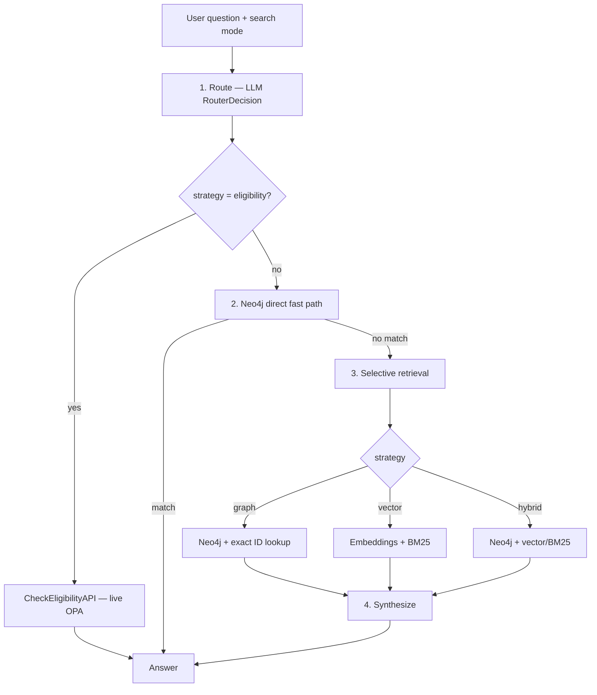

# Intent Determination in Policy Pilot

This document describes how **ssi-chat** decides what to do with a natural-language question before retrieval and answer synthesis. The design replaces brittle regex phrase lists with **LLM semantic routing**, then executes a **deterministic pipeline** (route → retrieve → synthesize).

## Summary

| Layer | Mechanism | Purpose |
|-------|-----------|---------|
| **Route** | Gemini Flash + structured `RouterDecision` JSON | Pick retrieval strategy from question intent |
| **Fast paths** | Neo4j direct YAML intents, live OPA eligibility API | Skip full RAG when a specialized handler applies |
| **Retrieve** | Selective backends (graph, vector, or both) | Avoid merging unrelated search results |
| **Synthesize** | Deterministic formatters or Gemini | Produce the final answer from retrieved context |

We do **not** use fuzzy ML text classification for routing. Intent is expressed as a strict Pydantic schema returned by Gemini structured output.

## End-to-end flow



Implementation entry point: `RagService.ask()` delegates to `RagPipelineOrchestrator` in `ssi-chat/src/chat_application/pipeline/orchestrator.py`.

## Step 1 — Semantic routing (LLM)

Every question is sent to **Gemini Flash** with a fixed system prompt and **structured JSON output** validated against `RouterDecision`:

```python
class RouterDecision(BaseModel):
    strategy: Literal["eligibility", "graph", "vector", "hybrid"]
    eligibility_target: Literal["payment", "instruction"] | None
    reasoning: str
```

| Field | Meaning |
|-------|---------|
| `strategy` | Which retrieval backends to run (see below) |
| `eligibility_target` | For eligibility questions: payment vs instruction |
| `reasoning` | Short audit trail for logs and debugging |

**Conceptual tools** the router maps to (not a free-form agent loop — one decision, then deterministic execution):

| Tool | Strategy | Example questions |
|------|----------|-------------------|
| **CheckEligibilityAPI** | `eligibility` | Who can approve / authorize / green-light payment `20260705-FX-P-534`? |
| **SearchGraph** | `graph` | How many alerts today? Who approved instruction X? List payments for Y. |
| **SearchPolicyDocuments** | `vector` | Why was this payment denied? Explain the policy for self-approval. |
| **Hybrid** | `hybrid` | Questions that genuinely need structured facts **and** semantic policy text |

### Eligibility vs audit (critical distinction)

The router must separate **forward-looking** from **past-tense** approval language:

| Intent | Wording | Strategy |
|--------|---------|----------|
| **Eligibility** (who *can*) | approve, authorize, green-light, sign off, release, eligible, allowed | `eligibility` → OPA API |
| **Audit** (who *did*) | who approved, when was it approved, who signed off yesterday | `graph` → Neo4j |

Synonyms like *green-light*, *sign off*, and *authorize* are handled by the LLM router semantically — they are **not** maintained as a growing regex phrase list.

### Heuristic fallback

If the LLM router fails (network, schema error, etc.), `route_question()` falls back to `heuristic_router_decision()` in `pipeline/heuristic_strategy.py`. This uses structural detectors from `cypher_builder` (counts, aggregates, rankings) plus a minimal eligibility pattern. Fallback is for **resilience**, not primary routing.

### Resolving payment vs instruction

For eligibility, target resolution order:

1. LLM `eligibility_target` when present
2. Sequence ID heuristics: `-P-` → payment, `-I-` → instruction
3. Keywords (`payment`, `instruction`, `ssi`) and UI search mode

## Step 2 — Neo4j direct fast path (unchanged)

Before full RAG, **YAML-defined direct intents** in `neo4j_direct.yaml` still match high-confidence patterns and return formatted answers with zero vector search. This path is preserved for latency, cost, and regression stability.

Observability path: `neo4j_direct` → `retrieval_strategy: deterministic`.

## Step 3 — Selective retrieval (no blind merge)

Previously, the fallback path always ran **vector + BM25 + graph in parallel** and merged everything with RRF. That polluted structured answers with fuzzy semantic hits.

Now `execute_selective_retrieval()` runs only what the router chose:

| Strategy | Neo4j / exact lookup | Vector + BM25 |
|----------|----------------------|---------------|
| `graph` | Yes | No |
| `vector` | No | Yes |
| `hybrid` | Yes | Yes |
| `eligibility` | N/A (handled in step 1) | N/A |

Graph retrieval still uses the existing stack: planned Cypher from `cypher_builder`, LLM `GraphQueryPlan` extraction when needed, and exact UUID/sequence ID lookups.

## Step 4 — Synthesize

After retrieval, the orchestrator applies the same synthesis rules as before:

- **Deterministic formatters** for counts, rankings, payment lists, alert tables, etc.
- **Gemini WHY-only** rewrite for approval audit questions
- **Full Gemini synthesis** when no formatter applies

## What we deliberately did *not* do

| Anti-pattern | Our approach |
|--------------|--------------|
| Regex phrase list as primary router | LLM `RouterDecision` with structured output |
| Unconstrained multi-step agent on every turn | Single route call → deterministic execution |
| Always parallel RRF merge | Strategy-driven selective retrieval |
| Replace Neo4j direct YAML intents | Keep them as a fast path after routing |

Regex and YAML remain appropriate for **parsers** (IDs, status tokens) and **high-confidence direct intents**, not for open-ended NLU.

## Observability

Each answer records routing metadata (`AnswerRoutingInfo`):

| Field | Values |
|-------|--------|
| `path` | `eligibility`, `neo4j_direct`, `full_rag` |
| `retrieval_strategy` | `eligibility`, `deterministic`, `graph`, `vector` (derived post-hoc) |
| `cypher_provenance` | `predefined_yaml`, `predefined_planned`, `llm_graph_plan`, `none` |
| `answer_synthesis` | `eligibility_api`, `formatter`, `gemini_why_only`, `gemini_full` |

Structured log line: `chat.answer.completed strategy=… path=… cypher=… synthesis=…`

## Code map

| File | Role |
|------|------|
| `ssi-chat/src/chat_application/pipeline/orchestrator.py` | Route → retrieve → synthesize orchestration |
| `ssi-chat/src/chat_application/pipeline/route.py` | LLM route + heuristic fallback |
| `ssi-chat/src/chat_application/pipeline/models.py` | `RouterDecision` schema |
| `ssi-chat/src/chat_application/pipeline/prompts.py` | Router system prompt |
| `ssi-chat/src/chat_application/pipeline/heuristic_strategy.py` | Fallback routing heuristics |
| `ssi-chat/src/chat_application/pipeline/retrieve.py` | Selective retrieval execution |
| `ssi-chat/src/chat_application/ml_client.py` | `route_query()` — Gemini structured output |
| `shared/vertex_client/src/vertex_client/generation.py` | `response_schema` support for Gemini |
| `ssi-chat/src/chat_application/neo4j_intents.py` | Direct Neo4j intent matching |
| `shared/cypher_builder/` | Graph plan extraction and planned Cypher |

## Reviewer talking points

1. **Deterministic intent routing** uses Gemini with a strict Pydantic `RouterDecision` schema — not fuzzy text classification.
2. **Structured financial queries** (counts, totals, lists) go to Neo4j only; vector search does not run unless the router chooses `vector` or `hybrid`.
3. **Eligibility questions** call live OPA through the authorization service; synonyms like *green-light* are understood by the LLM router.
4. **Audit questions** (*who approved*) route to graph retrieval, not eligibility.
5. The pipeline is **testable**: unit tests mock `route_query`; regression cases assert `retrieval_strategy` and answer quality.

## Related documentation

- `ssi-chat/README.md` — chat API, routing observability, feedback metrics
- Regression bank: `ssi-chat/regression/questions.yaml` — cases tagged with expected `retrieval` strategy
