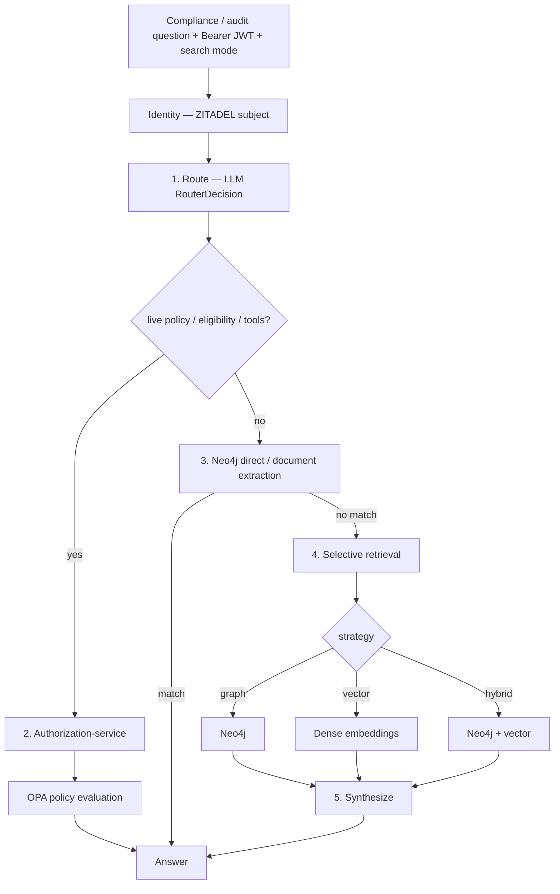
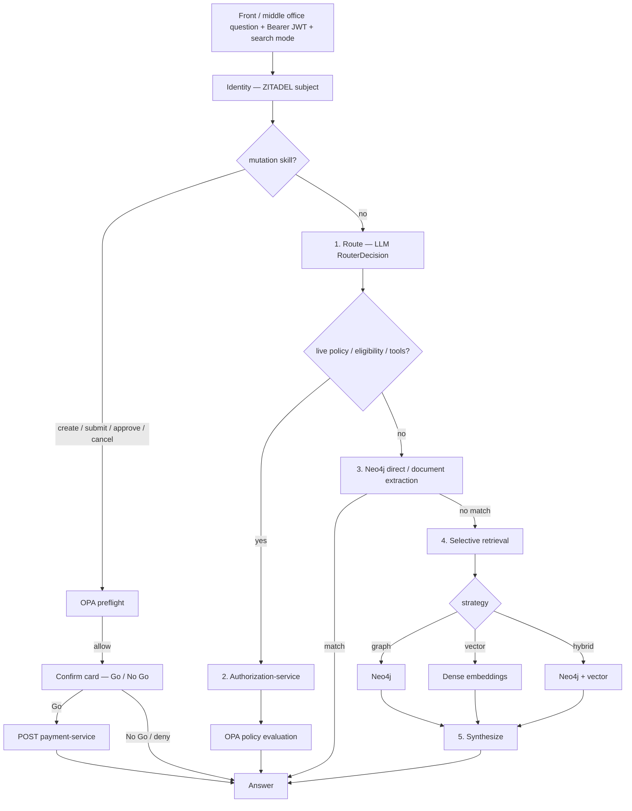

# Intent Determination in Policy Pilot

This document describes how **ssi-chat-j** decides what to do with a natural-language question before retrieval and answer synthesis. The design replaces brittle regex phrase lists with **LLM semantic routing** (Spring AI structured `RouterDecision`), then executes a **deterministic pipeline** (route → retrieve → synthesize).

The former Python `ssi-chat` router is retired. Cursor rule: [`.cursor/rules/ssi-chat-j-intent-routing.mdc`](../.cursor/rules/ssi-chat-j-intent-routing.mdc).

## Summary

| Layer | Mechanism | Purpose |
|-------|-----------|---------|
| **Route** | Gemini Flash + structured `RouterDecision` JSON (path + slots) | Pick intent / backends from question meaning |
| **Path-owned handlers** | skill / me / policy tools / `neo4j_direct` / `document_extraction` / investigate | One handler per path |
| **Retrieve** | Selective backends (graph, vector, or both) on investigate only | Avoid merging unrelated search results |
| **Synthesize** | Deterministic formatters (Thymeleaf) or Gemini | Produce the final answer from retrieved context |

We do **not** use fuzzy ML text classification for routing. Intent is a strict schema returned by Spring AI structured output.

## Thumb rule

**Natural-language intent → Spring AI structured `RouterDecision`. Not regex phrase lists. Not fuzzy classification.**

People can express the same intent with many wordings. Regex and keyword heuristics do not scale for open-ended NLU. After the route decision, execution stays deterministic (OPA, skill steps, Neo4j, formatters).

| Allowed | Not for primary intent |
|---------|------------------------|
| Extending `RouterDecision` (path, skill, me_*, policy_*, document_extraction / neo4j_direct slots) + router prompt | Growing `re.compile(...)` / phrase lists to guess what the user meant |
| Regex / extractors for **stable tokens** once intent is known (sequence ids, explicit club names, literal enum tokens like `APPROVED`) | Fuzzy keyword scoring, synonym/lemma tables, or typo lists as the classifier |
| Documented post-route **clamps** in `routing.RouteClamps` (slot/token repair) | Ad-hoc handler force-lanes or free-text amount/date scrapers |

### Open-vocabulary slots (status, type, amounts, skill dates, …)

**Map paraphrase → domain enum / number with LLM structured slots — not regex or lemma tables.**

Examples: `paused` / `on hold` → `entityStatus=SUSPENDED`; `a billion` → `directoryAmount=1e9`; `12 million` → `skillAmount=1.2e7`. Prefer growing `RouterDecision` fields and the router system prompt. Do **not** maintain synonym lists in application code.

Skill slots (`skillInstructionId`, `skillPaymentId`, `skillAmount`, `skillValueDate`) come from the model. Amount and value date are **not** scraped from free text. Sequence ids prefer LLM slots, with a documented stable-token fallback (`InstructionIdParser` / `PaymentIdParser`).

`RouterDecision.path` is the primary dispatch key. **Path is law:** `ChatPathDispatcher` dispatches on `path` only. After the LLM routes, **documented post-route clamps** may rewrite `path` before handlers:

| Clamp helper | Typical rewrites |
|--------------|------------------|
| `routing.RouteClamps` | Entity API shapes → `document_extraction`; person query on me/eligibility → `person_permissions`; open narrative → `vector` (as documented in `ssi-chat-j/AGENTS.md`) |

## End-to-end flow

The logged-in user's **JWT / ZITADEL session** is resolved to a subject. Live policy and eligibility answers go through **authorization-service → OPA**.

### Compliance and audit (read-only)

### Front and middle office (payment operations)

Implementation entry point: `ChatApiController` → orchestrator / `ChatPathDispatcher` in `ssi-chat-j`. Skills: [create-payment](create-payment-skill.md), [submit-payment](submit-payment-skill.md), [approve-payment](approve-payment-skill.md), [cancel-payment](cancel-payment-skill.md).

## Step 1 — Semantic routing (LLM)

Every question is sent to **Gemini Flash** via Spring AI with:

1. A fixed system prompt (`RouterPrompts.ROUTER_SYSTEM`)
2. The user question (plus UI search mode)
3. **Structured JSON output** constrained by the `RouterDecision` schema

There is **no free-form agent loop** — one route call, then deterministic handlers. Java chat does **not** use a heuristic keyword router as primary (or failover) NLU.

### Paths and strategies

Typical `path` values include: `skill`, `me`, `policy_summary`, `policy_directory`, `person_permissions`, `eligibility`, `document_extraction`, `neo4j_direct`, `graph`, `vector`, `hybrid`. Tool-style paths do not use selective retrieval merge.

Illustrative fields (see `RouterDecision.java` for the full schema):

| Field | Meaning |
|-------|---------|
| `path` | Primary intent dispatch |
| `skill` / `skillInstructionId` / `skillPaymentId` / `skillAmount` / `skillValueDate` | Payment mutation skill + slots |
| `eligibilityTarget` / `eligibilityAction` | Live OPA eligibility |
| `extractionFacet` / `entityStatus` / `instructionType` | Document extraction / inventory |
| `directoryAmount` / `directoryAmountStrict` / covering LOB | Policy directory |
| `meKind` / `meAction` / `meEntityType` | Me-centric intents |
| `graphIntent` / `graphTimeWindow` / … | Neo4j direct plans |
| `personQuery` | Person permissions |
| `reasoning` | Short audit trail for logs |

### Eligibility vs audit (critical distinction)

| Intent | Wording | Path |
|--------|---------|------|
| **Eligibility** (who *can*) | approve, authorize, green-light, sign off, eligible | `eligibility` → OPA API |
| **Audit** (who *did*) | who approved, when was it approved | `neo4j_direct` / graph → Neo4j (or document_extraction for some facets) |

Synonyms are handled by the LLM router — **not** a growing regex phrase list.

### Resolving payment vs instruction

For eligibility, target resolution prefers LLM `eligibilityTarget`, then sequence-id shape (`-P-` / `-I-`), then UI mode.

## Step 2 — Neo4j direct / document extraction

High-confidence shapes run without full RAG:

- **`neo4j_direct`** — in-process Java Cypher planner + Thymeleaf formatters
- **`document_extraction`** — instruction/payment domain GET (OBO) for show-by-id, status, creator, inventory lists

Observability may label answers `deterministic` / API facets accordingly.

## Step 3 — Selective retrieval

When the router chooses investigate strategies, only the chosen backends run:

| Strategy | Neo4j | Dense vector |
|----------|-------|--------------|
| `graph` | Yes | No |
| `vector` | No | Yes |
| `hybrid` | Yes | Yes |

## Step 4 — Synthesize

- **Deterministic formatters** (Thymeleaf) for counts, rankings, eligibility cards, skill confirmations, etc.
- **Gemini** rewrite / full synthesis when no formatter applies

## What we deliberately did *not* do

| Anti-pattern | Our approach |
|--------------|--------------|
| Regex / fuzzy phrase list as primary NLU | LLM structured `RouterDecision` |
| Unconstrained multi-step agent on every turn | Single route call → deterministic execution |
| Always parallel RRF merge | Strategy-driven selective retrieval |
| Free-text amount/date scrapers for skills | LLM `skillAmount` / `skillValueDate` slots |
| HTTP cypher-builder sidecar for chat | In-process Java planner |

**Thumb rule:** open-ended intent is semantic (Gemini). Regex remains appropriate for **stable tokens** (ids, explicit clubs) after path is known — not for guessing which skill or me-intent the user meant.

## Observability

Each answer records routing metadata (path, retrieval strategy, cypher provenance, answer synthesis). Structured log / Micrometer SLIs mirror the chat product surface (`GET /api/routing-stats`, feedback endpoints).

## Code map

| File / package | Role |
|----------------|------|
| `ssi-chat-j/.../api/ChatApiController.java` | HTTP chat entry |
| `ssi-chat-j/.../pipeline/RouterDecision.java` | Structured route schema |
| `ssi-chat-j/.../routing/RouteClamps.java` | Documented post-route path rewrites |
| `ssi-chat-j/.../cypher/` | In-process Neo4j planner |
| `ssi-chat-j/.../skill/SkillSlots.java` | Skill slot resolution from `RouterDecision` |
| `ssi-chat-j/.../skill/*PaymentSkill.java` | Scripted mutation skills |
| `shared/cypher_builder/` | Indexer Search Console planner only |

## Golden eval

HTTP black-box bank: [`ssi-chat-j/eval/eligibility_golden.yaml`](../ssi-chat-j/eval/eligibility_golden.yaml) (**98** cases). Prove: `./ssi-chat-j/scripts/prove-eligibility.sh`.

## Reviewer talking points

1. **Deterministic intent routing** uses Spring AI with a strict `RouterDecision` schema — not fuzzy text classification.
2. **Open-vocabulary slots** (status, amounts, skill dates) are LLM fields — not synonym tables.
3. **Eligibility** calls live OPA; **audit** (*who approved*) uses graph / document paths.
4. **Skills** are scripted pipelines with OPA preflight + Go / No Go — not free-form tool loops.
5. The pipeline is **testable**: unit tests mock the router; prove goldens assert path/synthesis/answer shape.

## Related documentation

- [`ssi-chat-j/README.md`](../ssi-chat-j/README.md) — chat API surface
- [`ssi-chat-j/eval/README.md`](../ssi-chat-j/eval/README.md) — golden bank families
- [`ssi-chat-j/AGENTS.md`](../ssi-chat-j/AGENTS.md) — agent thumb rules
