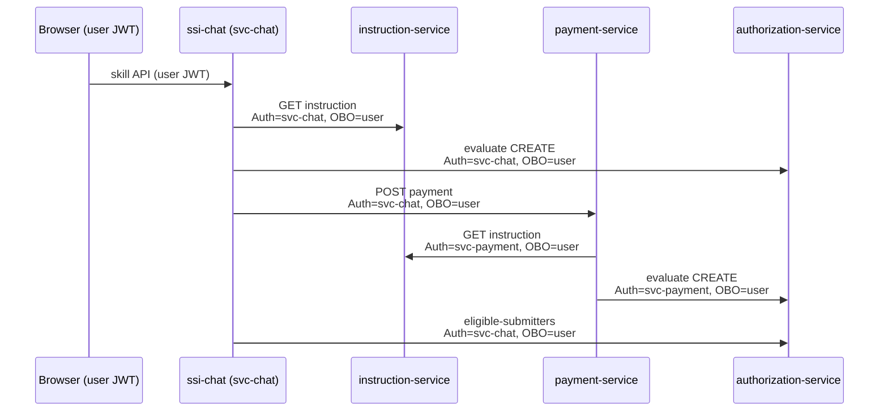
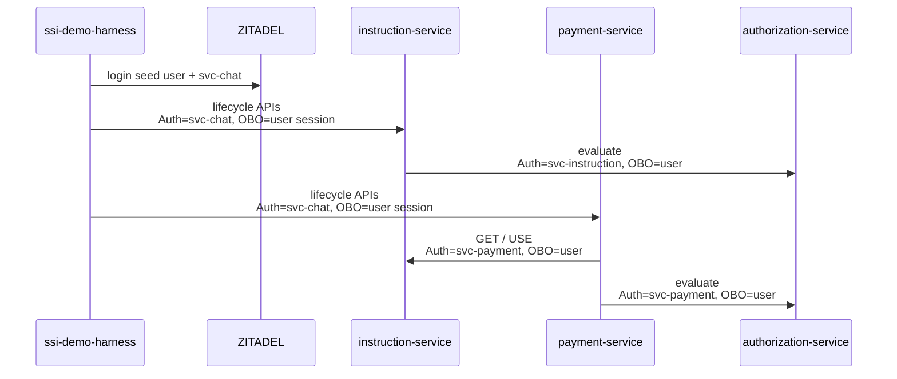

# OBO call paths

Uniform contract on **payment-service**, **instruction-service**, and **authorization-service** `/api/v1` APIs:

| Header | Value |
|--------|--------|
| `Authorization` | Service JWT (`svc-*`) |
| `X-On-Behalf-Of` | User JWT |
| `X-Session-Id` | Service session (optional) |
| `X-On-Behalf-Of-Session-Id` | User session (optional) |

Missing `X-On-Behalf-Of` → **403**.

| Service account | Used by |
|-----------------|---------|
| `svc-chat` | ssi-chat and ssi-demo-harness → domain / authz |
| `svc-payment` | payment-service → instruction / authz |
| `svc-instruction` | instruction-service → authz |

Admin `/api/ui/*` is an exception: platform-admin JWT in `Authorization` only (no OBO).

**Assumption:** end users never call payment / instruction / authz `/api/v1` directly. Only chat, harness, and service-to-service callers use those APIs (always with OBO). API smoke and other tests must use the same pattern.

---

## 1. Chat API → backends

The browser signs into chat with a **human JWT**. Chat never forwards that JWT as `Authorization` to domain services — it always uses `svc-chat` + OBO.

### Clients

| Client | Role |
|--------|------|
| `PaymentClient` / `InstructionClient` | Mutations and GETs via svc-chat + OBO |
| `AuthzOboClient` | Preflight evaluate, eligible submitters/approvers |
| `EligibilityClient` | Compliance Q&A (same OBO headers) |

### Skill example: create-payment

Same OBO pattern for submit / approve / cancel.

| Hop | From | To | Authorization | X-On-Behalf-Of |
|-----|------|-----|---------------|----------------|
| 0 | Browser | ssi-chat | user JWT | — |
| 1a | ssi-chat | instruction-service | svc-chat | user JWT |
| 1b | ssi-chat | authorization-service | svc-chat | user JWT |
| 2 | ssi-chat | payment-service | svc-chat | user JWT |
| 2→ | payment-service | instruction-service | svc-payment | user JWT (forwarded) |
| 2→ | payment-service | authorization-service | svc-payment | user JWT (forwarded) |
| 3 | ssi-chat | authorization-service | svc-chat | user JWT |

**Hop meaning**

| Hop | Meaning |
|-----|---------|
| 1a | Load instruction for slots / LOB |
| 1b | Preflight CREATE evaluate |
| 2 | POST payment (draft) |
| 2→ | Payment loads instruction + evaluates CREATE at authz |
| 3 | Eligible submitters list |

### Authz inline subject

When payment/instruction also send a body `subject`, authorization-service still derives identity from OBO and returns **403** if identity fields do not match. OPA always evaluates the OBO-derived subject.

---

## 2. Harness → backends

Harness logs in demo users, then wraps each domain call with `svc-chat` + that user session as OBO via `obo_headers()` in `ssi-demo-harness`.

### Seed / scenario actions

| Hop | From | To | Authorization | X-On-Behalf-Of |
|-----|------|-----|---------------|----------------|
| 0 | Harness UI/CLI | ssi-demo-harness | operator / local | — |
| login | harness | ZITADEL | service PAT | creates user session |
| 1 | harness | instruction-service | svc-chat | seeded user session |
| 1→ | instruction-service | authorization-service | svc-instruction | user JWT (forwarded) |
| 2 | harness | payment-service | svc-chat | seeded user session |
| 2→ | payment-service | instruction-service | svc-payment | user JWT (forwarded) |
| 2→ | payment-service | authorization-service | svc-payment | user JWT (forwarded) |
| 3 | harness | authorization-service | svc-chat | user session |

Hop 3 is used for calls such as payment-amount-limits (club ceilings). Most seed traffic is hops 1–2.

---

## 3. Nested OBO (domain → domain)

Payment create in detail:

1. **Chat/harness → payment:** `Authorization: svc-chat`, `X-On-Behalf-Of: user`
2. **Payment → instruction:** `Authorization: svc-payment`, `X-On-Behalf-Of: user` (same user token)
3. **Payment → authz:** `Authorization: svc-payment`, `X-On-Behalf-Of: user`, optional matching body `subject`

OPA subject = OBO user + `delegated_by=svc-payment` (and service roles).

**Invariant:** on every `/api/v1` hop, `Authorization` is a service account and `X-On-Behalf-Of` is the human. Nested calls re-stamp `Authorization` with the calling service (`svc-payment` / `svc-instruction`) but keep the same user OBO.

---

## Exceptions

| Surface | Auth |
|---------|------|
| `/health` | none |
| `/api/auth/login` | none (issues admin/user session) |
| Static `/ui` | none |
| `/api/ui/*` | platform-admin JWT in `Authorization` only (not OBO) |
