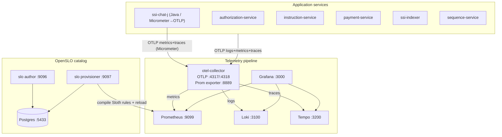

# Observability mesh

Policy Pilot's observability is modeled on [sanjuthomas/observability-mesh-demo](https://github.com/sanjuthomas/observability-mesh-demo): an OpenTelemetry Collector fans OTLP out to a Grafana-centric backend, and an **OpenSLO catalog** compiles SLO documents into Sloth recording rules that Prometheus evaluates.

The reference is a metrics + SLO stack for a single petstore service. We extend it to a multi-service security/payments RAG platform: **logs go to Loki** (replacing the old OpenSearch pipeline), **traces go to Tempo**, and the SLOs are domain SLIs (chat, authorization, skills, pipeline) rather than generic HTTP CRUD.

## Architecture



**Three signals, one collector**

| Signal | Collector pipeline | Backend | Grafana datasource |
|--------|--------------------|---------|--------------------|
| Metrics | `otlp → batch → prometheus (:8889)` | Prometheus scrapes `:8889` | `Prometheus` |
| Logs | `otlp → batch → otlphttp/loki` | Loki OTLP ingest (`/otlp`) | `Loki` |
| Traces | `otlp → batch → otlp/tempo` | Tempo OTLP (`:4317`) | `Tempo` |

The `prometheus` exporter runs with `add_metric_suffixes: false` and `resource_to_telemetry_conversion: true`, so OTLP metrics keep predictable names (`http_server_request_duration_bucket`, `chat_answer_count`) and carry a `service_name` label lifted from the OTel resource.

**ssi-chat-j** emits chat SLI instrument names via **Micrometer** (`micrometer-registry-otlp`, Micrometer Tracing → OTel). It does **not** expose a Prometheus scrape endpoint; series land under `service.name=ssi-chat-j`. OpenSLO seed docs may still label the service `ssi-chat` in PromQL — treat that as the chat product surface (`ssi-chat-j` metrics) until the catalog is renamed.

## Services & ports

| Service | Host port | Purpose |
|---------|-----------|---------|
| OTel Collector (OTLP) | 4317 gRPC / 4318 HTTP | Signal ingest from apps |
| OTel Collector (Prom) | [8889/metrics](http://localhost:8889/metrics) | Re-exported metrics for Prometheus |
| Prometheus | [9099](http://localhost:9099) | TSDB, targets, Sloth rules |
| Grafana | [3000](http://localhost:3000) | Dashboards (`admin`/`admin`) |
| Loki | 3100 | Log store (OTLP-native) |
| Tempo | 3200 | Trace store |
| SLO author | [9096/ui](http://localhost:9096/ui/) | Author / browse OpenSLO docs |
| SLO provisioner | [9097/ui](http://localhost:9097/ui/) | Provision status + generated rules |
| Postgres (catalog) | 5433 | OpenSLO document store |

> Prometheus is on host **9099** (not the reference's 9092) because Kafka already binds 9092.

## Dashboards

Grafana folder **Policy Pilot** (anonymous viewer enabled):

| Dashboard | UID | What it shows |
|-----------|-----|----------------|
| [SLO Catalog](http://localhost:3000/d/policy-pilot-slo-catalog) | `policy-pilot-slo-catalog` | All defined SLOs: fleet budget/burn overview + per-SLO objective, remaining budget, burn, and SLI error ratios |
| [SLO Overview](http://localhost:3000/d/policy-pilot-slo-overview) | `policy-pilot-slo-overview` | Compact Sloth SLI error ratio, burn rate, 30-day budget remaining |
| [HTTP SLIs](http://localhost:3000/d/policy-pilot-http-slis) | `policy-pilot-http-slis` | Per-service request rate, success ratio, p95 latency, 5xx |
| [Domain SLIs](http://localhost:3000/d/policy-pilot-domain) | `policy-pilot-domain` | Chat route mix + latency, **requested vs executed path** (honored / override rate + pairs), feedback non-downvote rate, OPA decisions/deny rate/latency, skill funnel, indexer throughput + DLQ |

## SLOs

Seven OpenSLO documents are seeded (`observability/slo-catalog/seed-slos.sql`) and auto-provisioned. All use a **30-day rolling** window with **Occurrences** budgeting.

| SLO | Service | Target | Good / total (PromQL idea) |
|-----|---------|--------|----------------------------|
| `chat-answer-success-30d` | ssi-chat-j (catalog may say `ssi-chat`) | 99.5% | non-5xx `/api/chat` / all `/api/chat` |
| `chat-answer-latency-5s-30d` | ssi-chat-j | 95% | `/api/chat` histogram `le="5000"` / total |
| `chat-answer-non-downvote-30d` | ssi-chat-j | 98% | (`chat_answer_count` - downvotes) / `chat_answer_count` |
| `authz-evaluate-latency-250ms-30d` | authorization-service | 99% | `authz_evaluate_duration` `le="250"` / total |
| `skill-execution-success-30d` | ssi-chat-j | 99% | `chat_skill_outcome_count{status!="error"}` / all |
| `platform-http-success-30d` | policy-pilot | 99.9% | non-5xx / all requests, every service |
| `pipeline-consumer-success-30d` | ssi-indexer | 99.9% | `etl_consumer_processed` / (processed + (`etl_consumer_failed` or 0)) |

Provisioned Sloth rules land in the `prometheus-sloth-rules` volume mounted at `/etc/prometheus/rules-sloth`. Useful recorded series:

| Metric | Role |
|--------|------|
| `slo:sli_error:ratio_rate5m` | Short-window SLI error ratio (by `sloth_id`) |
| `slo:current_burn_rate:ratio` | Current burn vs budget |
| `slo:period_error_budget_remaining:ratio` | Remaining 30-day budget |

> SLI ratios read `NaN` on an idle stack (0/0 over the 5m window). Generate traffic and wait one or two evaluation intervals for real values.

### Why deny rate is not an error-budget SLO

OPA **denies are correct behavior**, not failures — so the authorization SLO tracks *evaluate latency*, and the deny rate is surfaced as a dashboard panel (`authz_evaluate_count{authz_decision="deny"}`), not an error budget. Likewise skill **No Go / denied / wrong_status** outcomes are healthy; only system errors (`*_error`) burn the skill-success budget.

### Why no-vote counts as good feedback

The primary answer-quality feedback SLO is **non-downvote rate**, not upvote rate:

```promql
good  = chat answers - explicit downvotes
total = chat answers
```

Users tend to stay silent when an answer is acceptable and vote when something is wrong. Treating no-vote as bad would turn low engagement into an artificial outage; treating no-vote as good burns budget only on explicit dissatisfaction. The dashboard still shows diagnostic panels for **upvote share among voters** and **vote / no-vote mix**, but those are not error-budget SLOs.

## Custom SLI metrics

Most SLIs are derived from the shared HTTP histogram (`http.server.request.duration` in `shared/telemetry`) and existing chat/indexer counters. Two domain metrics were added:

- **`authz.evaluate.count` / `authz.evaluate.duration`** — emitted from `OpaClient._evaluate` (`authorization-service/src/authz/metrics.py`) with an `authz.decision` (`allow`/`deny`) and `authz.package` attribute. Powers the deny-rate panel and the evaluate-latency SLO.
- **`chat.skill.outcome.count`** — emitted for every `path=skill` response in `ssi-chat-j` (Micrometer). Intent ids like `skill.<name>.<outcome>` feed `chat.skill` / `chat.skill.outcome` / `chat.skill.status` (`error` only for `*_error` outcomes). Powers the skill funnel and the skill-success SLO.
- **`chat.feedback.count`** — thumbs-up/down feedback counter tagged by `chat.feedback_rating`. Downvotes burn the non-downvote SLO; upvotes and no-votes are good outcomes. No-vote is approximated in Prometheus as `chat_answer_count - chat_feedback_count`.
- **`chat.routing.path_decision.count`** — every completed answer tagged with requested vs executed path (and override when clamps rewrite). Powers the **Routing — requested vs executed** panels on [Domain SLIs](http://localhost:3000/d/policy-pilot-domain).

## Kafka lag (follow-up)

`ssi-indexer` already computes consumer lag and exposes it at `/api/index-integrity` (`kafka_lag_total`, per-consumer breakdown) for the integrity banner. Promoting that to an OTel observable gauge (e.g. `etl.consumer.lag`) would let Prometheus/Grafana chart lag directly and back a freshness SLO; today the pipeline SLO uses the processed-vs-failed ratio instead.

## Troubleshooting

| Symptom | What to check |
|---------|----------------|
| Collector target down | `curl http://localhost:8889/metrics`; `docker compose logs otel-collector` |
| Empty SLO gauges (`NaN`) | Idle stack — generate traffic, wait 1–2 evaluation intervals |
| No Sloth rules in Prometheus | `docker compose exec prometheus ls /etc/prometheus/rules-sloth`; check `slo-catalog` logs and the reload URL |
| Prometheus port conflict | Host port is **9099** (Kafka owns 9092) |
| Apple Silicon / arch pull error for catalog | Use `sanjuthomas/observability-mesh-slo-catalog:latest` (multi-arch amd64+arm64); avoid pinning the amd64-only `0.1.1` tag |
| No logs in Loki | `curl "http://localhost:3100/loki/api/v1/labels"`; check the `otlphttp/loki` exporter in the collector |
