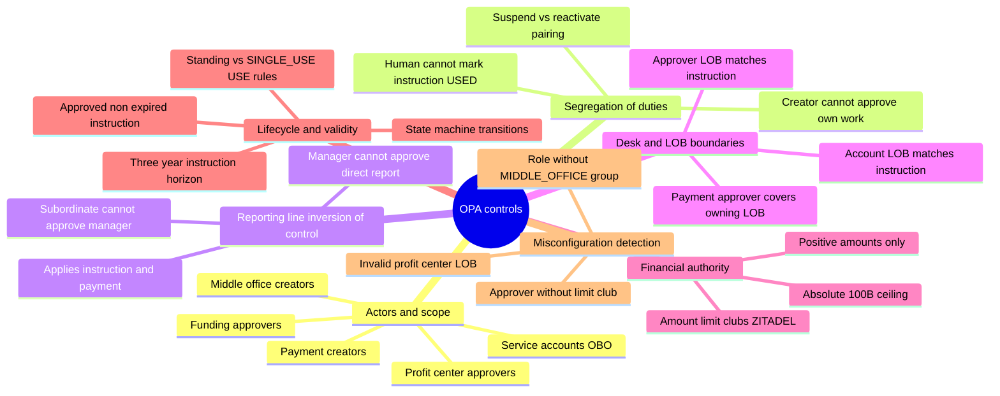
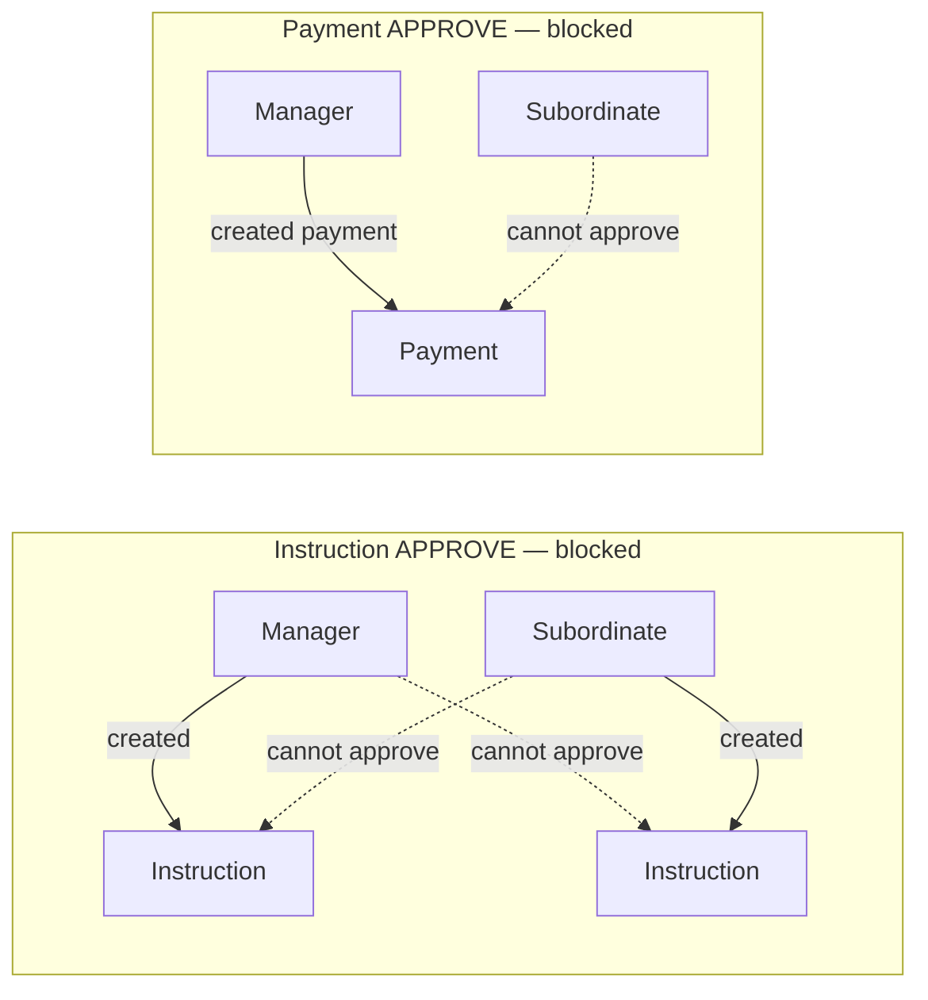
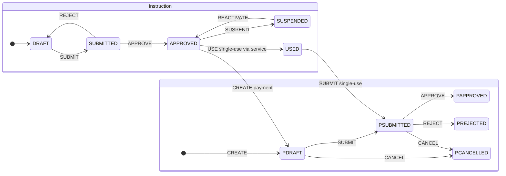

# OPA policy controls

Policy Pilot’s authorization rules are expressed in **Rego** under [`opa-policy-seed/policies/`](../opa-policy-seed/policies/). They mirror controls found in large-bank SSI and cash-management operations: **segregation of duties**, **inversion of control** on reporting lines, **desk / LOB boundaries**, **delegated financial authority**, and **immutable audit** of every allow and deny.

At runtime only **authorization-service** calls OPA. Domain services receive allow/deny plus named **violation codes** and **allow_basis** reasons that flow into Mongo security events → Kafka → Neo4j for **Who / When / Why** investigation in chat.

Technical layout and curl examples: **[opa-policy-seed/README.md](../opa-policy-seed/README.md)**.

---

## Control map

---

## Design principles

| Principle | What it means in this demo | Where enforced |
|-----------|----------------------------|----------------|
| **Four-eyes** | Creator and approver must be different people on instructions and payments | `creator_is_not_approver`, `payment_creator_is_not_approver` |
| **Inversion of control** | Approval authority must not flow *up* or *down* the reporting line in ways that create coercion or undue influence | Instruction: supervisor ↔ subordinate blocks; Payment: subordinate cannot approve manager’s payment |
| **Desk integrity** | Profit-center approvers act only on their LOB; middle-office funding approvers must **cover** the instruction’s owning LOB | `same_lob_as_instruction`, `covers_lob` |
| **Delegated limits** | No one may create or approve above their ZITADEL amount club; no payment may exceed **$100 B** absolute | `amount_limits.rego`, `within_amount_limit` |
| **Lifecycle gates** | Payments cannot fund against draft, expired, or wrong-state instructions | `instruction_is_approved`, `instruction_not_expired`, transitions |
| **Privileged automation** | Only service accounts with `INSTRUCTION_MARKER` may mark instructions USED / RELEASE_USE (payment saga) | `USE`, `RELEASE_USE` + OBO delegation |
| **Deny loudly** | Policy violations emit named codes; `ALERT_*` codes escalate to compliance-grade security events | `violations.rego`, `is_alert` |

---

## Actor model

| Actor | Roles / groups | Typical actions | Scope |
|-------|----------------|-----------------|-------|
| **Middle office (instruction)** | `INSTRUCTION_CREATOR`, `MIDDLE_OFFICE` | Create, update, submit, cancel instructions | All LOBs; title Analyst–MD |
| **Profit center (instruction)** | `INSTRUCTION_APPROVER`, `lob` | Approve, reject, suspend, reactivate | Own desk LOB only (`FICC`, `FX`, `DESK_*`) |
| **Middle office (payment)** | `PAYMENT_CREATOR`, `MIDDLE_OFFICE`, `covering_lobs` | Create, update, cancel draft/submitted payments | LOBs listed in `covering_lobs` |
| **Front office (payment)** | `PAYMENT_CREATOR`, `lob` | Submit payment for desk review | `subject.lob` must equal instruction owning LOB |
| **Funding (payment)** | `FUNDING_APPROVER`, `MIDDLE_OFFICE`, amount club, `covering_lobs` | Approve / reject submitted payments | Covered LOBs + club ceiling |
| **Service (payment saga)** | `INSTRUCTION_MARKER` via OBO | `USE` / `RELEASE_USE` on instructions | No direct human access |

Instruction creators and payment operators intentionally use **different identity namespaces** (desk `ficc-*` / `mo-*` vs middle-office `pay-*`), which prevents cross-entity collusion patterns from arising through policy-allowed API calls alone.

---

## Instruction controls

| Control | Rule | Violation code | Alert? |
|---------|------|----------------|--------|
| Creator role | CREATE / UPDATE / CANCEL / SUBMIT require `INSTRUCTION_CREATOR` | `MISSING_ROLE_INSTRUCTION_CREATOR` | |
| Approver role | APPROVE / REJECT / SUSPEND / REACTIVATE require `INSTRUCTION_APPROVER` | `MISSING_ROLE_INSTRUCTION_APPROVER` | |
| Middle-office membership | Creators must be in `MIDDLE_OFFICE` group | `NOT_MIDDLE_OFFICE_GROUP` | ✓ |
| Creator title band | Only Analyst → Managing Director may mutate drafts | `CREATOR_TITLE_INELIGIBLE` | ✓ |
| Account ↔ instruction LOB | Funding account `owning_lob` must match instruction | `ACCOUNT_LOB_MISMATCH` | ✓ |
| Valid profit center | LOB must be `FICC`, `FX`, or `DESK_<name>` | `INVALID_PROFIT_CENTER` | ✓ |
| Instruction type | CREATE allows `STANDING` or `SINGLE_USE` only | `INVALID_INSTRUCTION_TYPE` | |
| Draft-only edits | UPDATE / SUBMIT only from `DRAFT` | `INVALID_INSTRUCTION_STATUS` | |
| Cancel window | CANCEL only from `DRAFT` or `SUBMITTED` | `INVALID_INSTRUCTION_STATUS` | |
| Duration ceiling | Effective → end date positive and ≤ **3 years** | `INSTRUCTION_DURATION_EXCEEDS_3Y` | ✓ |
| State machine | Valid transitions only (e.g. APPROVE from `SUBMITTED`) | `INVALID_STATE_TRANSITION` | |
| **Approver LOB match** | Approver’s `lob` must equal instruction `owning_lob` | `ALERT_LOB_MISMATCH` | ✓ |
| **Self-approval** | Creator cannot approve own instruction | `SELF_APPROVAL` | ✓ |
| **Manager → report** | Supervisor cannot approve direct report’s instruction | `ALERT_SUPERVISOR_APPROVING_SUBORDINATE` | ✓ |
| **Report → manager** | Subordinate cannot approve manager’s instruction (inversion of control) | `ALERT_SUBORDINATE_APPROVING_CREATOR` | ✓ |
| **Title seniority** | Approver title must be senior per approval matrix | `ALERT_APPROVAL_MATRIX_VIOLATION` | ✓ |
| Suspend authority | SUSPEND requires Managing Director title | `SUSPEND_REQUIRES_MANAGING_DIRECTOR` | |
| Suspend / reactivate pairing | User who suspended cannot reactivate same instruction | `SELF_REACTIVATION` | ✓ |
| Instruction USE | Only `INSTRUCTION_MARKER` service via OBO; instruction must be `APPROVED`, not expired | `ALERT_UNAUTHORIZED_SERVICE`, `ALERT_UNAPPROVED_INSTRUCTION`, `ALERT_EXPIRED_INSTRUCTION` | ✓ |
| Read access | VIEW / USE require viewer role set (creator, approver, payment staff, etc.) | `VIEWER_ACCESS_DENIED` | |

### Instruction approval matrix (title seniority)

Junior titles cannot approve work created by more senior titles on the same desk:

| Creator title | Approver must be |
|---------------|------------------|
| Analyst | Associate, VP, MD, Partner |
| Associate | VP, MD, Partner |
| Vice President | MD, Partner |
| Managing Director | Partner |

---

## Payment controls

| Control | Rule | Violation code | Alert? |
|---------|------|----------------|--------|
| **Absolute ceiling** | No payment may exceed **$100 billion** | `ALERT_AMOUNT_EXCEEDS_100B_LIMIT` | ✓ |
| **Club ceiling** | Amount ≤ subject’s ZITADEL club (`UP_TO_100_MILLION_CLUB`, `UP_TO_1_BILLION_CLUB`, `UP_TO_100_BILLION_CLUB`) | `ALERT_AMOUNT_EXCEEDS_SUBJECT_LIMIT` | ✓ |
| Limit club assigned | CREATE / UPDATE / APPROVE require a club group | `NO_LIMIT_GROUP_ASSIGNED` | ✓ |
| Instruction backing (draft) | CREATE / UPDATE: instruction `DRAFT`, `SUBMITTED`, or `APPROVED` | `ALERT_UNAPPROVED_INSTRUCTION` | ✓ |
| Instruction backing (submit) | SUBMIT: instruction must be `APPROVED` | `ALERT_UNAPPROVED_INSTRUCTION` | ✓ |
| Instruction backing (approve) | APPROVE: `APPROVED` (standing) or `USED` (single-use after submit saga) | `ALERT_UNAPPROVED_INSTRUCTION` | ✓ |
| Expired instruction | Backing instruction `end_date` not passed | `ALERT_EXPIRED_INSTRUCTION` | ✓ |
| Middle-office approver | APPROVE requires `MIDDLE_OFFICE` group | `ALERT_NOT_MIDDLE_OFFICE_GROUP` | ✓ |
| **LOB coverage** | Approver `covering_lobs` must include instruction owning LOB | `ALERT_LOB_COVERAGE_VIOLATION` | ✓ |
| **Self-approval** | Payment creator cannot approve own payment (even dual-role users) | `SELF_APPROVAL` | ✓ |
| **Report → manager** | Subordinate cannot approve payment created by their supervisor | `ALERT_SUBORDINATE_APPROVING_CREATOR` | ✓ |
| CREATE scope | `PAYMENT_CREATOR` + `MIDDLE_OFFICE` + covers LOB + positive amount within limits | (allow rule) | |
| SUBMIT scope | Front-office `PAYMENT_CREATOR` with `subject.lob` = instruction LOB | (allow rule) | |
| REJECT | Same funding team as approve; no four-eyes block on rejection | (allow rule) | |
| CANCEL | Creator may cancel `DRAFT` or `SUBMITTED` payments on covered LOBs | (allow rule) | |

### Amount-limit clubs

| ZITADEL group | Maximum payment (USD) |
|---------------|----------------------|
| `UP_TO_100_MILLION_CLUB` | $100,000,000 |
| `UP_TO_1_BILLION_CLUB` | $1,000,000,000 |
| `UP_TO_100_BILLION_CLUB` | $100,000,000,000 |
| *(absolute, all users)* | $100,000,000,000 hard cap |

---

## Reporting-line controls (inversion of control)

Banks routinely block approvals that would let **managers pressure subordinates** or let **subordinates sign off on their boss’s work**. Policy Pilot encodes both directions on **instructions** and the subordinate→manager direction on **payments**.

| Scenario | Instruction | Payment |
|----------|-------------|---------|
| Subordinate approves manager’s work | **Blocked** (`ALERT_SUBORDINATE_APPROVING_CREATOR`) | **Blocked** (`ALERT_SUBORDINATE_APPROVING_CREATOR`) |
| Manager approves direct report’s work | **Blocked** (`ALERT_SUPERVISOR_APPROVING_SUBORDINATE`) | *(not separately coded — payment uses middle-office approvers)* |
| Creator approves own work | **Blocked** (`SELF_APPROVAL`) | **Blocked** (`SELF_APPROVAL`) |

---

## Collusion patterns OPA is designed to prevent

These graph investigation questions describe scenarios that **normal policy execution should not produce**. Demo seeds such as [`seed_mutual_approval.py`](../ssi-demo-harness/seed_mutual_approval.py) and [`seed_cross_entity_reciprocal.py`](../ssi-demo-harness/seed_cross_entity_reciprocal.py) rewire Neo4j to simulate collusion for compliance analytics — they are not obtainable through allowed OPA paths alone.

| Pattern | Description | Why OPA blocks it |
|---------|-------------|-------------------|
| **Mutual instruction approval** | A approves B’s instruction and B approves A’s | Self-approval, matrix, and reporting-line rules on each leg |
| **Cross-entity reciprocal approval** | A creates instruction / B approves; B creates payment / A approves | Separate desk vs middle-office roles; four-eyes on each entity |
| **Dual-role self-approval** | User holds creator + approver roles | Explicit `SELF_APPROVAL` even when both roles present |
| **Cross-desk interference** | Approver acts outside their LOB or `covering_lobs` | `ALERT_LOB_MISMATCH`, `ALERT_LOB_COVERAGE_VIOLATION` |
| **Limit shopping** | Payment above delegations | Club ceiling + absolute $100 B cap |

---

## Lifecycle overview

OPA evaluates **every** action at the arrow: role, group, LOB, reporting line, amount, and backing instruction state must all pass before the domain service mutates Mongo.

---

## Audit and investigation

| OPA query | Purpose |
|-----------|---------|
| `/v1/data/{instruction\|payment}/lifecycle/allow` | Boolean decision |
| `…/violations` | Named denial codes (table above) |
| `…/is_alert` | Escalation-worthy violation present |
| `…/allow_basis` | Human-readable allow reasons on success |

Denied or alerted decisions become **security events** indexed into Neo4j. Policy Pilot chat answers *who approved*, *why was it allowed*, and *show ALERT events* from that trail. See **[Authorization audit trail](authorization-audit-trail.md)**.

---

## Related documentation

| Document | Contents |
|----------|----------|
| [opa-policy-seed/README.md](../opa-policy-seed/README.md) | Rego layout, local curl evaluation |
| [authorization-audit-trail.md](authorization-audit-trail.md) | Who / When / Why in chat |
| [domain-models.md](domain-models.md) | Demo users, roles, and personas |
| [zitadel-seed/README.md](../zitadel-seed/README.md) | Groups, amount clubs, seed users |
