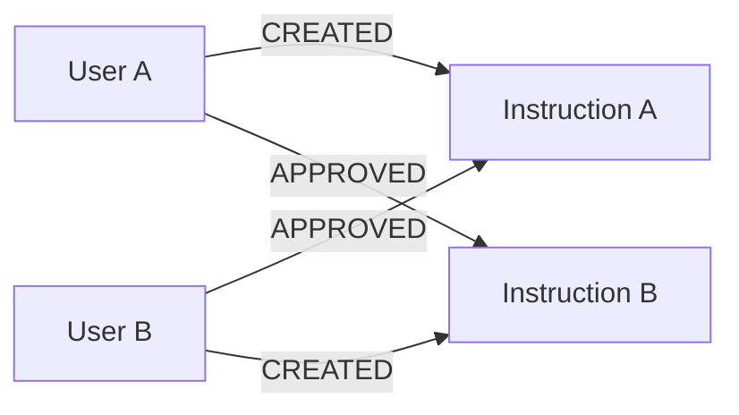
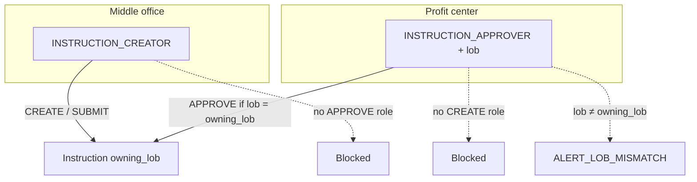
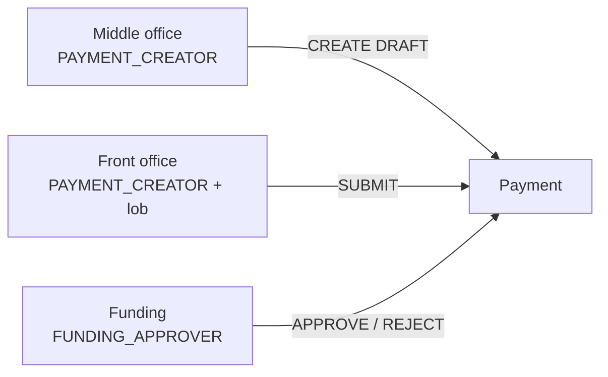

# Showcase: Mutual Approval SoD (Instruction + Payment)

**Compliance questions:**

- *Are there any instances of approving each other's instructions?*
- *(Payments)* Reciprocal create / approve among funding users — do we block that the same way?

This page contrasts how Policy Pilot treats **mutual (reciprocal) approval** on the two entities. There is **no** Rego rule named “mutual approval.” Controls come from **identity design** and **lifecycle party split**, with OPA enforcing those facts on each call.

| Entity | Primary stance | How |
|--------|----------------|-----|
| **Instruction** | **Prevent** mutual A↔B | No dual creator/approver roles; desk LOB match on APPROVE |
| **Payment** | **Not a primary target** | Four-eyes + one-way reporting line; **FO-only SUBMIT** as the extra operational split |

Instruction is the high-stakes SSI route (“the meat”). Payment is day-to-day cash against that route.

---

## Instruction — Prevent Mutual Approval

### The Risk

| Leg | What happens |
|-----|----------------|
| 1 | User **A** creates instruction \(I_A\); user **B** approves it |
| 2 | User **B** creates instruction \(I_B\); user **A** approves it |

Each leg can look like normal maker–checker. Together they are **reciprocal collusion**.



For that swap to complete through product APIs, **the same two people must each be able to create *and* approve**.

### Identity Design (Primary Control)

#### 1. Role Separation — Makers ≠ Checkers

In [`zitadel-seed/users.yaml`](../zitadel-seed/users.yaml), **no demo user holds both** `INSTRUCTION_CREATOR` and `INSTRUCTION_APPROVER`:

| Role | Who (examples) | Can create? | Can approve? |
|------|----------------|-------------|--------------|
| `INSTRUCTION_CREATOR` only | Middle office `mo-100`, `mo-101`, `mo-050`, `mo-010` | Yes | **No** |
| `INSTRUCTION_APPROVER` only | Desk `ficc-*`, `fx-*`, `rates-*` | **No** | Yes |

So the mutual swap cannot close:

1. A creator opens \(I_A\); a desk approver approves it — **leg 1 OK**.
2. That desk approver **cannot create** \(I_B\) (no `INSTRUCTION_CREATOR`).
3. That middle-office creator **cannot approve** \(I_B\) (no `INSTRUCTION_APPROVER`).

#### 2. Desk LOB — Approver LOB Must Match Instruction Owning LOB

Profit-center approvers carry a single desk `lob`. APPROVE requires `subject.lob == instruction.owning_lob` (`same_lob_as_instruction` → `ALERT_LOB_MISMATCH`).

| Approver | `subject.lob` | May approve `owning_lob` |
|----------|---------------|--------------------------|
| `ficc-300` | `FICC` | `FICC` only |
| `fx-300` | `FX` | `FX` only |
| `rates-201` | `DESK_RATES` | `DESK_RATES` only |



### OPA’s Job (Secondary Gate)

| Gate | Requirement |
|------|-------------|
| Role | CREATE / SUBMIT → `INSTRUCTION_CREATOR`; APPROVE → `INSTRUCTION_APPROVER` |
| Desk LOB | APPROVE → `subject.lob == instruction.owning_lob` |
| Four-eyes | Creator ≠ approver (`SELF_APPROVAL` if dual-role ever existed) |

Reporting-line inversion and the title matrix harden *single-leg* approvals further — see **[Reporting-line controls](opa-controls.md#reporting-line-controls-inversion-of-control)**.

### Investigation

> Are there any instances of approving each other's instructions?

```cypher
MATCH (a:User)-[:APPROVED_IV]->(va:InstructionVersion)<-[:CREATED_IV]-(b:User)
MATCH (b)-[:APPROVED_IV]->(vb:InstructionVersion)<-[:CREATED_IV]-(a)
WHERE a.user_id < b.user_id
RETURN a.display_name, b.display_name,
       va.instruction_id, vb.instruction_id
```

On a policy-only seed, expect **no rows**. [`ssi-demo-harness/seed_mutual_approval.py`](../ssi-demo-harness/seed_mutual_approval.py) **rewires** Neo4j for chat demos because the product path cannot build this symmetry.

| Path | Mutual pairs in graph? |
|------|-------------------------|
| Normal create → submit → approve | Should not appear |
| Harness mutual-approval seed | Appears for investigation demos |

---

## Payment — Not the Same Primary Target

### Why That Is Fine

- **Instruction** is the durable SSI route control.
- **Payment** is day-to-day cash against that route.
- Dual-role MO users (`PAYMENT_CREATOR` + `FUNDING_APPROVER`, e.g. `pay-205`, `pay-300`) **do** exist — so pure role segregation like instructions is **not** the payment story.

### What We Enforce on Each Payment APPROVE

| Gate | Meaning |
|------|---------|
| Four-eyes | Creator ≠ approver (`SELF_APPROVAL`) |
| Reporting line (one way) | Subordinate cannot approve manager’s payment; **manager approving a reportee’s payment is allowed** (manager stays answerable) |
| Amount / LOB | Club ceiling + `covering_lobs` |

There is **no** mutual-pair Rego rule for payments. Reciprocal A↔B among dual-role funding users can pass current policy if each only approves the **other’s** payment.

### Extra Operational Check: FO-Only SUBMIT

The payment path is intentionally **three parties**, even when dual-role MO users exist:



| Step | Who |
|------|-----|
| CREATE / UPDATE / CANCEL draft | Middle office `PAYMENT_CREATOR` + `MIDDLE_OFFICE` + covering LOBs |
| **SUBMIT** | **Front office only** — `PAYMENT_CREATOR` with `subject.lob` = instruction `owning_lob` |
| APPROVE / REJECT | `FUNDING_APPROVER` (+ club, covering LOBs, four-eyes, one-way reporting line) |

So create → submit → approve is already a **multi-party** workflow. That FO submit gate is the main extra control on payments; mutual MO funding approve is not treated like mutual instruction SoD.

### Investigation

Compliance can still ask the graph whether reciprocal create/approve pairs exist among payments (same shape as instructions, on `PaymentVersion`):

> Are there any instances of approving each other's payments?

```cypher
MATCH (a:User)-[:APPROVED_PV]->(va:PaymentVersion)<-[:CREATED_PV]-(b:User)
MATCH (b)-[:APPROVED_PV]->(vb:PaymentVersion)<-[:CREATED_PV]-(a)
WHERE a.user_id < b.user_id
RETURN coalesce(a.display_name, a.user_id, '') AS user_a_display,
       a.user_id AS user_a_id,
       coalesce(b.display_name, b.user_id, '') AS user_b_display,
       b.user_id AS user_b_id,
       va.payment_id AS approved_by_a,
       vb.payment_id AS approved_by_b,
       va.owning_lob AS lob_a,
       vb.owning_lob AS lob_b
ORDER BY user_a_id, user_b_id
LIMIT 50
```

| Expectation | Why |
|-------------|-----|
| Rows **may** appear | Dual-role MO users can create and approve each other’s payments under current policy (four-eyes still blocks self-approve) |
| Not an OPA deny by itself | Mutual payment A↔B is **investigation**, not a primary prevent control |
| FO submit not in this pattern | This query only looks at `CREATED_PV` / `APPROVED_PV`; submit is a separate `SUBMITTED_PV` edge |

(Unlike instructions, chat does not yet ship a dedicated neo4j_direct intent for this payment pattern — run the Cypher in Neo4j Browser / ops tooling, or extend cypher_builder later.)

---

## Side-by-Side

| | Instruction | Payment |
|---|-------------|---------|
| Dual creator+approver users in seed? | **No** | **Yes** (some `pay-*`) |
| Mutual A↔B primary SoD target? | **Yes — prevent** | **No** |
| Desk / FO split | Approver LOB = owning LOB | **FO-only SUBMIT** between MO create and funding APPROVE |
| Own-work approve | Blocked | Blocked |
| Subordinate approves manager | Blocked | Blocked |
| Manager approves reportee | Blocked | **Allowed** |

---

## Related Documentation

- Control catalog: **[OPA policy controls](opa-controls.md)**
- Reporting-line (OPA-modeled): **[Reporting-line controls](opa-controls.md#reporting-line-controls-inversion-of-control)**
- Identity seed: [`zitadel-seed/users.yaml`](../zitadel-seed/users.yaml)
- Cross-entity reciprocal (instruction ↔ payment legs): “Collusion patterns” in `opa-controls.md` / `seed_cross_entity_reciprocal.py`
