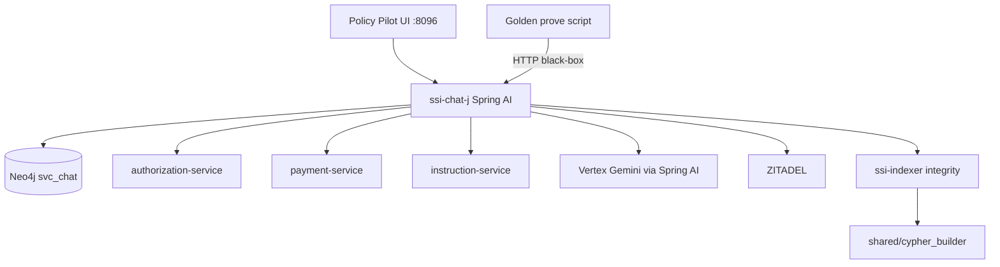

# ssi-chat-j — plan (historical)

> **Status (2026-07):** Cutover complete. **`ssi-chat-j` is the Policy Pilot chat surface** (Compose **8096**). Python `ssi-chat` and `cypher-builder-svc` are retired (local-only / gitignored). Chat plans Cypher **in-process** in Java. `shared/cypher_builder` remains for the **indexer** Search Console only.
>
> Living tracker: [`ssi-chat-j-todo.md`](ssi-chat-j-todo.md). Module README: [`ssi-chat-j/README.md`](../ssi-chat-j/README.md).

This document records the original A/B experiment decisions. Do not treat the A/B architecture below as current product topology.

---

## Original experiment decisions (superseded)

| Decision | Original choice | Outcome |
|----------|-----------------|---------|
| Module name | `ssi-chat-j` | Kept |
| Role | Peer A/B beside Python `ssi-chat` | **Java is the only chat** |
| Build | Maven / Java 21 / Spring Boot + Spring AI | Kept |
| Cypher | HTTP sidecar over `shared/cypher_builder` | **Superseded** by in-process `com.sanjuthomas.policypilot.cypher` |
| UI | Thymeleaf + copy statics from Python | **Vendored** under `ssi-chat-j/.../static/` |
| Success bar | Golden eval green on `:8096` | Bank now **98** cases under `ssi-chat-j/eval/` |
| Ports | Java 8096 · Python 8092 · bridge 8097 | **8096 only** for chat |

---

## Current architecture (post-cutover)



---

## What the A/B plan got right

1. Prove Spring AI + Vertex can run route → tools/skills → OPA OBO → evidence.
2. Keep chat APIs close enough for an HTTP golden bank.
3. Prefer reusing planner logic over a blind rewrite — then graduate to an in-process Java planner when the HTTP bridge was no longer needed for chat.

---

## Success bar (current)

```bash
./scripts/clean-slate.sh --with-demo-seed   # or equivalent warm stack
./ssi-chat-j/scripts/prove-eligibility.sh
```

Cases: [`ssi-chat-j/eval/eligibility_golden.yaml`](../ssi-chat-j/eval/eligibility_golden.yaml) (**98**). See [`ssi-chat-j/eval/README.md`](../ssi-chat-j/eval/README.md).
