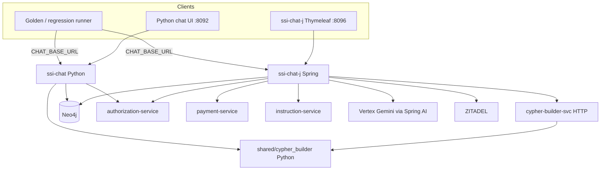
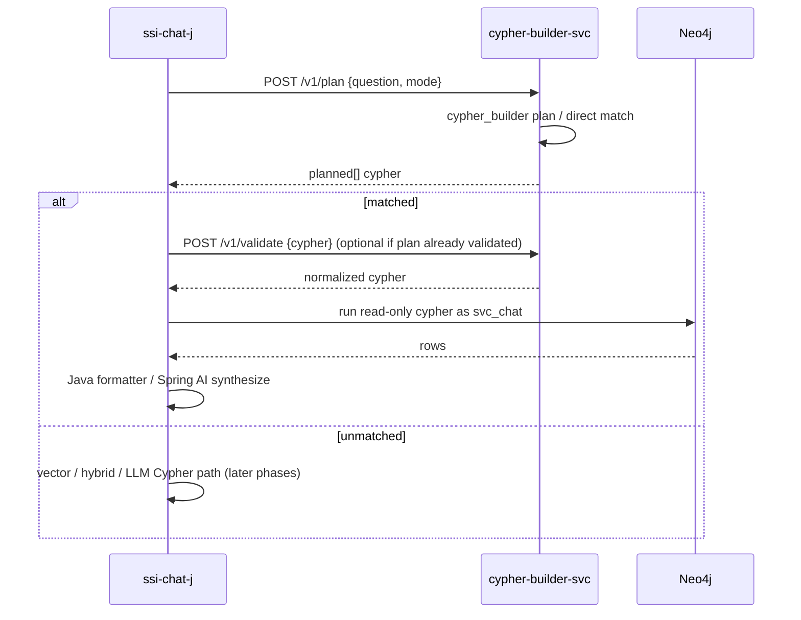

# ssi-chat-j — experiment plan

Java / Spring AI chat module for **A/B testing** beside the existing Python `ssi-chat`. It does **not** replace `ssi-chat`.

| Decision | Choice |
|----------|--------|
| Module name | `ssi-chat-j` |
| Role | Peer experiment (A/B), not a cutover target |
| Build | **Maven** |
| Cypher | Reuse `shared/cypher_builder` via an HTTP protocol (see below) |
| UI | Spring **Thymeleaf** shell + **build-time assembly** of shared static assets from Python chat |
| Success bar | **Golden eval green** against `ssi-chat-j` |
| Tracking | Living checklist: [`ssi-chat-j-todo.md`](ssi-chat-j-todo.md) |

Compose sketch (proposed): service `ssi-chat-j`, port **8096**, Python `ssi-chat` stays on **8092**.

---

## Goals

1. Prove Spring AI + Vertex can run the same governance story: route → retrieve/tools/skills → OPA OBO → evidence.
2. Keep product APIs close enough that the **existing golden eval** can target either base URL.
3. Avoid rewriting `cypher_builder` unless the HTTP bridge becomes the bottleneck.

Non-goals (v1): replace Python chat, port full `questions.yaml` bank, rewrite indexer/authz/payment.

---

## Architecture (A/B)



Both chats call the **same** Neo4j, OPA path, and domain services. Only the chat process differs.

---

## Cypher: how we reuse `shared/cypher_builder`

### Why not in-process from Java?

`cypher_builder` is a mature Python package (deterministic intents, LOB scoping, read-only validation). Embedding CPython in the JVM (JPype/JNI) or shelling out per request is brittle for an A/B service. Prefer a **small HTTP sidecar** that imports the package the same way `ssi-chat` does today.

### Protocol: HTTP JSON over localhost (recommended)

New thin service (name TBD, e.g. `cypher-builder-svc`) in the monorepo:

| Item | Proposal |
|------|----------|
| Runtime | FastAPI + `pip install -e shared/cypher_builder` |
| Port | **8097** (compose-internal + optional host publish) |
| Auth | Network-local only in compose (no public ingress); optional shared secret later |
| Transport | `POST application/json` → `application/json` |
| Client | Spring `WebClient` in `ssi-chat-j` |

#### Endpoints (v1 contract)

**`POST /v1/plan`** — map question → planned read-only Cypher (deterministic path).

Request:

```json
{
  "question": "How many instruction policy denials happened this week?",
  "mode": "events",
  "options": {
    "lob_scope": null
  }
}
```

Response:

```json
{
  "matched": true,
  "intent_id": "security_event.denials_count_week",
  "strategy": "neo4j_direct",
  "planned": [
    { "label": "denials_count", "cypher": "MATCH ... RETURN ..." }
  ],
  "meta": {
    "cypher_class": "deterministic",
    "builder_version": "0.1.0"
  }
}
```

When unmatched: `{ "matched": false, "planned": [], "intent_id": null }`.

**`POST /v1/validate`** — normalize + enforce read-only Cypher (defense in depth before Neo4j).

Request: `{ "cypher": "MATCH ..." }`  
Response: `{ "ok": true, "cypher": "<normalized>" }` or `{ "ok": false, "error": "..." }`.

**`GET /health`** — liveness.

Optional later: `POST /v1/match-direct` mirroring `match_neo4j_direct_intent` if chat needs match metadata without full plan.

#### Sequence



#### What stays in Java

- Neo4j execution (`svc_chat`, read-only session)
- Answer formatters for golden cases
- RouterDecision / Spring AI
- OBO clients, skills, eligibility

#### What stays in Python (`cypher_builder`)

- Intent detection + Cypher templates
- LOB clauses / read-only guards inside the builder
- Single source of truth shared with Python chat + indexer Search Console

#### Alternatives considered

| Option | Verdict |
|--------|---------|
| Call indexer `POST /api/intent/extract` | **No** for golden/direct — that path is Vertex graph-plan extraction, not deterministic `cypher_builder` |
| Subprocess `python -c` per request | Too slow / fragile |
| Full Java rewrite of builder | Deferred until sidecar proves insufficient |
| gRPC | Possible later; HTTP JSON is enough for A/B |

---

## UI: Thymeleaf + shared statics

- **Thymeleaf** serves the HTML shell (login/chat layout) under `ssi-chat-j`.
- **Build-time assembly** (Maven): copy JS/CSS (and any shared assets) from  
  `ssi-chat/src/chat_application/static/`  
  into `ssi-chat-j` resources (e.g. `maven-resources-plugin` or `copy-rename-maven-plugin`).
- Prefer **not** dual-editing assets: Python tree remains canonical for static files; Java build copies them.
- Config/API base URL in the page must point at **8096** when served by `ssi-chat-j` (build filter or Thymeleaf model).

---

## Maven module sketch

```text
ssi-chat-j/
  pom.xml
  src/main/java/com/policypilot/chatj/
  src/main/resources/
    application.yml
    templates/          # Thymeleaf
    static/             # assembled from Python chat at build
  Dockerfile
  README.md
```

CI: add a Build workflow job for `ssi-chat-j` (Maven test + package). Coverage gates TBD (start without 80% until code exists).

Companion (minimal): `cypher-builder-svc/` FastAPI wrapping `shared/cypher_builder`.

---

## Phased delivery (aligned to todo file)

1. **Scaffold** — Maven app, Docker, compose `:8096`, health, Thymeleaf hello, static copy  
2. **Auth + stub chat** — ZITADEL JWT / login parity, `POST /api/chat` stub  
3. **Cypher bridge** — `cypher-builder-svc` + Java client; one golden neo4j_direct case  
4. **Tools lanes** — eligibility / policy / me needed for golden  
5. **Vector / RAG** — as required by remaining golden cases  
6. **Skills** — only if a golden case requires them (defer if not)  
7. **Golden green** — `regression.runner --eval-golden` with `CHAT_BASE_URL=http://localhost:8096`

Living status: **[`ssi-chat-j-todo.md`](ssi-chat-j-todo.md)**.

---

## Success bar

**Done** when:

```bash
cd ssi-chat
CHAT_BASE_URL=http://localhost:8096 PYTHONPATH=. python -m regression.runner \
  --eval-golden --skip-api-smoke --report /tmp/golden-ssi-chat-j.json
```

…exits green (seed policy same as Python golden runs). Track gaps in the todo file as cases fail.

---

## Open follow-ups (not blocking the plan doc)

- Exact package name (`com.policypilot.chatj` vs other)
- Whether `cypher-builder-svc` is a new compose service or a profile of an existing Python service
- Spring AI vs Google GenAI SDK for structured `RouterDecision` (spike in Phase 1)

Update [`ssi-chat-j-todo.md`](ssi-chat-j-todo.md) whenever work starts or finishes a checkbox.
