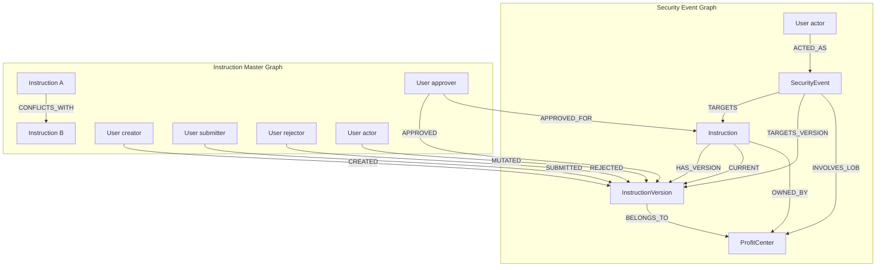

# Neo4j Graph Model

Version-controlled **graph schema and documentation** for security events and instruction lifecycle snapshots.

## Layout

```
schema.cypher         — constraints and indexes (applied by ETL on startup)
relationships.cypher  — node labels, properties, relationships (documentation)
```

## Two ETL pipelines write to this graph

| Pipeline | Kafka topic | Consumer group | Writes |
|---|---|---|---|
| `SecurityEventPipeline` | `instruction-security-events` (4 partitions) | `security-event-qdrant-etl` | SecurityEvent, User (actor), Instruction, InstructionVersion, ProfitCenter |
| `InstructionPipeline` | `ssi-instructions` (4 partitions) | `ssi-instruction-etl` | Instruction, InstructionVersion, User (creator/approver/rejector/actor), ProfitCenter, CONFLICTS_WITH |

Both topics carry **full fact events** — the ETL makes no API calls to the ILM.
Partition key is `user_id` so all actions by the same user arrive in order.

## Graph model



## Node properties

| Node | Key properties |
|---|---|
| `Instruction` | `instruction_id`, `owning_lob`, `instruction_type`, `wire_scope`, `currency` |
| `InstructionVersion` | `instruction_id`, `version_number`, `status`, `action`, `instruction_type`, `owning_lob`, `wire_scope`, `currency`, `effective_date`, `end_date`, `is_expired`, `creditor_name`, `creditor_account`, `creditor_bic`, `debtor_name`, `debtor_account`, `creator_user_id`, `approver_user_id`, `rejector_user_id` |
| `SecurityEvent` | `event_id`, `timestamp`, `severity`, `action`, `outcome`, `message`, `wire_scope`, `instruction_type`, `owning_lob` |
| `User` | `user_id`, `given_name`, `family_name`, `display_name` (\*), `title`, `lob`, `roles`, `supervisor_id` |
| `ProfitCenter` | `name` |

(\*) `display_name` is computed as `"FamilyName, GivenName (user_id)"` on every upsert.

## Relationship types

| Relationship | Direction | Written by | Meaning |
|---|---|---|---|
| `HAS_VERSION` | `Instruction → InstructionVersion` | both | All point-in-time versions |
| `CURRENT` | `Instruction → InstructionVersion` | both | Latest version (version-aware, never regresses) |
| `OWNED_BY` | `Instruction → ProfitCenter` | InstructionPipeline | Instruction's owning LOB |
| `BELONGS_TO` | `InstructionVersion → ProfitCenter` | InstructionPipeline | Version's owning LOB |
| `CONFLICTS_WITH` | `Instruction ↔ Instruction` | InstructionPipeline | Same creditor account + currency = potential duplicate route |
| `CREATED` | `User → InstructionVersion` | both | Creator of this version |
| `SUBMITTED` | `User → InstructionVersion` | SecurityEventPipeline | Submitter of this version |
| `APPROVED` | `User → InstructionVersion` | both | Approver of this version |
| `APPROVED_FOR` | `User → Instruction` | InstructionPipeline | User has approved for this instruction root |
| `REJECTED` | `User → InstructionVersion` | both | Rejector of this version |
| `MUTATED` | `User → InstructionVersion` | InstructionPipeline | Actor who triggered mutation (carries `action`, `timestamp` props) |
| `ACTED_AS` | `User → SecurityEvent` | SecurityEventPipeline | Actor who generated the security event |
| `TARGETS` | `SecurityEvent → Instruction` | SecurityEventPipeline | Event targets instruction root |
| `TARGETS_VERSION` | `SecurityEvent → InstructionVersion` | SecurityEventPipeline | Event targets specific version |
| `INVOLVES_LOB` | `SecurityEvent → ProfitCenter` | SecurityEventPipeline | Event's owning LOB |

**Planned but not yet written:** `SUPERSEDES` (version chain), `REPORTS_TO` (org hierarchy).

## Qdrant points (dual source)

The ETL also writes to Qdrant (`instruction_security_events` collection). Each point has a `source` tag:

| `source` tag | Point ID | One per | Written by |
|---|---|---|---|
| `security_event` | `uuid5(event_id)` | Security event | SecurityEventPipeline |
| `instruction_state` | `uuid5("instruction:" + instruction_id)` | Instruction (upserted on every mutation) | InstructionPipeline |

The chat API filters by source based on the selected mode:

| Chat mode | Qdrant filter | Neo4j focus |
|---|---|---|
| `events` | `source = security_event` | SecurityEvent graph |
| `instructions` | `source = instruction_state` | Instruction master graph |
| `both` | no filter | both |

## Neo4j Browser

http://localhost:7474/browser/ — login `neo4j` / `devpassword`

## Apply schema manually

```bash
cat schema.cypher | docker exec -i neo4j cypher-shell -u neo4j -p devpassword
```

## Example queries

```cypher
// All STANDING instructions for LOB FICC with creator and approver
MATCH (i:Instruction)-[:CURRENT]->(v:InstructionVersion {status: 'STANDING', owning_lob: 'FICC'})
OPTIONAL MATCH (cu:User {user_id: v.creator_user_id})
OPTIONAL MATCH (au:User {user_id: v.approver_user_id})
RETURN v.instruction_id, v.currency, v.wire_scope,
       coalesce(cu.display_name, v.creator_user_id) AS creator,
       coalesce(au.display_name, v.approver_user_id) AS approver
ORDER BY v.end_date ASC;

// Mutual approval (A approved B's instruction AND B approved A's)
MATCH (a:User)-[:APPROVED]->(va:InstructionVersion)<-[:CREATED]-(b:User)
MATCH (b)-[:APPROVED]->(vb:InstructionVersion)<-[:CREATED]-(a)
WHERE a.user_id <> b.user_id
RETURN a.display_name AS user_a, b.display_name AS user_b,
       va.instruction_id AS approved_by_a,
       vb.instruction_id AS approved_by_b;

// Potential duplicate settlement routes
MATCH (i1:Instruction)-[:CONFLICTS_WITH]->(i2:Instruction)
MATCH (i1)-[:CURRENT]->(v1:InstructionVersion)
MATCH (i2)-[:CURRENT]->(v2:InstructionVersion)
RETURN v1.instruction_id, v1.creditor_account, v1.currency,
       v2.instruction_id
LIMIT 50;

// Subordinate approved supervisor's instruction (inversion of control)
MATCH (sup:User)-[:CREATED]->(v:InstructionVersion)
MATCH (sub:User)-[:APPROVED]->(v)
WHERE sub.supervisor_id = sup.user_id
RETURN sup.display_name AS supervisor, sub.display_name AS subordinate,
       v.instruction_id, v.owning_lob;

// ALERT events today with full context
MATCH (e:SecurityEvent {severity: 'ALERT'})
WHERE date(datetime(e.timestamp)) = date()
OPTIONAL MATCH (actor:User)-[:ACTED_AS]->(e)
OPTIONAL MATCH (e)-[:TARGETS_VERSION]->(v:InstructionVersion)
RETURN e.event_id, e.message, e.timestamp,
       coalesce(actor.display_name, actor.user_id) AS actor,
       v.instruction_id, v.owning_lob
ORDER BY e.timestamp DESC;
```

See `relationships.cypher` for the full property catalog.
