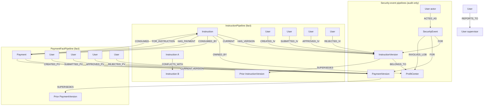

# Neo4j Graph Model

Canonical **graph schema and documentation** for security events, instruction lifecycle, and payment lifecycle. Keep this file up to date when the model changes.

Symmetric **fact** vs **security-event** writers, named lifecycle edges (`_*IV` / `_*PV`), audit links via `FOR` → version, and root denormalization on instruction and payment roots.

## Layout

```
schema.cypher                    — constraints and indexes (applied by ETL on startup)
relationships.cypher             — node/relationship property reference (documentation)
ssi-indexer/src/etl/graph_model.py — action → edge maps consumed by ETL
```

## Principles

| Principle | Rule |
|-----------|------|
| Read-optimized | Redundant edges and denormalized root properties are intentional |
| Append-only versions | Never delete `*Version` nodes; history via `HAS_VERSION`, `SUPERSEDES`, `created_at` |
| Two writers, symmetric | **Fact pipelines** = state; **security-event pipelines** = audit only |
| Named lifecycle | User → Version edges (`CREATED_IV`, `CREATED_PV`, …) per Mongo action |
| Domain approval | `(User)-[:APPROVED_*]->(Version)` = regulatory sign-off on the **route** |
| Property naming | `snake_case` everywhere in Neo4j (matches Mongo payloads) |

Demo data is disposable — wipe Neo4j and replay Kafka when the model changes (see [Wipe and reload](#wipe-and-reload-demo-graph)).

## Four ETL pipelines, two writer types

| Pipeline | Kafka topic | Consumer group | Writer role |
|---|---|---|---|
| `InstructionPipeline` | `instructions` | `ssi-instruction-etl` | **Fact** — instruction state |
| `PaymentFactPipeline` | `payments` | `payment-fact-etl` | **Fact** — payment state |
| `InstructionSecurityEventPipeline` | `instruction_security_events` | `instruction-security-event-etl` | **Audit** — instruction security events |
| `PaymentSecurityEventPipeline` | `payment_security_events` | `payment-security-event-etl` | **Audit** — payment security events |

All topics carry **full Mongo documents** via Kafka Connect — the ETL makes no API calls to instruction-service or payment-service.

| Writer type | Pipelines | Owns |
|-------------|-----------|------|
| **Fact** (state) | `InstructionPipeline`, `PaymentFactPipeline` | Versions, `CURRENT`, `SUPERSEDES`, lifecycle edges (`_*IV` / `_*PV`), structural edges, root denorm, vector state docs |
| **Audit** (events) | `InstructionSecurityEventPipeline`, `PaymentSecurityEventPipeline` | `SecurityEvent`, `ACTED_AS`, `FOR` → version, `INVOLVES_LOB`, vector event docs |

### Fact pipelines own state

- Version nodes, `HAS_VERSION`, `CURRENT`, `SUPERSEDES`
- Lifecycle edges: `CREATED_IV`, `SUBMITTED_IV`, `APPROVED_IV`, … and `CREATED_PV`, `SUBMITTED_PV`, …
- Structural edges: `OWNED_BY`, `BELONGS_TO`, `CONFLICTS_WITH`, `FOR_INSTRUCTION`, `HAS_PAYMENT`, `CONSUMED` / `CONSUMED_BY`
- Root denormalization: `current_status`, `current_version_number`, `current_used_by`, etc.
- Vector docs: `instruction_state`, `payment_fact`

### Security-event pipelines own audit only

- `SecurityEvent`, `ACTED_AS`, `FOR` → `InstructionVersion` or `PaymentVersion`, `INVOLVES_LOB`
- Sparse version merge for search (no lifecycle, `CURRENT`, `CONSUMED`, `HAS_PAYMENT`, or `FOR_INSTRUCTION` writes)
- Vector docs: `instruction_security_event`, `payment_security_event`

## Graph model



## Node properties

| Node | Key properties |
|---|---|
| `Instruction` | `instruction_id`, `instruction_type`, `owning_lob`, `wire_scope`, `currency`, `current_status`, `current_version_number`, `current_used_by` (denorm from `CURRENT`) |
| `InstructionVersion` | `version_key`, `version_number`, `status`, `action`, `created_at`, `used_by`, route/auth fields, `creator_user_id`, `approver_user_id`, … |
| `Payment` | `payment_id`, `instruction_id`, `current_status`, `current_version_number`, `current_amount`, `current_currency` (denorm) |
| `PaymentVersion` | `version_key`, `version_number`, `status`, `created_at`, `amount`, `currency`, `value_date`, `cancellation_reason`, actor ids, … |
| `SecurityEvent` | `event_id`, `timestamp`, `severity`, `action`, `outcome`, `message`, `authorization_summary`, … |
| `User` | `user_id`, `given_name`, `family_name`, `display_name` (\*), `title`, `lob`, `roles`, `supervisor_id` |
| `ProfitCenter` | `lob` (unique), `name` |

(\*) `display_name` is computed as `"FamilyName, GivenName (user_id)"` on every upsert.

## Relationship types

| Relationship | Direction | Written by | Meaning |
|---|---|---|---|
| `HAS_VERSION` | Root → Version | fact pipelines | All point-in-time versions |
| `CURRENT` | Root → Version | fact pipelines | Latest open version (never regresses) |
| `SUPERSEDES` | Version → Version | fact pipelines | vN → v(N−1) chain |
| `OWNED_BY` | Instruction → ProfitCenter | InstructionPipeline | Instruction LOB |
| `BELONGS_TO` | InstructionVersion → ProfitCenter | InstructionPipeline | Version LOB |
| `CONFLICTS_WITH` | Instruction ↔ Instruction | InstructionPipeline | Same creditor account + currency |
| `FOR_INSTRUCTION` | Payment → Instruction | PaymentFactPipeline | Payment linked to instruction |
| `HAS_PAYMENT` | Instruction → Payment | PaymentFactPipeline | Instruction has payment(s) |
| `CONSUMED` | Payment → Instruction | PaymentFactPipeline | SINGLE_USE submit saga; deleted on `RELEASE_USE` |
| `CONSUMED_BY` | Instruction → Payment | PaymentFactPipeline | Same as `CONSUMED`; deleted on `RELEASE_USE` |
| `CREATED_IV` | User → InstructionVersion | InstructionPipeline | Create |
| `SUBMITTED_IV` | User → InstructionVersion | InstructionPipeline | Submit |
| `APPROVED_IV` | User → InstructionVersion | InstructionPipeline | Regulatory sign-off on route |
| `REJECTED_IV` | User → InstructionVersion | InstructionPipeline | Reject |
| `CANCELLED_IV` | User → InstructionVersion | InstructionPipeline | Instruction cancel |
| `SUSPENDED_IV` / `REACTIVATED_IV` | User → InstructionVersion | InstructionPipeline | Suspend / reactivate |
| `USED_IV` / `RELEASED_IV` | User → InstructionVersion | InstructionPipeline | SINGLE_USE use / release |
| `CREATED_PV` | User → PaymentVersion | PaymentFactPipeline | Create payment |
| `SUBMITTED_PV` | User → PaymentVersion | PaymentFactPipeline | Submit payment |
| `APPROVED_PV` | User → PaymentVersion | PaymentFactPipeline | Approve payment |
| `REJECTED_PV` | User → PaymentVersion | PaymentFactPipeline | Reject payment |
| `CANCELLED_PV` | User → PaymentVersion | PaymentFactPipeline | Cancel payment (user or system) |
| `ACTED_AS` | User → SecurityEvent | security-event pipelines | Event actor |
| `FOR` | SecurityEvent → Version | security-event pipelines | Audit link to version at event time |
| `INVOLVES_LOB` | SecurityEvent → ProfitCenter | security-event pipelines | Event LOB |
| `REPORTS_TO` | User → User | all pipelines (user upsert) | Org hierarchy from `supervisor_id` |

### Instruction lifecycle (Mongo action → edge)

All: `(User)-[:<EDGE> {at: <iso>}]->(InstructionVersion)`

| Edge | Mongo action |
|------|--------------|
| `CREATED_IV` | `CREATE` |
| `SUBMITTED_IV` | `SUBMIT` |
| `APPROVED_IV` | `APPROVE` |
| `REJECTED_IV` | `REJECT` |
| `CANCELLED_IV` | `CANCEL` |
| `SUSPENDED_IV` | `SUSPEND` |
| `REACTIVATED_IV` | `REACTIVATE` |
| `USED_IV` | `USE` |
| `RELEASED_IV` | `RELEASE_USE` |

`USED_IV` is written by the payment submitter (OBO human) with edge props `{at, payment_id, delegated_by}`; version `used_by` holds the payment id.

| Scenario | Instruction edge |
|----------|------------------|
| User cancels instruction | `CANCELLED_IV` |
| Payment reject / cancel / system cancel on approve | `RELEASED_IV` |

### Payment lifecycle (Mongo action → edge)

All: `(User)-[:<EDGE> {at: <iso>}]->(PaymentVersion)`

| Edge | Mongo action |
|------|--------------|
| `CREATED_PV` | `CREATE` |
| `SUBMITTED_PV` | `SUBMIT` |
| `APPROVED_PV` | `APPROVE` |
| `REJECTED_PV` | `REJECT` |
| `CANCELLED_PV` | `CANCEL` |

### SINGLE_USE (payment submit saga)

| Step | Payment graph | Instruction graph |
|------|---------------|-------------------|
| Create payment | `DRAFT`, `FOR_INSTRUCTION`, `HAS_PAYMENT` | unchanged |
| Submit | `SUBMITTED_PV`, `CONSUMED`, `CONSUMED_BY` | `USED_IV`, `used_by` |
| Approve | `APPROVED_PV` | stays `USED` |
| Reject / cancel / system cancel | `REJECTED_PV` or `CANCELLED_PV` | `RELEASED_IV`; **delete** consumption edges |

ETL edge constants: `ssi-indexer/src/etl/graph_model.py`.

## Vector documents (four source tags)

The ETL writes searchable `MultimodalDocument` nodes in Neo4j for dense vector search. Each document has a `source` tag:

| `source` tag | Document ID | One per | Written by |
|---|---|---|---|
| `instruction_security_event` | `uuid5(event_id)` | Security event | InstructionSecurityEventPipeline |
| `instruction_state` | `uuid5("instruction:" + instruction_id)` | Instruction (upserted on every mutation) | InstructionPipeline |
| `payment_security_event` | `uuid5(event_id)` | Payment security event | PaymentSecurityEventPipeline |
| `payment_fact` | `uuid5("payment:" + payment_id)` | Payment (upserted on every mutation) | PaymentFactPipeline |

The chat API filters by source based on the selected mode:

| Chat mode | Vector `source` filter | Neo4j focus |
|---|---|---|
| `events` | `instruction_security_event` + `payment_security_event` | Security events + `FOR` audit links |
| `instructions` | `instruction_state` | Instruction master graph |
| `payments` | `payment_fact` | Payment master graph |
| `all` | no filter | All entity types |

## Neo4j Browser

http://localhost:7474/browser/ — admin login `neo4j` / `devpassword`

Application services use dedicated least-privilege accounts (Neo4j Enterprise RBAC), bootstrapped by `scripts/neo4j-init-users.sh` / `init-service-accounts.cypher`:

| User | Used by | Privileges (summary) |
|------|---------|----------------------|
| `svc_chat` | ssi-chat-j | Read (`MATCH`), show indexes/constraints, **`EXECUTE PROCEDURE db.index.vector.queryNodes` only** (no `*` / no BOOSTED / no `FUNCTION *`) |
| `svc_indexer` | ssi-indexer | Read/write, create labels/types/properties, index + constraint management, procedures |
| `svc_harness` | demo seed scripts | Read/write + create labels/types/properties (no schema management) |

Default app passwords: `Password1!` (override with `NEO4J_CHAT_PASSWORD` / `NEO4J_INDEXER_PASSWORD` / `NEO4J_HARNESS_PASSWORD`).

## Apply schema manually

```bash
cat schema.cypher | docker exec -i neo4j cypher-shell -u neo4j -p devpassword
```

## Example queries

```cypher
// Who approved an instruction (from current version properties)
MATCH (i:Instruction {instruction_id: $uuid})-[:CURRENT]->(v:InstructionVersion)
OPTIONAL MATCH (au:User {user_id: v.approver_user_id})
RETURN v.instruction_id, v.approved_at,
       coalesce(au.display_name, v.approver_user_id) AS approver,
       v.authorization_summary, v.authorization_basis
LIMIT 1;

// ALERT events with actor and linked version
MATCH (e:SecurityEvent {severity: 'ALERT'})
WHERE date(datetime(e.timestamp)) = date()
OPTIONAL MATCH (actor:User)-[:ACTED_AS]->(e)
OPTIONAL MATCH (e)-[:FOR]->(v:InstructionVersion)
OPTIONAL MATCH (e)-[:FOR]->(pv:PaymentVersion)
RETURN e.event_id, e.message, e.timestamp,
       coalesce(actor.display_name, actor.user_id) AS actor,
       v.instruction_id, pv.payment_id, pv.amount
ORDER BY e.timestamp DESC;

// SINGLE_USE consumption
MATCH (p:Payment {payment_id: $id})-[:CONSUMED]->(i:Instruction)
RETURN i.instruction_id, i.current_status, i.current_used_by;

// Who holds SINGLE_USE instruction
MATCH (i:Instruction {instruction_id: $id})
RETURN i.current_status, i.current_used_by;

// Full version chain (newest → oldest)
MATCH (i:Instruction {instruction_id: $uuid})-[:CURRENT]->(head:InstructionVersion)
MATCH (head)-[:SUPERSEDES*0..]->(v:InstructionVersion)
RETURN v.version_number, v.status, v.action
ORDER BY v.version_number DESC;
```

### Are there active instructions sharing the same creditor account and currency?

`CONFLICTS_WITH` edges are maintained by the indexer when current versions share creditor account + currency (among other route fields). Chat’s duplicate-routes intent uses this shape (active = `APPROVED` or `SUBMITTED`):

```cypher
// Are there active instructions sharing the same creditor account and currency?
MATCH (i1:Instruction)-[:CONFLICTS_WITH]-(i2:Instruction)
WHERE elementId(i1) < elementId(i2)
MATCH (i1)-[:CURRENT]->(v1:InstructionVersion)
MATCH (i2)-[:CURRENT]->(v2:InstructionVersion)
WHERE v1.status IN ['APPROVED', 'SUBMITTED']
  AND v2.status IN ['APPROVED', 'SUBMITTED']
RETURN i1.instruction_id AS instruction_id_a,
       i2.instruction_id AS instruction_id_b,
       v1.owning_lob AS owning_lob,
       v1.currency AS currency,
       v1.creditor_account AS creditor_account,
       v1.creditor_name AS creditor_name
ORDER BY v1.creditor_account, v1.currency
LIMIT 50;
```

## Cross-graph queries

Nodes are shared across pipelines — these join audit events, lifecycle edges, and current state:

```cypher
-- ALERT event actor + linked version + current instruction state
MATCH (actor:User)-[:ACTED_AS]->(e:SecurityEvent {severity: 'ALERT'})
OPTIONAL MATCH (e)-[:FOR]->(v:InstructionVersion)
OPTIONAL MATCH (i:Instruction {instruction_id: v.instruction_id})-[:CURRENT]->(cv:InstructionVersion)
RETURN actor.display_name, e.message, v.instruction_id, cv.status, cv.owning_lob
ORDER BY e.timestamp DESC LIMIT 20;

-- Mutual approval (collusion signal)
MATCH (a:User)-[:APPROVED_IV]->(va:InstructionVersion)<-[:CREATED_IV]-(b:User)
MATCH (b)-[:APPROVED_IV]->(vb:InstructionVersion)<-[:CREATED_IV]-(a)
WHERE a.user_id < b.user_id
RETURN a.display_name AS user_a, b.display_name AS user_b,
       va.instruction_id AS approved_by_a, vb.instruction_id AS approved_by_b;

-- Subordinate approved supervisor's instruction (inversion of control)
MATCH (creator:User)-[:CREATED_IV]->(v:InstructionVersion)
MATCH (approver:User)-[:APPROVED_IV]->(v)
MATCH (approver)-[:REPORTS_TO]->(creator)
RETURN creator.display_name AS supervisor, approver.display_name AS subordinate,
       v.instruction_id, v.owning_lob;

-- Payment approver reports to payment creator
MATCH (p:Payment)-[:CURRENT]->(pv:PaymentVersion)
MATCH (creator:User)-[:CREATED_PV]->(pv)
MATCH (approver:User)-[:APPROVED_PV]->(pv)
MATCH (approver)-[:REPORTS_TO]->(creator)
RETURN creator.display_name, approver.display_name, p.payment_id, pv.amount
LIMIT 50;

-- Potential duplicate settlement routes (see also Example queries above)
MATCH (i1:Instruction)-[:CONFLICTS_WITH]-(i2:Instruction)
WHERE elementId(i1) < elementId(i2)
MATCH (i1)-[:CURRENT]->(v1:InstructionVersion)
MATCH (i2)-[:CURRENT]->(v2:InstructionVersion)
WHERE v1.status IN ['APPROVED', 'SUBMITTED']
  AND v2.status IN ['APPROVED', 'SUBMITTED']
RETURN v1.instruction_id, v1.creditor_account, v1.currency, v2.instruction_id
ORDER BY v1.creditor_account, v1.currency
LIMIT 50;
```

## Wipe and reload demo graph

When the graph model changes, wipe Neo4j and replay Kafka (Mongo data stays):

```bash
docker compose -p security-event-rag-demo stop ssi-indexer ssi-chat-j

docker exec neo4j cypher-shell -u neo4j -p devpassword \
  "MATCH (n) DETACH DELETE n"

docker exec -i neo4j cypher-shell -u neo4j -p devpassword < neo4j-graph-model/schema.cypher

# Reset all four indexer consumer groups to earliest (see ssi-indexer/README.md)

docker compose -p security-event-rag-demo up -d --force-recreate ssi-indexer ssi-chat-j
```

Re-run `./ssi-demo-harness/seed-demo-data.sh --seed-only` if you need fresh ALERT demo events (replay alone does not recreate harness policy-denial seeds).
