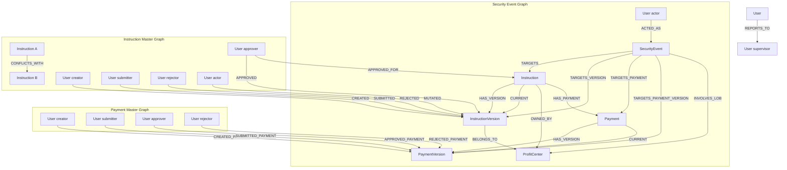

# Neo4j Graph Model

Version-controlled **graph schema and documentation** for security events, instruction lifecycle snapshots, and payment lifecycle.

## Layout

```
schema.cypher         — constraints and indexes (applied by ETL on startup)
relationships.cypher  — node labels, properties, relationships (documentation)
```

## Four ETL pipelines write to this graph

| Pipeline | Kafka topic | Consumer group | Writes |
|---|---|---|---|
| `InstructionSecurityEventPipeline` | `instruction_security_events` (4 partitions) | `instruction-security-event-etl` | SecurityEvent, User (actor), Instruction, InstructionVersion, ProfitCenter |
| `InstructionPipeline` | `instructions` (4 partitions) | `ssi-instruction-etl` | Instruction, InstructionVersion, User (creator/approver/rejector/actor), ProfitCenter, CONFLICTS_WITH |
| `PaymentSecurityEventPipeline` | `payment_security_events` (4 partitions) | `payment-security-event-etl` | SecurityEvent (payment), User (actor), Payment, Instruction |
| `PaymentFactPipeline` | `payments` (4 partitions) | `payment-fact-etl` | Payment, User (creator/submitter/approver/rejector), Instruction, HAS_PAYMENT |

All topics carry **full Mongo documents** via Kafka Connect — the ETL makes no API calls to instruction-service or the payment service.

## Graph model



## Node properties

| Node | Key properties |
|---|---|
| `Instruction` | `instruction_id`, `owning_lob`, `instruction_type`, `wire_scope`, `currency` |
| `InstructionVersion` | `instruction_id`, `version_number`, `status`, `action`, …, `approved_at`, `authorization_summary`, `authorization_basis`, `creator_user_id`, `approver_user_id`, `rejector_user_id` |
| `Payment` | `payment_id`, `instruction_id` |
| `PaymentVersion` | `payment_id`, `version_number`, `status`, `amount`, `currency`, `value_date`, `owning_lob`, `instruction_type`, `creator_user_id`, `submitter_user_id`, `approver_user_id`, `rejector_user_id`, `created_at`, `updated_at` |
| `SecurityEvent` | `event_id`, `timestamp`, `severity`, `action`, `outcome`, `message`, …, `authorization_summary`, `authorization_basis`, `authorization_decision` |
| `User` | `user_id`, `given_name`, `family_name`, `display_name` (\*), `title`, `lob`, `roles`, `supervisor_id` |
| `ProfitCenter` | `name` |

(\*) `display_name` is computed as `"FamilyName, GivenName (user_id)"` on every upsert.

## Relationship types

| Relationship | Direction | Written by | Meaning |
|---|---|---|---|
| `HAS_VERSION` | `Instruction → InstructionVersion` | instruction pipelines | All point-in-time versions |
| `CURRENT` | `Instruction → InstructionVersion` | instruction pipelines | Latest version (version-aware, never regresses) |
| `OWNED_BY` | `Instruction → ProfitCenter` | InstructionPipeline | Instruction's owning LOB |
| `BELONGS_TO` | `InstructionVersion → ProfitCenter` | InstructionPipeline | Version's owning LOB |
| `CONFLICTS_WITH` | `Instruction ↔ Instruction` | InstructionPipeline | Same creditor account + currency = potential duplicate route |
| `CREATED` | `User → InstructionVersion` | both instruction pipelines | Creator of this version |
| `SUBMITTED` | `User → InstructionVersion` | InstructionSecurityEventPipeline | Submitter of this version |
| `APPROVED` | `User → InstructionVersion` | both instruction pipelines | Approver of this version |
| `APPROVED_FOR` | `User → Instruction` | InstructionPipeline | User has approved for this instruction root |
| `REJECTED` | `User → InstructionVersion` | both instruction pipelines | Rejector of this version |
| `MUTATED` | `User → InstructionVersion` | InstructionPipeline | Actor who triggered mutation (carries `action`, `timestamp` props) |
| `ACTED_AS` | `User → SecurityEvent` | security event pipelines | Actor who generated the security event |
| `TARGETS` | `SecurityEvent → Instruction` | InstructionSecurityEventPipeline | Event targets instruction root |
| `TARGETS_VERSION` | `SecurityEvent → InstructionVersion` | InstructionSecurityEventPipeline | Event targets specific version |
| `TARGETS_PAYMENT` | `SecurityEvent → Payment` | PaymentSecurityEventPipeline | Payment security event targets payment root |
| `TARGETS_PAYMENT_VERSION` | `SecurityEvent → PaymentVersion` | PaymentSecurityEventPipeline | Event targets specific payment version |
| `HAS_PAYMENT` | `Instruction → Payment` | PaymentFactPipeline | Instruction has payment(s) |
| `HAS_VERSION` | `Payment → PaymentVersion` | payment pipelines | All point-in-time payment versions |
| `CURRENT` | `Payment → PaymentVersion` | payment pipelines | Latest payment version |
| `CREATED_PAYMENT` | `User → PaymentVersion` | PaymentFactPipeline | Payment creator |
| `SUBMITTED_PAYMENT` | `User → PaymentVersion` | PaymentFactPipeline | Payment submitter |
| `APPROVED_PAYMENT` | `User → PaymentVersion` | PaymentFactPipeline | Payment approver |
| `REJECTED_PAYMENT` | `User → PaymentVersion` | PaymentFactPipeline | Payment rejector |
| `INVOLVES_LOB` | `SecurityEvent → ProfitCenter` | InstructionSecurityEventPipeline | Event's owning LOB |
| `REPORTS_TO` | `User → User` | all pipelines (on user upsert) | Org hierarchy from ZITADEL `supervisor_id` |

**Planned but not yet written:** `SUPERSEDES` (version chain).

## Multimodal documents (four source tags)

The ETL writes searchable `MultimodalDocument` nodes in Neo4j (vector + fulltext). Each document has a `source` tag:

| `source` tag | Document ID | One per | Written by |
|---|---|---|---|
| `instruction_security_event` | `uuid5(event_id)` | Security event | InstructionSecurityEventPipeline |
| `instruction_state` | `uuid5("instruction:" + instruction_id)` | Instruction (upserted on every mutation) | InstructionPipeline |
| `payment_security_event` | `uuid5(event_id)` | Payment security event | PaymentSecurityEventPipeline |
| `payment_fact` | `uuid5("payment:" + payment_id)` | Payment (upserted on every mutation) | PaymentFactPipeline |

The chat API filters by source based on the selected mode:

| Chat mode | Multimodal filter | Neo4j focus |
|---|---|---|
| `events` | `instruction_security_event` + `payment_security_event` | Both security event graphs |
| `instructions` | `instruction_state` | Instruction master graph |
| `payments` | `payment_fact` | Payment master graph |
| `all` | no filter | All entity types |

## Neo4j Browser

http://localhost:7474/browser/ — login `neo4j` / `devpassword`

## Apply schema manually

```bash
cat schema.cypher | docker exec -i neo4j cypher-shell -u neo4j -p devpassword
```

## Example queries

```cypher
// Who approved an instruction (audit trail from instruction master graph)
MATCH (i:Instruction {instruction_id: $uuid})-[:CURRENT]->(v:InstructionVersion)
OPTIONAL MATCH (au:User {user_id: v.approver_user_id})
RETURN v.instruction_id, v.approved_at,
       coalesce(au.display_name, v.approver_user_id) AS approver,
       v.authorization_summary, v.authorization_basis
LIMIT 1;

// All approved STANDING-type instructions for LOB FICC with creator and approver
MATCH (i:Instruction)-[:CURRENT]->(v:InstructionVersion {status: 'APPROVED', instruction_type: 'STANDING', owning_lob: 'FICC'})
OPTIONAL MATCH (cu:User {user_id: v.creator_user_id})
OPTIONAL MATCH (au:User {user_id: v.approver_user_id})
RETURN v.instruction_id, v.currency, v.wire_scope,
       coalesce(cu.display_name, v.creator_user_id) AS creator,
       coalesce(au.display_name, v.approver_user_id) AS approver
ORDER BY v.end_date ASC;

// Mutual approval (A approved B's instruction AND B approved A's)
MATCH (a:User)-[:APPROVED]->(va:InstructionVersion)<-[:CREATED]-(b:User)
MATCH (b)-[:APPROVED]->(vb:InstructionVersion)<-[:CREATED]-(a)
WHERE a.user_id <> b.user_id
RETURN a.display_name AS user_a, b.display_name AS user_b,
       va.instruction_id AS approved_by_a,
       vb.instruction_id AS approved_by_b;

// Subordinate approved supervisor's instruction (inversion of control)
MATCH (creator:User)-[:CREATED]->(v:InstructionVersion)
MATCH (approver:User)-[:APPROVED]->(v)
MATCH (approver)-[:REPORTS_TO]->(creator)
RETURN creator.display_name AS supervisor, approver.display_name AS subordinate,
       v.instruction_id, v.owning_lob;

// Payment approver reports to payment creator (current version)
MATCH (pay:Payment)-[:CURRENT]->(pv:PaymentVersion)
MATCH (creator:User)-[:CREATED_PAYMENT]->(pv)
MATCH (approver:User)-[:APPROVED_PAYMENT]->(pv)
MATCH (approver)-[:REPORTS_TO]->(creator)
RETURN creator.display_name, approver.display_name, pay.payment_id, pv.amount
LIMIT 50;

// ALERT events today with full context
MATCH (e:SecurityEvent {severity: 'ALERT'})
WHERE date(datetime(e.timestamp)) = date()
OPTIONAL MATCH (actor:User)-[:ACTED_AS]->(e)
OPTIONAL MATCH (e)-[:TARGETS_VERSION]->(v:InstructionVersion)
OPTIONAL MATCH (e)-[:TARGETS_PAYMENT]->(pay:Payment)
OPTIONAL MATCH (e)-[:TARGETS_PAYMENT_VERSION]->(pv:PaymentVersion)
RETURN e.event_id, e.message, e.timestamp,
       coalesce(actor.display_name, actor.user_id) AS actor,
       v.instruction_id, pay.payment_id, pv.amount
ORDER BY e.timestamp DESC;
```

See `relationships.cypher` for the full property catalog.
