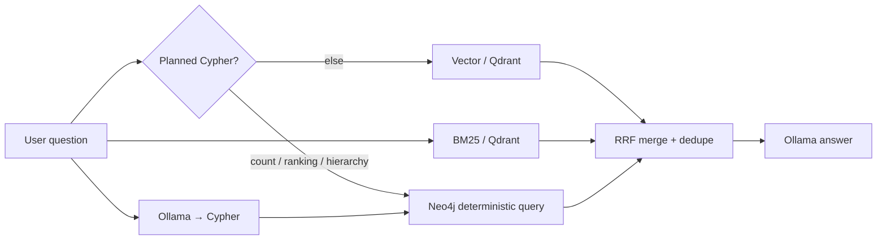

# Security Event Chat

Conversational Q&A over indexed security events, instructions, and payments. Modeled after
[sec-edgar-filings-chat](https://github.com/sanjuthomas/sec-edgar-filings-chat), but retrieval always runs **vector + BM25 + Neo4j** — no store picker in the UI.

## URL

http://localhost:8092

## Search modes

The sidebar radio buttons select what Qdrant and Neo4j focus on:

| Mode | Qdrant filter | Use for |
|------|---------------|---------|
| **Security Events** (`events`) | `security_event` + `payment_security_event` | Policy denials, audit trail, ALERT/INFO counts |
| **Instructions** (`instructions`) | `instruction_state` | Instruction state, duplicate routes, approval patterns |
| **Payments** (`payments`) | `payment_fact` | Payment amounts, statuses, approvers |
| **All entities** (`all`) | no filter | Cross-domain questions |

Pass `"mode"` in the API request body (default `"events"`).

## RAG pipeline



1. **Planned Cypher** — count, ranking, and hierarchy questions bypass LLM Cypher generation and run deterministic queries (Neo4j is authoritative; vector hits are not used to infer structural violations)
2. **Vector** — `bge-m3:latest` embed → Qdrant dense search (mode-filtered)
3. **BM25** — Qdrant sparse lexical search (mode-filtered)
4. **Neo4j** — Ollama generates read-only Cypher from mode-specific prompts + `neo4j-graph-model/relationships.cypher`
5. **Merge** — reciprocal rank fusion (k=60), dedupe by `event_id` / `payment_id`
6. **Answer** — Ollama chat model synthesizes natural language from merged context

The sidebar shows generated Cypher, timing, and source cards tagged `vector` / `bm25` / `neo4j`.

## Example questions

**Security Events mode:**
- How many ALERT events happened today?
- How many payment policy denial alerts happened today?
- Which user triggered the most policy denial alerts this week?

**Instructions mode:**
- How many instructions were created today?
- Are there any instructions approved by someone who directly reports to the creator?
- Are there active instructions sharing the same creditor account and currency?

**Payments mode:**
- How many payments were approved today for FICC?
- Show payments over $10M approved this week.

## Configuration (Docker)

| Variable | Default |
|----------|---------|
| `OLLAMA_EMBEDDING_MODEL` | `bge-m3:latest` |
| `OLLAMA_CHAT_MODEL` | `qwen3:30b` |
| `QDRANT_COLLECTION` | `ssi_search_index` |
| `NEO4J_URI` | `bolt://neo4j:7687` |
| `GRAPH_MODEL_DIR` | `/app/neo4j-graph-model` |

Requires Qdrant and Neo4j populated by `security-event-qdrant-etl` and **host Ollama**.

## Run locally

```bash
cd security-event-chat
pip install -e .
security-event-chat
```

## API

```bash
curl -s -X POST http://localhost:8092/api/chat \
  -H 'Content-Type: application/json' \
  -d '{"message":"How many payment ALERT events happened today?","mode":"events","history":[]}'
```

| Method | Path | Description |
|--------|------|-------------|
| GET | `/health` | Liveness |
| GET | `/api/status` | Ollama models + Qdrant collection exists |
| POST | `/api/chat` | Ask a question (`mode`, multi-turn via `history`) |

## Docker

```bash
docker compose up -d security-event-chat
```
