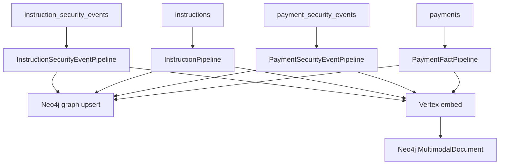

# SSI Indexer

Kafka consumers that index instruction and payment facts into **Neo4j** — both the **graph projection** and a **multimodal store** (dense vector embeddings on `MultimodalDocument` nodes).

Also exposes a **Search Console** UI for manual vector / Neo4j queries.

## URL

http://localhost:8090

## ML stack

| Role | Provider | Model |
|------|----------|-------|
| Document embeddings | **Vertex AI** | `text-embedding-004` (768-dim) |

Embeddings use `RETRIEVAL_DOCUMENT` task type at index time; PolicyPilot uses the same model with `RETRIEVAL_QUERY` at chat time.

Graph query generation in the Search Console uses **Vertex Gemini** to extract a structured graph query plan (`POST /api/intent/extract`).

## Pipelines

Four independent consumers run in the same process. Kafka messages are published by **MongoDB Kafka Connect** (`publish.full.document.only=true`) from the domain Mongo collections — the ETL makes no API calls to instruction-service or the payment service. `etl.mongo_cdc` normalizes versioned Mongo rows and security-event `_id` values into the shapes the pipelines expect. `etl.kafka_deserialize` unwraps JSON values from the broker (handles both `StringConverter` and legacy double-encoded records).



| Pipeline | Kafka topic | Consumer group | Multimodal `source` tag |
|----------|-------------|----------------|-------------------------|
| `InstructionSecurityEventPipeline` | `instruction_security_events` | `instruction-security-event-etl` | `instruction_security_event` |
| `InstructionPipeline` | `instructions` | `ssi-instruction-etl` | `instruction_state` |
| `PaymentSecurityEventPipeline` | `payment_security_events` | `payment-security-event-etl` | `payment_security_event` |
| `PaymentFactPipeline` | `payments` | `payment-fact-etl` | `payment_fact` |

### Graph writers

| Role | Pipelines | Neo4j writes |
|------|-----------|--------------|
| **Fact (state)** | `InstructionPipeline`, `PaymentFactPipeline` | Versions, `CURRENT`, `SUPERSEDES`, `_*IV` / `_*PV` lifecycle, `CONFLICTS_WITH`, `HAS_PAYMENT`, `CONSUMED`, root denorm |
| **Audit (events)** | `InstructionSecurityEventPipeline`, `PaymentSecurityEventPipeline` | `SecurityEvent`, `ACTED_AS`, `FOR` → version, `INVOLVES_LOB` only |

Edge/action constants: `src/etl/graph_model.py`. Full spec: [neo4j-graph-model/README.md](../neo4j-graph-model/README.md).

For each message:

1. Parse the fact event (security event or state snapshot).
2. Upsert Neo4j nodes/relationships (see `neo4j-graph-model/`). User upserts also write `REPORTS_TO` from `supervisor_id`.
3. Embed `search_text` with **Vertex `text-embedding-004`** → upsert a `MultimodalDocument` with `embedding` + `search_text`.

Each pipeline message is processed as: **build search text → Vertex embed → one Neo4j transaction** (graph nodes/relationships + `MultimodalDocument` vector payload).

## Enriched document shape (instruction security events)

Stored in the multimodal document payload (and used for search text):

| Field | Content |
|-------|---------|
| `security_event` | Full Kafka/Mongo event (includes `instruction_snapshot`) |
| `instruction` | Instruction snapshot from the event |
| `merged` | Denormalized join (actor, creator, action, wire_scope, …) |
| `search_text` | Flattened string for embedding |
| `source` | `instruction_security_event`, `instruction_state`, `payment_security_event`, or `payment_fact` |

### Authorization fields (indexed for chat)

| Pipeline | Extra indexed fields |
|----------|---------------------|
| Instruction security events | `merged.authorization_summary`, `merged.authorization_basis`, `merged.timestamp` |
| Instruction state (`instructions`) | `approved_at`, `authorization_summary`, `authorization_basis` on multimodal doc + Neo4j `InstructionVersion` |
| Payment security events / facts | Same denormalization pattern |

On APPROVE instruction security events, the pipeline **patches** the existing `instruction_state` multimodal document with approval authorization in the **same Neo4j transaction** as the security-event graph + vector write. Non-APPROVE instruction facts preserve existing approval fields when upserting.

## Search Console

| Mode | Backend |
|------|---------|
| Vector | Neo4j vector index (`multimodal_embedding`) |
| Neo4j | Text search on `SecurityEvent` nodes |
| Cypher generate | Vertex Gemini → structured graph query plan (admin API) |

Component status bar shows Kafka, multimodal vector index, Neo4j graph, and Vertex embedding health.

## Configuration (Docker)

Copy `.env.example` to `.env` at the repo root to override defaults. Docker Compose and pydantic-settings both read it.

| Variable | Default |
|----------|---------|
| `GCP_PROJECT_ID` | `rag-demos-501323` |
| `GCP_REGION` | `us-central1` |
| `VERTEX_EMBEDDING_MODEL` | `text-embedding-004` |
| `VERTEX_GEMINI_MODEL` | `gemini-2.5-flash` |
| `EMBEDDING_DIMENSION` | `768` |
| `GCP_SA_KEY_PATH` | host path to service account JSON (Compose mount) |
| `GOOGLE_APPLICATION_CREDENTIALS` | `/run/secrets/gcp-sa.json` (in container) |
| `KAFKA_INSTRUCTION_SECURITY_EVENTS_TOPIC` | `instruction_security_events` |
| `KAFKA_INSTRUCTION_TOPIC` | `instructions` |
| `KAFKA_PAYMENT_SECURITY_EVENTS_TOPIC` | `payment_security_events` |
| `KAFKA_PAYMENTS_TOPIC` | `payments` |
| `MULTIMODAL_VECTOR_INDEX` | `multimodal_embedding` |
| `NEO4J_URI` | `bolt://neo4j:7687` |

Requires **GCP Vertex AI** credentials for embeddings and vector search.

## Run locally

```bash
cd ssi-indexer
pip install -e ../shared/cypher_builder -e ../shared/vertex_client -e .
export GOOGLE_APPLICATION_CREDENTIALS=~/.config/gcloud/your-vertex-key.json
ssi-indexer   # serves on :8090
```

## API (selected)

| Method | Path | Description |
|--------|------|-------------|
| GET | `/api/stats` | Component health + multimodal document counts |
| POST | `/api/search/vector` | Dense vector search (Vertex embed query) |
| POST | `/api/intent/extract` | Natural language → graph query plan (Vertex Gemini) |
| POST | `/api/cypher/run` | Validate and run read-only Cypher against Neo4j |
| GET | `/api/graph/events` | Neo4j event text search |
| GET | `/api/graph/events/{event_id}` | Event subgraph |

## Reindex / replay vectors

If Neo4j was wiped or embedding dimension changed, replay Kafka messages so the indexer re-embeds all documents with Vertex:

```bash
docker compose stop ssi-indexer

# Drop stale indexes if dimension changed (768 for text-embedding-004)
docker exec neo4j cypher-shell -u neo4j -p devpassword "
DROP INDEX multimodal_embedding IF EXISTS;
DROP INDEX multimodal_search_text IF EXISTS;
"

# Re-apply constraints (+ drop legacy fulltext if still present)
docker exec -i neo4j cypher-shell -u neo4j -p devpassword < neo4j-graph-model/schema.cypher
docker exec neo4j cypher-shell -u neo4j -p devpassword "
DROP INDEX multimodal_search_text IF EXISTS;
"

for TOPIC_GROUP in \
  "instruction_security_events:instruction-security-event-etl" \
  "instructions:ssi-instruction-etl" \
  "payment_security_events:payment-security-event-etl" \
  "payments:payment-fact-etl"
do
  TOPIC="${TOPIC_GROUP%%:*}"
  GROUP="${TOPIC_GROUP##*:}"
  docker exec kafka /opt/kafka/bin/kafka-consumer-groups.sh \
    --bootstrap-server kafka:9092 \
    --group "$GROUP" \
    --topic "$TOPIC" \
    --reset-offsets --to-earliest --execute
done

docker compose start ssi-indexer
```

Verify: `SHOW VECTOR INDEXES` in Neo4j Browser; Search Console status bar should show vector index **up**.

## Reset consumer offsets

If Neo4j is empty but Kafka has messages, reset each consumer group (same loop as above without the index drop):

```bash
docker compose stop ssi-indexer

for TOPIC_GROUP in \
  "instruction_security_events:instruction-security-event-etl" \
  "instructions:ssi-instruction-etl" \
  "payment_security_events:payment-security-event-etl" \
  "payments:payment-fact-etl"
do
  TOPIC="${TOPIC_GROUP%%:*}"
  GROUP="${TOPIC_GROUP##*:}"
  docker exec kafka /opt/kafka/bin/kafka-consumer-groups.sh \
    --bootstrap-server kafka:9092 \
    --group "$GROUP" \
    --topic "$TOPIC" \
    --reset-offsets --to-earliest --execute
done

docker compose start ssi-indexer
```
