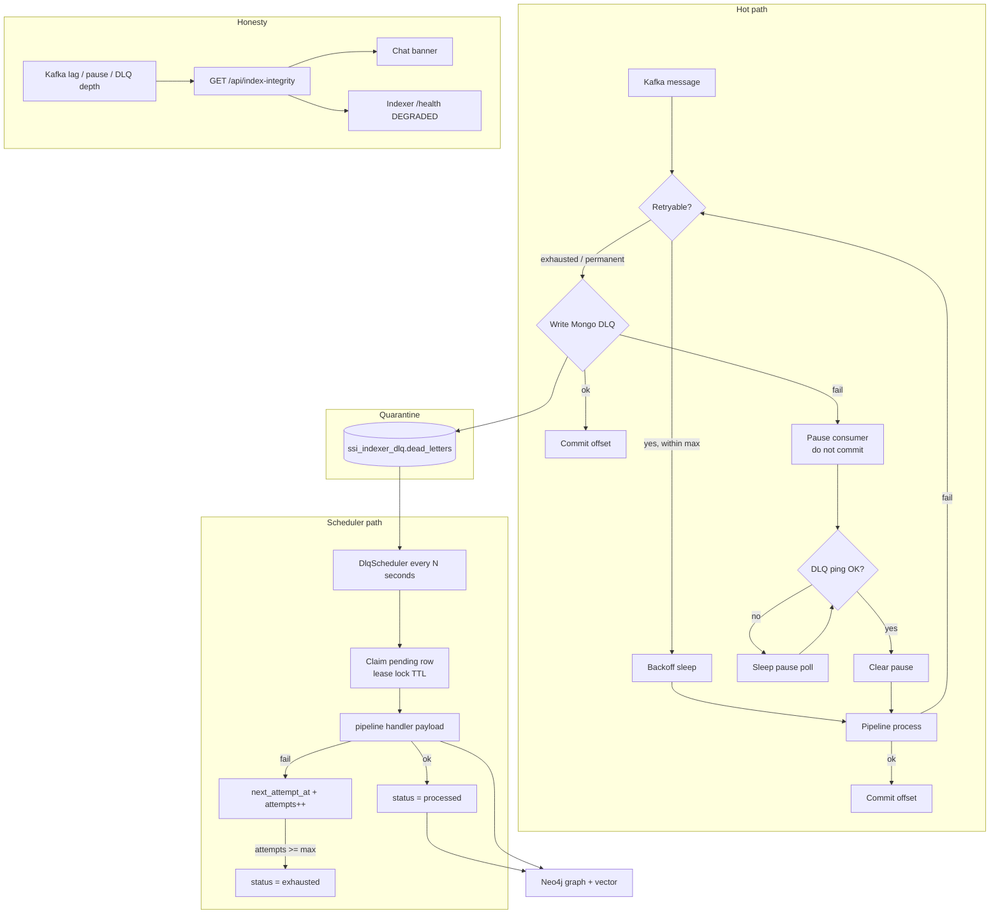

# Indexer Mongo DLQ

Dead-letter queue for **ssi-indexer** Kafka consumers. Prevents silent Neo4j / embedding under-counts by quarantining failed messages before Kafka offsets advance, then replaying them from durable Mongo storage.

This document covers design, configuration, status model, ops UI, and data flow.

## Why it exists

Before DLQ, a non-transient pipeline failure logged and skipped. The consumer continued; a later successful commit advanced past the failed offset. Neo4j could under-count denials/ALERTs while chat treated the graph as investigation truth.

**Rule:** never let the consumer progress past a failed message unless that failure is durably recorded in the DLQ (or the consumer is paused because DLQ is unavailable).

## Design principles

1. **Self-contained quarantine** — each DLQ row stores the full payload needed to re-run the pipeline. The scheduler never reads transactional Mongo (`ssi_cash_*`, `security_events`).
2. **DLQ-before-commit** — Kafka commit happens only after a successful DLQ insert (or after a successful process).
3. **Pause when quarantine fails** — if DLQ Mongo cannot accept a write, log, set `consumer_paused`, and do not commit. Resume when DLQ is healthy again.
4. **Replay = pipeline call, not Kafka seek** — after commit, the Kafka offset is already past. Scheduler calls the same `process*` handler with the stored payload.
5. **Mongo DLQ (not Kafka DLQ topic)** — easier ops UI (filter, lease, Retry Now) without fighting consumer-group ownership.
6. **User honesty** — chat shows a banner when lag exceeds threshold, any consumer is paused, or DLQ depth &gt; 0.

## Architecture / data flow



### Commit contract

| Outcome | Kafka offset | DLQ |
|---------|--------------|-----|
| Process success | Commit | — |
| Failure after retries, DLQ write OK | Commit | Insert `pending` (or `poison`) |
| Failure, DLQ write fails / DLQ down | **Do not commit**; pause | — |
| Scheduler replay success | (already committed) | `processed` |
| Scheduler replay fail | — | retry schedule or `exhausted` |

## Components (code map)

| Module | Role |
|--------|------|
| `etl/dlq/runtime.py` | Shared hot-path loop: retry → DLQ → commit / pause |
| `etl/dlq/store.py` | Mongo client for `ssi_indexer_dlq` only |
| `etl/dlq/scheduler.py` | Periodic claim + replay |
| `etl/dlq/pause.py` | In-process pause flags + replay handler registry |
| `etl/dlq/classify.py` | `transient` / `permanent` / `poison` |
| `etl/dlq/routes.py` | Admin DLQ API |
| `etl/dlq/metrics.py` | OTel counters (`etl.consumer.*`, `etl.dlq.*`) |
| `etl/integrity.py` | Lag / pause / depth → banner payload |
| Consumers | Register replay handlers; call `process_kafka_message` |

Pipelines replayed by kind:

| `pipeline_kind` | Handler |
|-----------------|---------|
| `instruction_security_event` | `InstructionSecurityEventPipeline.process_instruction_security_event` |
| `instruction_fact` | `InstructionPipeline.process_instruction_fact` |
| `payment_security_event` | `PaymentSecurityEventPipeline.process` |
| `payment_fact` | `PaymentFactPipeline.process` |

## DLQ document shape

Stored in Mongo **`ssi_indexer_dlq.dead_letters`** (configurable).

| Field | Purpose |
|-------|---------|
| `pipeline_kind` | Which replay handler to invoke |
| `consumer_name` | Ops / pause identity |
| `kafka.topic` / `partition` / `offset` / `consumer_group` | Audit only (not used for seek) |
| `payload` | Full message value for replay |
| `event_id` / `entity_id` | Ops lookup |
| `failure_class` | `transient` \| `permanent` \| `poison` |
| `error_message` / `stage` / `last_error` | Diagnostics |
| `status` | See below |
| `attempts` / `max_attempts` | Scheduler retry budget |
| `realtime_attempts` | Hot-path attempts before quarantine |
| `next_attempt_at` | Scheduler eligibility |
| `locked_by` / `lock_until` | Lease (TTL) for concurrent workers |
| `created_at` / `updated_at` / `processed_at` | Timeline |
| `audit[]` | Append-only action trail |

Unique index on `(kafka.topic, kafka.partition, kafka.offset)` for idempotent quarantine.

### Status machine

```text
pending ──claim──► processing ──ok──► processed
                       │
                       └──fail──► pending (backoff) ──max──► exhausted
poison   (quarantined, not auto-replayed by claim query for pending/processing only)
```

Ops UI **Retry Now** (enabled when depth &gt; 0):
- makes `pending` / `processing` eligible immediately (locks cleared, `next_attempt_at=now`; attempt counters kept)
- reopens `exhausted` as `pending` with `attempts=0`
- then runs one scheduler drain cycle

The background scheduler still claims due `pending` rows every interval until success or `exhausted`.

## Configuration

Defined in `etl/config.py` (Pydantic settings). Override via environment variables (UPPER_SNAKE).

### Realtime Kafka retry

| Setting | Env | Default | Meaning |
|---------|-----|---------|---------|
| `kafka_retry_max_attempts` | `KAFKA_RETRY_MAX_ATTEMPTS` | `5` | Hot-path attempts for retryable errors |
| `kafka_retry_base_delay_seconds` | `KAFKA_RETRY_BASE_DELAY_SECONDS` | `0.2` | Exponential backoff base |
| `kafka_retry_max_delay_seconds` | `KAFKA_RETRY_MAX_DELAY_SECONDS` | `30` | Cap per sleep |

Retryable classification (`etl/dlq/classify.py`): Neo4j `TransientError` / `ServiceUnavailable` / `SessionExpired`, plus timeout / 429 / 5xx-style messages. Poison-ish messages (invalid schema) quarantine as `poison` and still commit so they do not block the partition.

### DLQ store + scheduler

| Setting | Env | Default | Meaning |
|---------|-----|---------|---------|
| `dlq_mongodb_uri` | `DLQ_MONGODB_URI` | `mongodb://mongodb:27017/?replicaSet=rs0` | Dedicated URI (can share host, separate DB) |
| `dlq_mongodb_database` | `DLQ_MONGODB_DATABASE` | `ssi_indexer_dlq` | **Not** a transactional domain DB |
| `dlq_mongodb_collection` | `DLQ_MONGODB_COLLECTION` | `dead_letters` | Collection name |
| `dlq_scheduler_interval_seconds` | `DLQ_SCHEDULER_INTERVAL_SECONDS` | `300` | Poll interval (5 min) |
| `dlq_scheduler_batch_size` | `DLQ_SCHEDULER_BATCH_SIZE` | `20` | Max claims per cycle |
| `dlq_scheduler_max_attempts` | `DLQ_SCHEDULER_MAX_ATTEMPTS` | `8` | Then `exhausted` |
| `dlq_scheduler_backoff_seconds` | `DLQ_SCHEDULER_BACKOFF_SECONDS` | `300` | Base delay after a failed scheduler replay (~one interval) |
| `dlq_scheduler_max_backoff_seconds` | `DLQ_SCHEDULER_MAX_BACKOFF_SECONDS` | `3600` | Cap |
| `dlq_lock_ttl_seconds` | `DLQ_LOCK_TTL_SECONDS` | `300` | Lease expiry |
| `dlq_pause_poll_seconds` | `DLQ_PAUSE_POLL_SECONDS` | `5` | Pause loop / DLQ ping interval |

### Honesty signal

| Setting | Env | Default | Meaning |
|---------|-----|---------|---------|
| `index_lag_banner_threshold` | `INDEX_LAG_BANNER_THRESHOLD` | `10` | Chat banner when total Kafka lag &gt; N |

Compose (`ssi-indexer` service) currently sets URI/database/collection, scheduler interval `300`, and lag threshold `10`. Other values use code defaults until you add env entries.

## APIs and UI

### Public (chat banner)

| Method | Path | Auth |
|--------|------|------|
| `GET` | `/api/index-integrity` | None |
| `GET` | `/health` | None (embeds `integrity`) |

Chat proxies the same payload via `GET http://localhost:8092/api/index-integrity` (`INDEXER_URL`).

Banner shows when any of: `consumer_paused`, `kafka_lag_total > threshold`, `dlq.depth > 0`.

### Admin (Search Console)

Mounted under `/api` with platform-admin auth:

| Method | Path | Purpose |
|--------|------|---------|
| `GET` | `/api/dlq/stats` | Depth, by_status, pause snapshot |
| `GET` | `/api/dlq/entries` | List (payload stripped) |
| `GET` | `/api/dlq/entries/{id}` | Full document including payload |
| `POST` | `/api/dlq/retry-now` | Ops Retry Now — make active rows eligible + drain once |
| `POST` | `/api/dlq/reset` | Full reset of selected statuses (`attempts=0`) + drain |
| `POST` | `/api/dlq/resume-consumers` | Clear pause flags |

UI: http://localhost:8090 → **Dead letter queue** panel (Refresh / Retry Now / Resume consumers).

## Metrics (alerting hints)

Emitted via shared telemetry (`etl.dlq` meter), including:

- `etl.consumer.processed` / `retry` / `failed` / `paused` / `resume`
- `etl.dlq.quarantined` / `replay_ok` / `replay_failed`

Useful alerts: consumer paused, DLQ insert rate spike, depth &gt; 0 for long age, scheduler `exhausted` growth, Kafka lag &gt; banner threshold.

## Ops runbooks (short)

**Neo4j / Vertex outage (DLQ healthy)**  
Consumers quarantine failures and keep moving. The scheduler retries `pending` rows every interval (default 5 minutes) until success or `exhausted`. After recovery, either wait for the next scheduler tick or click **Retry Now** for an immediate drain.

**Mongo DLQ outage**  
Consumers pause; lag climbs; chat banner appears. Fix Mongo → auto-resume on ping (or **Resume consumers**) → stuck message retries → quarantine or success.

**Poison messages**  
Status `poison`. Investigate payload; do not bulk-reset poison unless intentional. Prefer fixing producer / CDC shape.

## Boundaries (what DLQ is not)

- Not a Kafka DLQ topic; Kafka coords are audit metadata only.
- Scheduler must **not** connect to domain transactional DBs.
- Replay must be **idempotent** at Neo4j / vector writers (`MERGE` / upsert by entity id).
- Truncating domain Mongo does not clear Kafka; after a wipe, reset consumer groups to `latest` (or earliest if you intend reindex) — see [Reset consumer offsets](../../../README.md#reset-consumer-offsets).

## Related

- Architecture finding **P0-1** (indexer skip-on-error → Neo4j under-counts)
- Parent service: [ssi-indexer README](../../../README.md)
- Chat integrity: `ssi-chat` `INDEXER_URL` + banner on `#index-integrity-banner`
